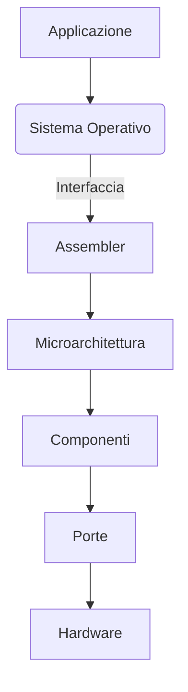

# Livelli

## Gerarchia

$\frac{L_i}{L_{i-1}}$

## Modularità

## Regolarità

## Bit

Binaria: $\{0,1\} \; \{F,V\} \; \{false,true\}$

Bit: $\text{valore} \in \{0,1\}$

Combinazioni: $2^n$

\# di bit: $log_2(\#N)$

| Computer | Processore | Bit registri | Valori |
| --- | --- | --- | --- |
| Apple II | Motorola 6502 | 8   | 256 |
| IBM | Intel 8086 | 16  | 65536 |

| Numero esponenziale | Numero | Simbolo |
| --- | --- | --- |
| $2^{10}$ | 1024 | K   |
| $2^{20}$ | 1048576 | M   |
| $2^{30}$ | 1073741824 | G   |

### Sistema posizionale

Decimale: 217

| Cifra | Peso |
| --- | --- |
| 7   | $10^0$ |
| 1   | $10^1$ |
| 2   | $10^2$ |

$2*10^2+1*10^1+7*10^0=217$

Binario: 11011001

| Cifra | Peso |
| --- | --- |
| 1   | $2^0$ |
| 0   | $2^1$ |
| 0   | $2^2$ |
| 1   | $2^3$ |
| 1   | $2^4$ |
| 0   | $2^5$ |
| 1   | $2^6$ |
| 1   | $2^7$ |

$1*2^0+0*2^1+0*2^2+1*2^3+1*2^4+0*2^5+1*2^6+1*2^7=217$

| \# bit | Nome |
| --- | --- |
| 8   | byte |
| 4   | nibble |

### Convertire numero

Convertiamo $50_{10}$:

| Valore bit | Totale |
| --- | --- |
| 32 ($2^5$) | 32 (-18) |
| 16 ($2^4$) | 48  |
| 2 ($2^1$) | 50  |

$110010_2$

### Somma

#### Decimale

$$
\begin{matrix}
1 & 2 & 3 & + \\
  & 2 & 1 & = \\
1 & 4 & 4
\end{matrix}

$$

#### Binaria

$$
\begin{matrix}
0 & 1 & 0 & 1 & + \\
0 & 1 & 0 & 0 & = \\
1 & (1)0 & 0 & 1
\end{matrix}

$$

### Esadecimale

| 1010 | 1110 | 0000 | 0101 |
| --- | --- | --- | --- |
| A   | E   | 0   | 5   |

### Complemento a 2

Se si ha il primo bit che specifica il segno, si ha che abbiamo 2 zeri, e inoltre sono necessaria controlli per vedere se un numero è negativo.

Un modo migliore è invertire tutti i bit e aggiungere 1. Così:

- C'è solo 1 zero
- Puoi sommare i numeri senza preoccuparti di sottrarre se c'è un numero negativo