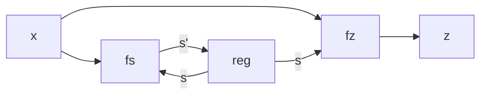
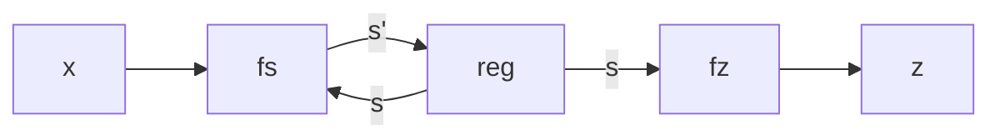
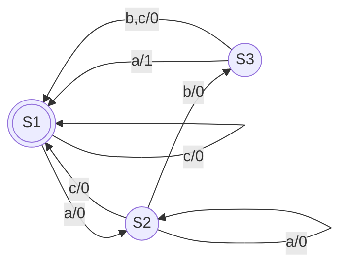
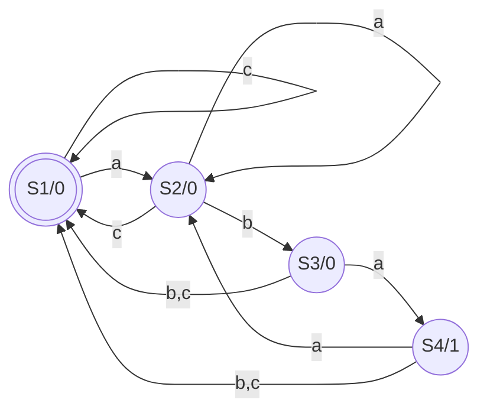
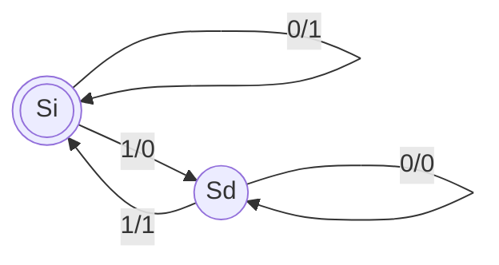
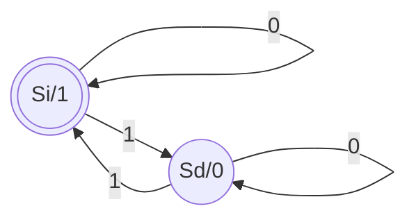

# Automi

Automa di Mealy
- $z=f_z(s,x)$
- $s'=f_s(s,x)$



Automa di Moore
- $z=f_z(s)$
- $s'=f_s(s,x)$



Entrambi gli automi hanno bisogno di un [[Porte logiche#^5dfc12|registro]] per memorizzare lo stato.

## Riconoscimento stringa

Vediamoli per riconoscere `aba` (alfabeto $\{a,b,c\}$) , in una stringa (come `abcabbaba`).

### Mealy



Con il carattere $\{a,b,c\}$ rappresentato dai bit $x_1x_0$, lo stato corrente da $b_1b_0$, il nuovo stato da $b_1'b_0'$, e il valore di riporto (quello a destra dello `/`) con $z$:

| $b_1b_0$ | $x_1x_0$ | $b_1'b_0'$ | $z$ |
| -------- | -------- | ---------- | --- |
| 00       | 00       | 01         | 0   |
| 00       | 01       | 00         | 0   |
| 00       | 10       | 00         | 0   |
| 01       | 00       | 01         | 0   |
| 01       | 01       | 10         | 0   |
| 01       | 10       | 00         | 0   |
| 10       | 00       | 00         | 1   | 
| 10       | 01       | 00         | 0   |
| 10       | 10       | 00         | 0   |

$b_1'=\bar{b_1}b_0\bar{x_1}x_0$

$b_0'=\bar{b_1}\bar{b_0}\bar{x_1}\bar{x_0}+\bar{b_1}b_0\bar{x_1}\bar{x_0}$

$z=b_1\bar{b_0}\bar{x_1}\bar{x_0}$


### Moore



Il risultato è $1$ solo in $S_4$, cioè $z=b_1b_0$.

| $b_1b_0$ | $x_1x_0$ | $b_1'b_0'$ | $z$ |
| -------- | -------- | ---------- | --- |
| 00       | 00       | 01         | 0   |
| 00       | 01       | 00         | 0   |
| 00       | 10       | 00         | 0   |
| 01       | 00       | 01         | 0   |
| 01       | 01       | 10         | 0   |
| 01       | 10       | 00         | 0   |
| 10       | 00       | 11         | 1   |
| 10       | 01       | 00         | 0   |
| 10       | 10       | 00         | 0   |
| 11       | 00       | 01         | 0   |
| 11       | 01       | 00         | 0   |
| 11       | 10       | 00         | 0   | 

$b_1'=\bar{b_1}b_0\bar{x_1}x_0+b_1\bar{b_0}\bar{x_1}\bar{x_0}$

$b_0'=\bar{x_1}\bar{x_0}$

$z=b_1\bar{b_0}\bar{x_1}\bar{x_0}$

## Rete che calcola parità di una sequenza di bit

```
input: 011010111101000
z_:    101100101001111
```

\# bit del registro di stato: 1

Mealy:



Moore:



In questo caso il numero di nodi è uguale in entrambi, e si può condividere la tabella.

| $s$ | $x$ | $s'$ | $z$ |
| --- | --- | ---- | --- |
| 0   | 0   | 0    | 1   |
| 0   | 1   | 1    | 0   |
| 1   | 0   | 1    | 0   |
| 1   | 1   | 0    | 1   | 

$s'=\bar{s}x+s\bar{x}$

$z=sx+\bar{s}\bar{x}$