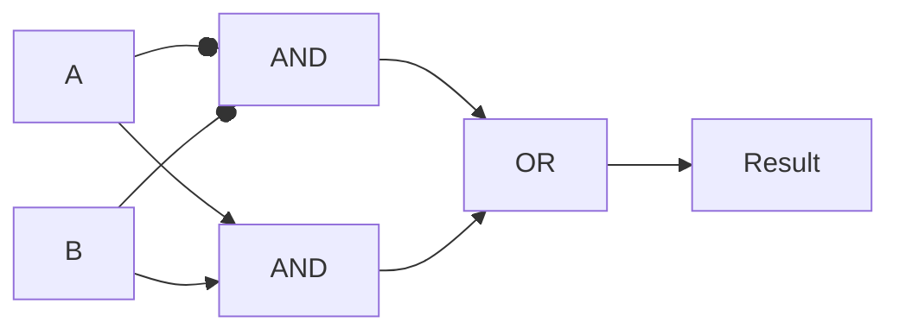
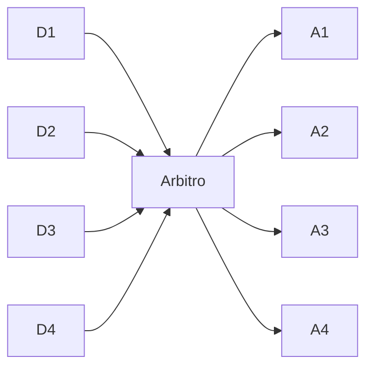
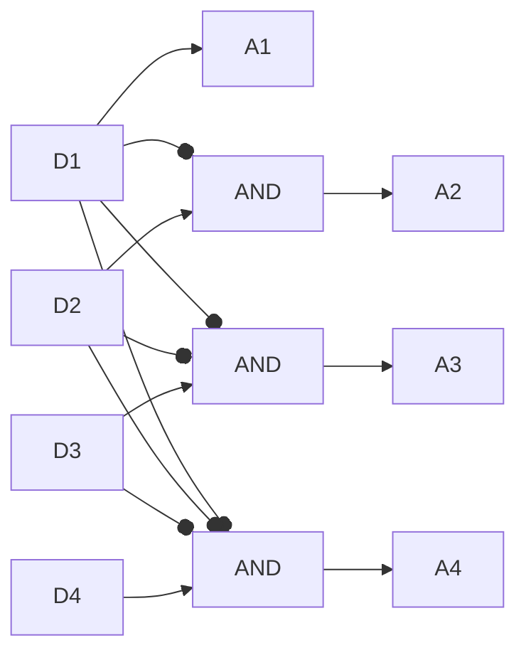
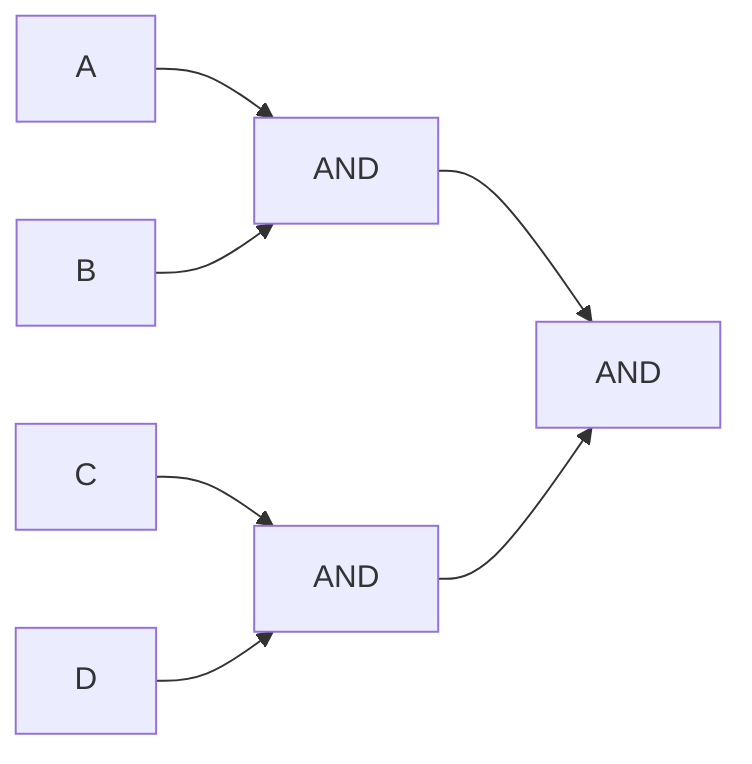

## Logica

- $A \text{ AND } B=1 \iff A=1 \land B=1$
- $A \text{ OR } B=1 \iff A=1 \lor B=1$
- $\text{NOT } A=1 \iff A=0$
- $A \text{ XOR } B=1 \iff A \neq B \iff ((\text{NOT } A) \text{ AND }(\text{NOT }B)) \text{ OR } (A \text{ AND } B)=1$
![[Immagine porte logiche.png]]

### Tabella di verità XOR

| Ingresso A | Ingresso B | Uscita Z |
| --- | --- | --- |
| 0   | 0   | 1   |
| 0   | 1   | 0   |
| 1   | 0   | 0   |
| 1   | 1   | 1   |

$z=\overline{A}*\overline{B}+A*B$ cerca di ottenere 1 dalla tabella.

$z=\overline{\overline{A}B+A\overline{B}}$ cerca di ottenere 0 dalla tabella (e infine nega il risultato). Utile per situazioni in cui ci sono più risultati con 0 che con 1.

Visualizzazione grafica (a mano sarebbe fatta diversamente):



### Altro esempio

Vogliamo una logica dove il risultato è 1 se solo se almeno 3 bit sono uguali a 1.

| A   | B   | C   | D   | E   | Z   |
| --- | --- | --- | --- | --- | --- |
| 0   | 0   | 0   | 0   | 0   | 0   |
| 0   | 0   | 0   | 0   | 1   | 0   |
| 0   | 0   | 0   | 1   | 0   | 0   |
| 0   | 0   | 0   | 1   | 1   | 0   |
| 0   | 0   | 1   | 0   | 0   | 0   |
| 0   | 0   | 1   | 0   | 1   | 0   |
| 0   | 0   | 1   | 1   | 0   | 0   |
| 0   | 0   | 1   | 1   | 1   | 1   |
| …   | …   | …   | …   | …   | …   | 

Da quello che abbiamo finora in tabella, questa formula è giusta: $z=\overline{A} \: \overline{B}CDE+…$

Cerchiamo di trovare tutti i casi in cui il risultato è 1. Si può usare il simbolo $-$ per dire "don't care". (Assicurati però di non avere conflitti: per esempio, seconda riga prima colonna, il bit è 0 e non $-$.)

| A   | B   | C   | D   | E   | Z   |
| --- | --- | --- | --- | --- | --- |
| 1   | 1   | 1   | -   | -   | 1   |
| 0   | 1   | 1   | 1   | -   | 1   |
| 0   | 0   | 1   | 1   | 1   | 1   |
| 0   | 1   | 0   | 1   | 1   | 1   |

$z=ABC+\overline{A}BCD+\overline{A}\:\overline{B}CDE+\overline{A}B\overline{C}DE$

### Altro esempio

Abbiamo diversi dispositivi D1-D4 che mandano un segnale. Se il segnalo che Di manda è uguale a 1, allora Ai diventa 1 a gli altri diventano 0. D1-D4 mandano il segnalo contemporaneamente, e un arbitro fa sì che il Di con i più basso abbia priorità con il segnale 1.



| # Combinazioni | D1  | D2  | D3  | D4  | A1  | A2  | A3  | A4  |
| --- | --- | --- | --- | --- | ---: | ---: | ---: | ---: |
| 1   | 0   | 0   | 0   | 0   | 0   | 0   | 0   | 0   |
| 8   | 1   | -   | -   | -   | 1   | 0   | 0   | 0   |
| 4   | 0   | 1   | -   | -   | 0   | 1   | 0   | 0   |
| 2   | 0   | 0   | 1   | -   | 0   | 0   | 1   | 0   |
| 1   | 0   | 0   | 0   | 1   | 0   | 0   | 0   | 1   |

Totale = 16

$$
A_1=D_1 \\
A_2=\overline{D_1}D_2 \\
A_3=\overline{D_1}\:\overline{D_2}D_3 \\
A_4=\overline{D_1}\:\overline{D_2}\:\overline{D_3}D_4
$$



Nota che in realtà una normale porta AND o OR supportano solo 2 ingressi. Per creare un circuito che "simula" una porta AND con 4 ingressi, usando solo AND da 2 ingressi:



Ciò causa un ritardo del doppio rispetto a fare l'AND su 2 variabili.

Senza un circuito dedicato (per fare i conti in parallelo) o una porta dedicata, il ritardo cresce in maniera esponenziale.

### Confrontare 2 numeri da 32 bit

Bisogna vedere bit a bit.

```mermaid
flowchart TB
H1 & I1 --> =1[=]
H2 & I2 --> =2[=]
...
H32 & I32 --> =N[=]
=1 & =2 & =N --> AND
```

Il costo di ritardo è:

- Il confronto di ogni bit:
	- $z=\overline{A}\:\overline{B}+AB$, che sono 1 livello di AND e 1 OR, quindi 2 livelli
- L'AND per tutti e 32 i bit. Se $n$ è il numero di ingressi per la porta AND, ci vogliono $\log_n32$ livelli (arrotondato per eccesso).
