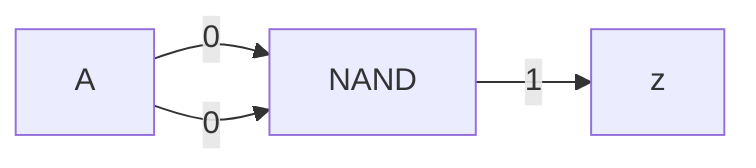
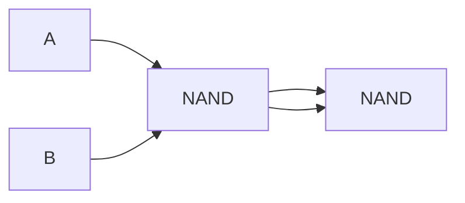
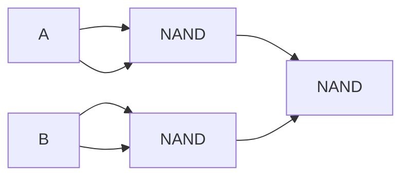

# Algebra booleana

## Assiomi

- NOT
	- $\bar{0}=1$
	- $\bar{1}=0$
- AND
	- $0*0=0$
	- $1*1=1$
	- $1*0=0$
	- $0*1=0$
- OR
	- $0+0=0$
	- $1+1=1$
	- $1+0=1$
	- $0+1=1$

## Teorema

^23603f

$ABC \: var \in \{0,1\}$

|     | Identità | Elemento nullo | Idempotenza | Complementi        | Commutativa | Associativa       |
|:---:| -------- | -------------- | ----------- | ------------------ | ----------- | ----------------- |
| AND | $A*1=A$  | $A*0=0$        | $A*A=A$     | $A*\bar{A}=0$ | $A*B=B*A$   | $(A*B)*C=A*(B*C)$ |
| OR  | $A+1=1$  | $A+0=A$        | $A+A=A$     | $A+\bar{A}=1$ | $A+B=B+A$   | $(A+B)+C=A+(B+C)$ |

- Distributiva: $A*(B+C)=A*B+A*C$ |
- Involuzioni: $\overline{\bar{A}}=A$
- De Morgan: $\overline{A*B}=\bar{A}+\bar{B}$

Sfrutteremo queste regole per ridurre il numero di [[Porte logiche]] usate. Al momento, l'espressione somma di prodotti (∀ "1" nella colonna z → Lemma AND di tanti ingressi quante sono le variabili d'input) con $k$ input ha al massimo $2^k-1$ z uguali a 1.

## Ottimizzazione

Funzione obiettivo: combinazione a piacere tra:
- \# porte
- Velocità
- Design time
- Costo (silicio)
- Consumo (silicio)

### Semplificazione di espressioni booleane

#### Esempio 1

$$
ABC+AB \bar{C}+\bar{A}B \\
=AB*(C+\bar{C})+\bar{A}B \\
=AB+\bar{A}B \\
=(A+\bar{A})B \\
=B
$$

| $A$ | $B$ | $C$ | $ABC$ | $AB\bar{C}$ | $\bar{A}B$ | $+$ | $B$ |
| --- | --- | --- | ----- | ---------------- | --------------- | --- | --- |
| 0   | 0   | 0   | 0     | 0                | 0               | 0   | 0   |
| 0   | 0   | 1   | 0     | 0                | 0               | 0   | 0   |
| 0   | 1   | 0   | 0     | 0                | 1               | 1   | 1   |
| 0   | 1   | 1   | 0     | 0                | 1               | 1   | 1   |
| 1   | 0   | 0   | 0     | 0                | 0               | 0   | 0   |
| 1   | 0   | 1   | 0     | 0                | 0               | 0   | 0   |
| 1   | 1   | 0   | 0     | 1                | 0               | 1   | 1   |
| 1   | 1   | 1   | 1     | 0                | 0               | 1   | 1   |

Da 3 AND (da 3) e 1 OR (da 3), a semplicemente il valore di $B$!

#### Esempio 2

$$
ABC+A\bar{B}\bar{C}+AB\bar{C} \\
=ABC+AB\bar{C}+A\bar{B}\bar{C}+AB\bar{C} \\
=AB(C+\bar{C})+A\bar{C}(\bar{B}+B) \\
=AB+A\bar{C} \\
=A(B+\bar{C})
$$

#### Esempio 3

$$
A\bar{B}\bar{C}+AB\bar{C}+\bar{A}BC+ABC \\
= A\bar{C}(\bar{B}+B)+(\bar{A}+A)BC \\
= A\bar{C}+BC
$$

| A   | B   | C   | z   |
| --- | --- | --- | --- |
| 1   | -   | 0   | 1   |
| -   | 1   | 1   | 1   |
| 0   | -   | 0   | 0   |
| -   | 0   | 1   | 0   |

$z=A\bar{C}+BC=$ Prima riga + Seconda riga

Questo è un [[Porte logiche#^b31833|multiplexer]] (con C che fa da arbitro).

# TODO: fare anche mappa di Karnaugh (registrazione 09/30)

## NAND

| A|B | z |
| --- | --- |
| 0|0 | 1 |
| 0|1 | 1 |
| 1|0 | 1 |
| 1|1 | 0 |

Permette di creare tutte le altre porte usando solo se stesso (stessa cosa per NOR). Non è il massimo dell'efficienza però:

### NOT

### AND

### OR

Sfrutta De Morgan (Vedi [[Algebra booleana#^23603f|teoremi]])

## Vedi anche

- [[Mappa di Karnaugh]]
