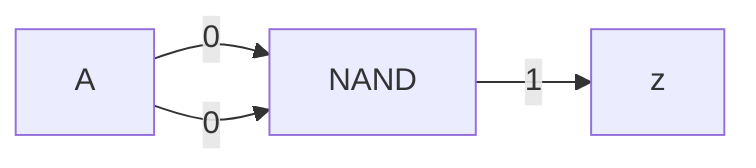
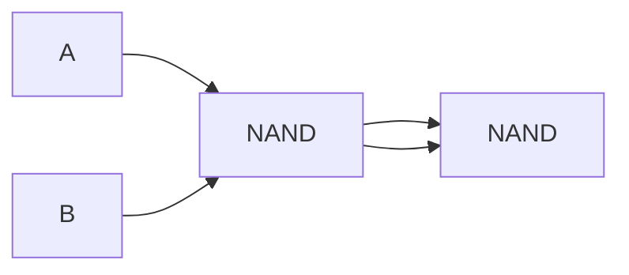
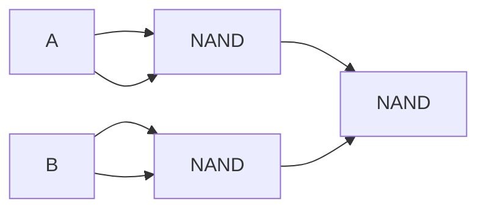

# Algebra booleana

## Assiomi

- NOT
	- $\bar{0}=1$
	- $\bar{1}=0$
- AND
	- $0*0=0$
	- $1*1=1$
	- $1*0=0$
	- $0*1=0$
- OR
	- $0+0=0$
	- $1+1=1$
	- $1+0=1$
	- $0+1=1$

## Teorema

^23603f

$ABC \: var \in \{0,1\}$

|     | Identità | Elemento nullo | Idempotenza | Complementi        | Commutativa | Associativa       |
|:---:| -------- | -------------- | ----------- | ------------------ | ----------- | ----------------- |
| AND | $A*1=A$  | $A*0=0$        | $A*A=A$     | $A*\bar{A}=0$ | $A*B=B*A$   | $(A*B)*C=A*(B*C)$ |
| OR  | $A+1=1$  | $A+0=A$        | $A+A=A$     | $A+\bar{A}=1$ | $A+B=B+A$   | $(A+B)+C=A+(B+C)$ |

- Distributiva: $A*(B+C)=A*B+A*C$ |
- Involuzioni: $\overline{\bar{A}}=A$
- De Morgan: $\overline{A*B}=\bar{A}+\bar{B}$

Sfrutteremo queste regole per ridurre il numero di [[Porte logiche]] usate. Al momento, l'espressione somma di prodotti (∀ "1" nella colonna z → Lemma AND di tanti ingressi quante sono le variabili d'input) con $k$ input ha al massimo $2^k-1$ z uguali a 1.

## Ottimizzazione

Funzione obiettivo: combinazione a piacere tra:
- \# porte
- Velocità
- Design time
- Costo (silicio)
- Consumo (silicio)

### Semplificazione di espressioni booleane

#### Esempio 1

$$
ABC+AB \bar{C}+\bar{A}B \\
=AB*(C+\bar{C})+\bar{A}B \\
=AB+\bar{A}B \\
=(A+\bar{A})B \\
=B
$$

| $A$ | $B$ | $C$ | $ABC$ | $AB\bar{C}$ | $\bar{A}B$ | $+$ | $B$ |
| --- | --- | --- | ----- | ---------------- | --------------- | --- | --- |
| 0   | 0   | 0   | 0     | 0                | 0               | 0   | 0   |
| 0   | 0   | 1   | 0     | 0                | 0               | 0   | 0   |
| 0   | 1   | 0   | 0     | 0                | 1               | 1   | 1   |
| 0   | 1   | 1   | 0     | 0                | 1               | 1   | 1   |
| 1   | 0   | 0   | 0     | 0                | 0               | 0   | 0   |
| 1   | 0   | 1   | 0     | 0                | 0               | 0   | 0   |
| 1   | 1   | 0   | 0     | 1                | 0               | 1   | 1   |
| 1   | 1   | 1   | 1     | 0                | 0               | 1   | 1   |

Da 3 AND (da 3) e 1 OR (da 3), a semplicemente il valore di $B$!

#### Esempio 2

$$
ABC+A\bar{B}\bar{C}+AB\bar{C} \\
=ABC+AB\bar{C}+A\bar{B}\bar{C}+AB\bar{C} \\
=AB(C+\bar{C})+A\bar{C}(\bar{B}+B) \\
=AB+A\bar{C} \\
=A(B+\bar{C})
$$

#### Esempio 3

$$
A\bar{B}\bar{C}+AB\bar{C}+\bar{A}BC+ABC \\
= A\bar{C}(\bar{B}+B)+(\bar{A}+A)BC \\
= A\bar{C}+BC
$$

| A   | B   | C   | z   |
| --- | --- | --- | --- |
| 1   | -   | 0   | 1   |
| -   | 1   | 1   | 1   |
| 0   | -   | 0   | 0   |
| -   | 0   | 1   | 0   |

$z=A\bar{C}+BC=$ Prima riga + Seconda riga

Questo è un [[Porte logiche#^b31833|multiplexer]] (con C che fa da arbitro).

## NAND

| A|B | z |
| --- | --- |
| 0|0 | 1 |
| 0|1 | 1 |
| 1|0 | 1 |
| 1|1 | 0 |

Permette di creare tutte le altre porte usando solo se stesso (stessa cosa per NOR). Non è il massimo dell'efficienza però:

### NOT

### AND

### OR

Sfrutta De Morgan (Vedi [[Algebra booleana#^23603f|teoremi]])

## Mappe di Karnaugh

Alternativa alle tabelle di verità.

Graficamente può essere di 2, 3 o 4 variabili d'ingresso.

### 2 variabili

Tabella di verità:

| AB  | z   |
| --- | --- |
| 00  | 1   |
| 01  | 1   |
| 10  | 1   |
| 11  | 0   |

Mappa di Karnaugh:

| A\\B | 0   | 1   |
| ---- | --- | --- |
| 0    | 1   | 1   |
| 1    | 1   | 0   |

### 3 variabili

| A\\BC | 00  | 01  | 11  | 10  |
| ----- | --- | --- | --- | --- |
| 0     |     |     |     |     |
| 1     |     |     |     |     |

Dopo 01 viene 11 (invece che 10 come accadrebbe nella tabella di verità) così che cambi una sola variabile.

### 4 variabili

In questa tabella si possono vedere esempi di 2 celle adiacenti che condividono 3 variabili (una sola variabile cambia).

| AB\\CD | 00                                         | 01               | 11               | 10               |
| ------ | ------------------------------------------ | ---------------- | ---------------- | ---------------- |
| 00     | $\bar{B}\bar{C}\bar{D}$ |                  |                  |                  |
| 01     |                                            | $AB\bar{D}$ | $AB\bar{D}$ |                  |
| 11     |                                            |                  |                  | $AC\bar{D}$ |
| 10     | $\bar{B}\bar{C}\bar{D}$ |                  |                  | $AC\bar{D}$ |

Inoltre, cambiare colonna non modifica $AB$, mentre cambiare riga non modifica $CD$:

| AB\\CD | 00   | 01   | 11   | 10   |
| ------ | ---- | ---- | ---- | ---- |
| 00     |      |      |      |      |
| 01     |      |      |      |      |
| 11     | $AB$ | $AB$ | $AB$ | $AB$ |
| 10     |      |      |      |      |

Si può anche vedere "quadrati" dove 2 variabili restano uguali:

| AB\\CD | 00  | 01   | 11   | 10  |
| ------ | --- | ---- | ---- | --- |
| 00     |     | $AD$ | $AD$ |     |
| 01     |     | $AD$ | $AD$ |     |
| 11     |     |      |      |     |
| 10     |     |      |      |     |

O un rettangolo per 1 variabile:

| AB\\CD | 00  | 01  | 11  | 10  |
| ------ | --- | --- | --- | --- |
| 00     |     | $D$ | $D$ |     |
| 01     |     | $D$ | $D$ |     |
| 11     |     | $D$ | $D$ |     |
| 10     |     | $D$ | $D$ |     |

La comodità è, per esempio, se tutte queste celle dove $D=1$ avessero anche $z=1$, allora $z=…+D$.

Infine, tecnicamente c'è anche la cella isolata.

Ciò permette di cancellare variabili dell'espressione di $z$. Il numero di variabili cancellate per ogni "adiacenza" è $\log_2 (\text{\#celle adiacenti})$

Esempio:

![[Disegno esempio mappa di Karnaugh.excalidraw]]

#### Somma

In una somma tra le variabili da 2 bit $X$ ($x_1x_0$) e $Y$ ($y_1y_0$), ricava:
- $z_1$: La prima cifra della somma
- $z_20: La seconda cifra della somma
- $c$: Se c'è un overflow

| $x_1x_0$\\$y_1y_0$ | 00  | 01  | 11  | 10  |
| ------------------ | --- | --- | --- | --- |
| 00                 | 0   | 0   | 1   | 1   |
| 01                 | 0   | 1   | 0   | 1   |
| 11                 | 1   | 0   | 1   | 0   |
| 10                 | 1   | 1   | 0   | 0   |

$z_1=x_1\bar{y_1}\bar{y_0}+x_1\bar{x_0}\bar{y_1}+\bar{x_1}\bar{x_0}y_1+\bar{x_1}y_1\bar{y_0}+\bar{x_1}x_0\bar{y_1}y_0+x_1x_0y_1y_0$

| $x_1x_0$\\$y_1y_0$ | 00  | 01  | 11  | 10  |
| ------------------ | --- | --- | --- | --- |
| 00                 | 0   | 1   | 1   | 0   |
| 01                 | 1   | 0   | 0   | 1   |
| 11                 | 1   | 0   | 0   | 1   |
| 10                 | 0   | 1   | 1   | 0   |

$z_2=\bar{x_0}y_0+x_0\bar{y_0}$

| $x_1x_0$\\$y_1y_0$ | 00  | 01  | 11  | 10  |
| ------------------ | --- | --- | --- | --- |
| 00                 | 0   | 0   | 0   | 0   |
| 01                 | 0   | 0   | 1   | 0   |
| 11                 | 0   | 1   | 1   | 1   |
| 10                 | 0   | 0   | 1   | 1   |

$c=x_1y_1+x_1x_0y_0+x_0y_1y_0$
