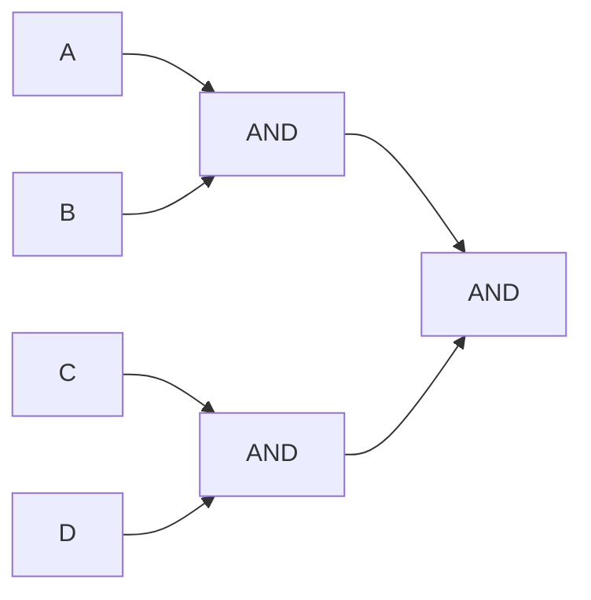
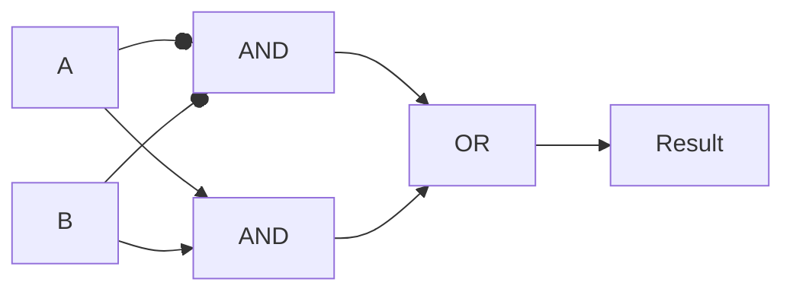
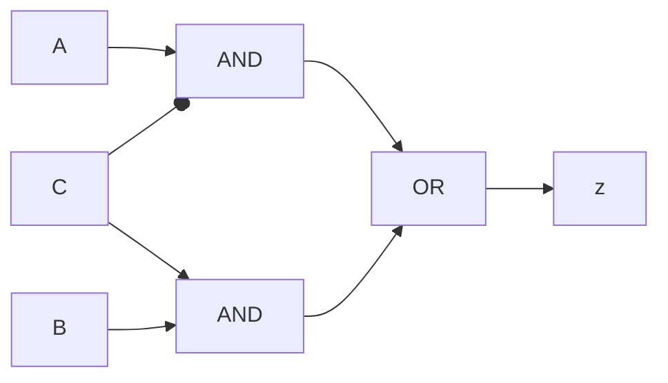
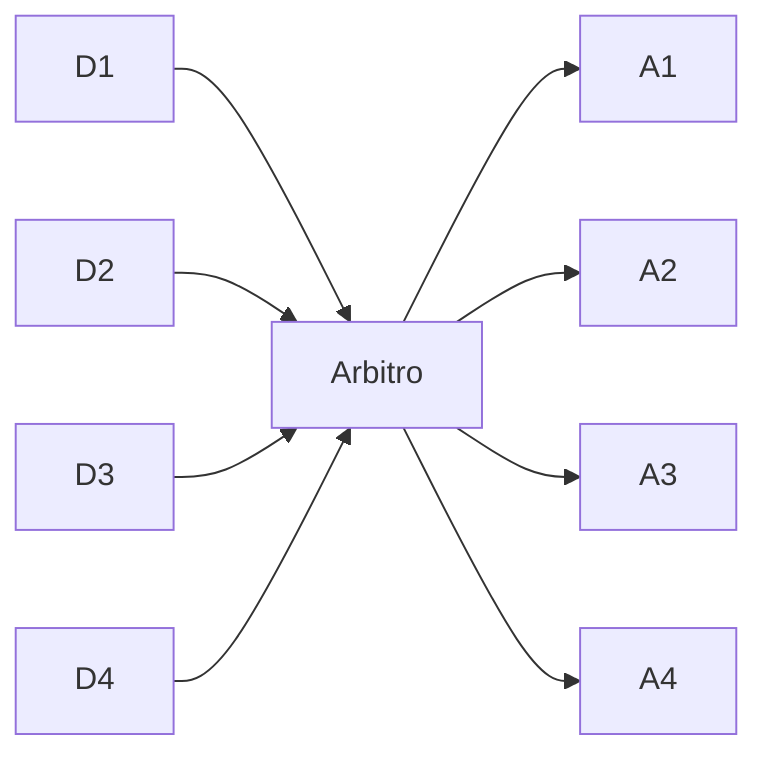
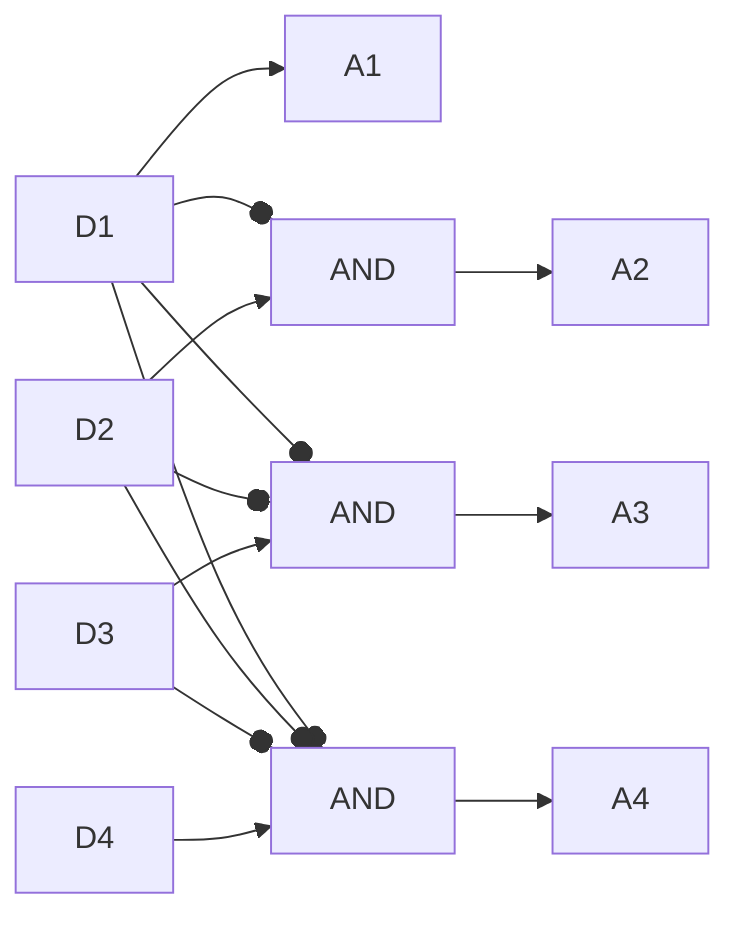
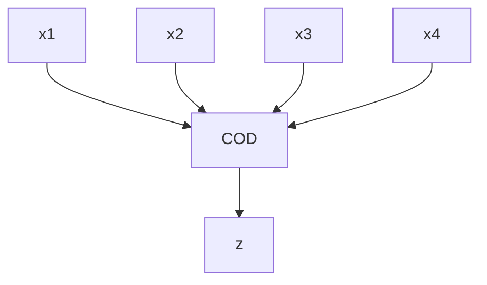

# Porte logiche

Circuito digitale in grado di implementare una particolare operazione logica di una o più variabili booleane. Usato per esempio nei [[Processore|processori]].

- $A \text{ AND } B=1 ⟺ A=1 ∧ B=1$
- $A \text{ OR } B=1 ⟺ A=1 ∨ B=1$
- $\text{NOT } A=1 ⟺ A=0$
- $A \text{ XOR } B=1 ⟺ A ≠ B ⟺ ((\text{NOT } A) \text{ AND }(\text{NOT }B)) \text{ OR } (A \text{ AND } B)=1$
![[Immagine porte logiche.png]]

Queste immagini sono semplificazioni. Vedi [[Transistor.excalidraw]].

Nota che in realtà una normale porta AND o OR supportano solo 2 ingressi. Per creare un circuito che "simula" una porta AND con 4 ingressi, usando solo AND da 2 ingressi:



Ciò causa un ritardo del doppio rispetto a fare l'AND su 2 variabili.

Senza un circuito dedicato (per fare i conti in parallelo) o una porta dedicata, il ritardo cresce in maniera esponenziale.

Per fare esercizi si fa il percorso:

Definizione funzione a parole → Tabella di verità → Espressione somma prodotti → Rete /AND/OR/NOT

## Tabella di verità XOR

| Ingresso A | Ingresso B | Uscita Z |
| --- | --- | --- |
| 0   | 0   | 1   |
| 0   | 1   | 0   |
| 1   | 0   | 0   |
| 1   | 1   | 1   |

$z=\bar{A}*\bar{B}+A*B$ cerca di ottenere 1 dalla tabella.

$z=\overline{\bar{A}B+A\bar{B}}$ cerca di ottenere 0 dalla tabella (e infine nega il risultato). Utile per situazioni in cui ci sono più risultati con 0 che con 1.

Visualizzazione grafica (i circuiti non si disegnano così):



### Esempio

Vogliamo una logica dove il risultato è 1 se solo se almeno 3 bit sono uguali a 1.

| A   | B   | C   | D   | E   | Z   |
| --- | --- | --- | --- | --- | --- |
| 0   | 0   | 0   | 0   | 0   | 0   |
| 0   | 0   | 0   | 0   | 1   | 0   |
| 0   | 0   | 0   | 1   | 0   | 0   |
| 0   | 0   | 0   | 1   | 1   | 0   |
| 0   | 0   | 1   | 0   | 0   | 0   |
| 0   | 0   | 1   | 0   | 1   | 0   |
| 0   | 0   | 1   | 1   | 0   | 0   |
| 0   | 0   | 1   | 1   | 1   | 1   |
| …   | …   | …   | …   | …   | …   |

Da quello che abbiamo finora in tabella, questa formula è giusta: $z=\bar{A}\bar{B}CDE+…$

Cerchiamo di trovare tutti i casi in cui il risultato è 1. Si può usare il simbolo $-$ per dire "don't care". (Assicurati però di non avere conflitti: per esempio, seconda riga prima colonna, il bit è 0 e non $-$.)

| A   | B   | C   | D   | E   | Z   |
| --- | --- | --- | --- | --- | --- |
| 1   | 1   | 1   | -   | -   | 1   |
| 0   | 1   | 1   | 1   | -   | 1   |
| 0   | 0   | 1   | 1   | 1   | 1   |
| 0   | 1   | 0   | 1   | 1   | 1   |

$z=ABC+\bar{A}BCD+\bar{A}\bar{B}CDE+\bar{A}B\bar{C}DE$

### Confrontare 2 numeri da 32 bit

Bisogna vedere bit a bit.

```mermaid
flowchart TB
H1 & I1 --> =1[=]
H2 & I2 --> =2[=]
...
H32 & I32 --> =N[=]
=1 & =2 & =N --> AND
```

Il costo di ritardo è:

- Il confronto di ogni bit:
	- $z=\bar{A}\bar{B}+AB$, che sono 1 livello di AND e 1 OR, quindi 2 livelli
- L'AND per tutti e 32 i bit. Se $n$ è il numero di ingressi per la porta AND, ci vogliono $\log_n32$ livelli (arrotondato per eccesso).

## Ritardo

Le operazioni nei circuiti richiedono un po' di tempo per essere eseguite, il che può far sì che i "percorsi" del circuito non siano sincronizzati come dovrebbero. Per esempio:

$z=BC+A\bar{C}$



Passando da $ABC=110$ a $ABC=111$, a causa del ritardo dell'operazione $NOT$ (nell'$AND$ sopra) si ha un breve periodo in cui $C=0$ e $\bar{C}=0$, rendendo il risultato $0$ (nonostante dovrebbe essere $1$).

![[Wave.png]]

# TODO: La registrazione ha fatto ciao ciao

## Multiplexer

^b31833

![[Multiplexer.png]]

Abbiamo diversi dispositivi D1-D4 che mandano un segnale. Se il segnalo che Di manda è uguale a 1, allora Ai diventa 1 a gli altri diventano 0. D1-D4 mandano il segnalo contemporaneamente, e un arbitro fa sì che il Di con i più basso abbia priorità con il segnale 1.



| # Combinazioni | D1  | D2  | D3  | D4  | A1  | A2  | A3  | A4  |
| --- | --- | --- | --- | --- | ---: | ---: | ---: | ---: |
| 1   | 0   | 0   | 0   | 0   | 0   | 0   | 0   | 0   |
| 8   | 1   | -   | -   | -   | 1   | 0   | 0   | 0   |
| 4   | 0   | 1   | -   | -   | 0   | 1   | 0   | 0   |
| 2   | 0   | 0   | 1   | -   | 0   | 0   | 1   | 0   |
| 1   | 0   | 0   | 0   | 1   | 0   | 0   | 0   | 1   |

Totale = 16

$$
A_1=D_1 \\
A_2=\bar{D_1}D_2 \\
A_3=\bar{D_1}\bar{D_2}D_3 \\
A_4=\bar{D_1}\bar{D_2}\bar{D_3}D_4
$$



## DeMultiplexer

![[DeMultiplexer.png]]

Manda l'ingresso su 1 delle $2^k$ uscite

```
if (ctl==0) then {z1=a; z2=0} else {z1=0; z2=a;}
```

Esempio con 1 bit di controllo:

| $ctl$ | $a$ | $z_1$ | $z_2$ |
| ---- | --- | ----- | ----- |
| 0    | 0   | 0     | 0     |
| 0    | 1   | 1     | 0     |
| 1    | 0   | 0     | 0     |
| 1    | 1   | 0     | 1     |

Semplificata (niente risultato 0):

| $ctl$ | $a$ | $z_1$ | $z_2$ |
| ---- | --- | ----- | ----- |
| 0    | 1   | 1     | 0     |
| 1    | 1   | 0     | 1     |

$z_1=\overline{ctl}*a \quad z_2=ctl*a$

Esempio con 2 bit di controllo (semplificato):

| $ctl_1$ | $ctl_0$ | $a$   | $z_1$ | $z_2$ | $z_3$ | $z_4$ |
| ------- | ------- | --- | ----- | ----- | ----- | ----- |
| 0       | 0       | 1   | 1     | 0     | 0     | 0     |
| 0       | 1       | 1   | 0     | 1     | 0     | 0     |
| 1       | 0       | 1   | 0     | 0     | 1     | 0     |
| 1       | 1       | 1   | 0     | 0     | 0     | 1     |

## Codificatore

Abbiamo $2^k$ bit, di cui solo 1 è uguale a 1.

Esempio con $k=2$ (4 ingressi):



| $x_1$ | $x_2$ | $x_3$ | $x_4$ | $z_1$ | $z_0$ |
| ----- | ----- | ----- | ----- | ----- | ----- |
| 0     | 0     | 0     | 1     | 0     | 0     |
| 0     | 0     | 1     | 0     | 0     | 1     |
| 0     | 1     | 0     | 0     | 1     | 0     |
| 1     | 0     | 0     | 0     | 1     | 1      |

$z_1=\bar{x_1}x_2\bar{x_3}x_4+x_1\bar{x_2}\bar{x_3}\bar{x_4} \quad z_0=\bar{x_1}\bar{x_2}x_3\bar{x_4}+x_1\bar{x_2}\bar{x_3}\bar{x_4}$

