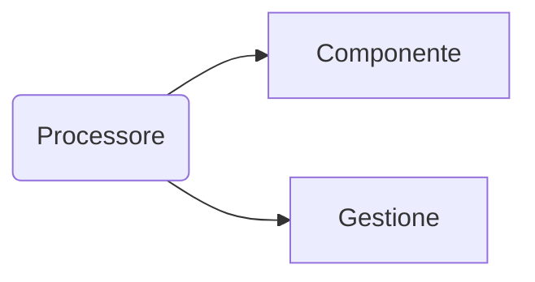
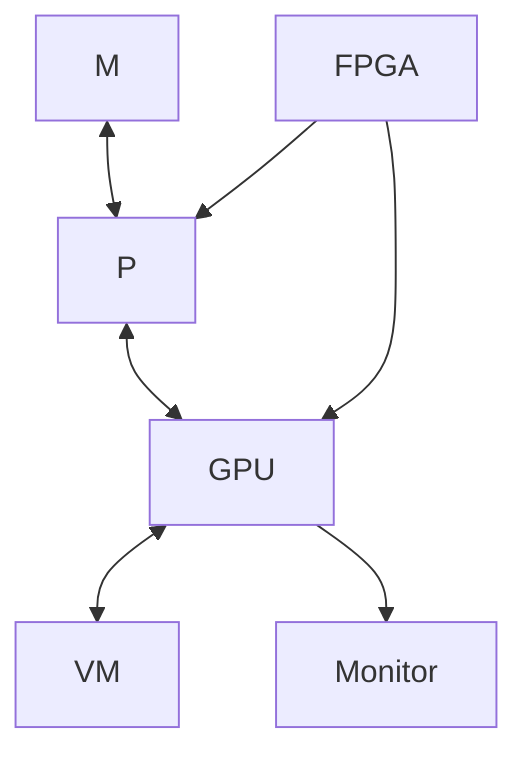

# Processore

**Entità che permette di fare dei calcoli.**



## Modello Von Neumann

^3ae1d1

Implementazione fisica della [[macchina di Turing]].

Concetti chiave:
- Memoria
- Stato

M ↔ P (Memoria e Processore)

```
while (true) {
    **fetch** prelievo istruzione in M dall'indirizzo **PC** (Program Counter)
    **decode** decodifica -> azioni
    **exec** azioni -> eseguiamo
    aggiorniamo **PC**
    (interruzioni)
}
```

Grazie a questa possiamo fare:
- Aritmetica e logica (CPU)
- Scrivere e leggere memoria (memoria, registri, ...).

### Von Neumann bottleneck

Quando decode/exec è più veloce di fetch.

## Transistor

https://www.youtube.com/watch?v=HqhE-8xXeCQ

| Clock | Dimensioni | Componenti |
|-------|------------|------------|
| Khz   | 10 um      | 1000       |
| Ghz   | 4 nm       | 1000000    |

"Giocare" con transistor più piccoli è più veloce (gli elettroni entrano/escono più velocemente)

Vedi [[Transistor.excalidraw]]

### Legge Moore

> Ogni 18 mesi le prestazioni raddoppiano
\- Gordon Moore


Ha smesso di essere vera da inizio anni 2000: gli elettroni per resistenza scaldano il transistor.

È il motivo per cui i processori di oggi sono multi-core.

Dobbiamo cambiare il modo in cui i processori (e di conseguenza i programmi) vanno pensati.

### Acceleratori

#### GPU

Processore che è specializzato per la grafica.

È collegato alla CPU con un bus V0, ha una propria memoria.

### CPU/Chip

Contiene

- Memoria
- GPU
- Processore
- FPGA (field-programmable gate array)
- DMA
- Bus

**SoC** System on Chip


