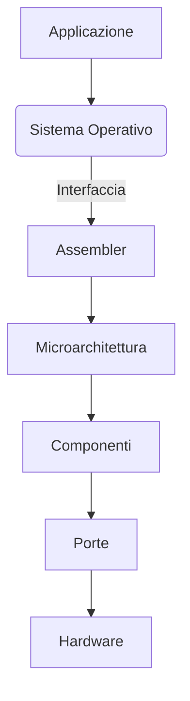

# Livelli

## Gerarchia

$\frac{L_i}{L_{i-1}}$

```mermaid
flowchart TB
Applicazione --> S("Sistema Operativo") --> |Interfaccia| Assembler --> Microarchitettura --> Componenti --> Porte --> Hardware
```

- **Modularità**

- **Regolarità**

Vedere [[Bit]]