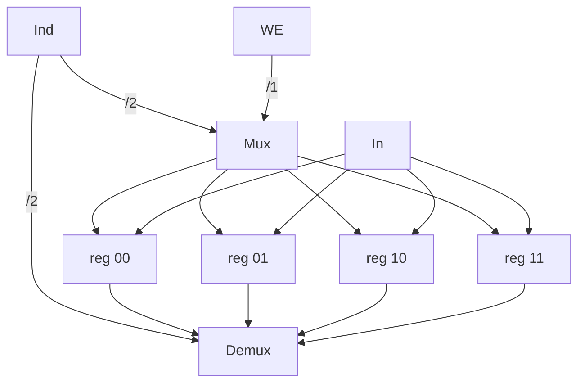

# Memoria

Vettore di parole (da 32 bit)
- `write(i,x)` scrivi nell'indirizzo `i` il contenuto `x`
- `read(i)` leggi il contenuto nell'indirizzo `i`

Esempio: `write(2, 12)`
- `In=1100` (che finisce su tutti gli ingressi dei registri)
- `Ind=10`, quindi `reg 10` sarà l'unico a ricevere `WE=1` (Write Enable), mentre tutti gli altri lo hanno a 0
- L'`OUT` di `Demux` è il contenuto di `reg 10`, quindi `1100`

Esempio in [[Verilog]]:
```verilog
reg[3:0] M[3:0];

assign out = M[IND];

always@(posedge clock)
    if(WE) M[IND]=IN;
```

Esempio implementazione:



Questo è estremamente costoso, soprattutto con così tanti registri. Inoltre, dato che i [[Porte logiche#^b31833|Multiplexer]] costano più dei [[Porte logiche#^5e85c1|Demultiplexer]], leggere richiede più tempo che scrivere.

Altro design:
![[Design memoria.excalidraw]]

Le bitline restituiscono i bit incidenti alla wordline corrispondente a `Ind`. Se le bitline sono accese, il bit viene anche scritto, se sono spente viene solo letto.

Questo design è di solito usato per le RAM: Random Access Memory
- Dinamiche
	- Va "rinfrescato" (leggendolo) periodicamente
- Statiche
	- Mantiene l'informazione se alimentato

(Implementazioni non disegnate qui)