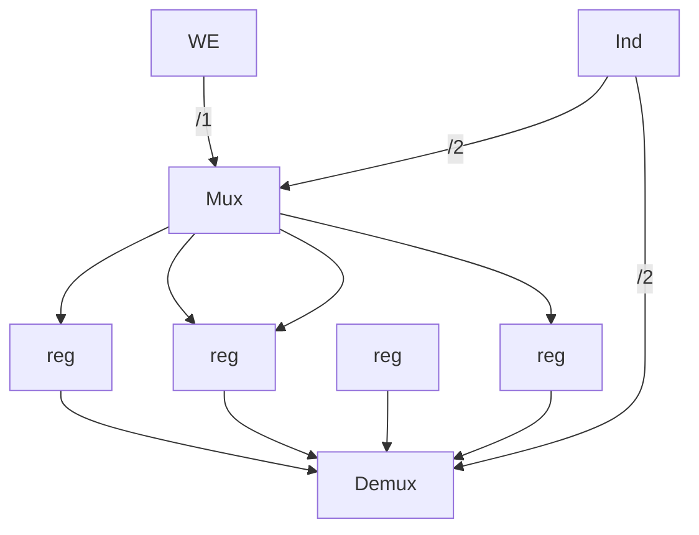

# Memoria

Vettore di parole (da 32 bit)
- `write(i,x)` scrivi nell'indirizzo `i` il contenuto `x`
- `read(i)` leggi il contenuto nell'indirizzo `i`

Implementazione TODO:



Questo è estremamente costoso, soprattutto con così tanti registri. Inoltre, dato che i [[Porte logiche#^b31833|Multiplexer]] costano più dei [[Porte logiche#^5e85c1|Demultiplexer]], leggere richiede più tempo che scrivere.

Altro design TODO:

```mermaid
flowchart LR

```

RAM: Random Access Memory
- Dinamiche
	- Va "rinfrescato" (leggendolo) periodicamente
- Statiche
	- Mantiene l'informazione se alimentato

TODO