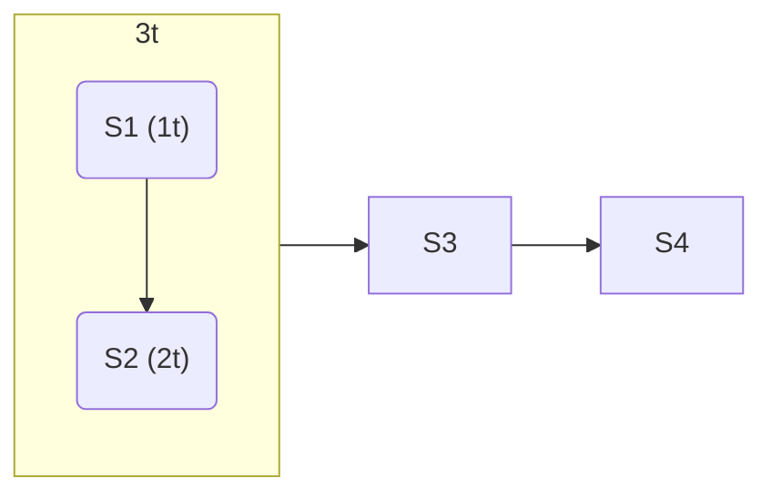

# Parallelismo

Se bisogna fare tre operazioni che richiedono una certa quantità di tempo ciascuno:
```
|-----|---|----|
```

**Parallelismo spaziale**: sarebbe più veloce poterle fare contemporaneamente:
```
|-----|
|---|
|----|
```

**Parallelismo temporale**: se non si può fare queste operazioni contemporaneamente, si può fare su entità diverse (immagina di preparare una torta, che ha bisogno di forno e poi altri operazioni, ma si ha un solo forno. Stile catena di montaggio):
```
 Forno
|-----|---|----|
       Forno
      |-----|---|----|
```

Il parallelismo spesso richiede risorse extra (*overhead*) rispetto alla teoria:
- Il tempo di startup (per esempio, si distribuisce il lavoro ai vari worker)
- Il tempo di raccolta (per esempio, dopo una somma fatta in parallelo, bisogna sommare le varie parti finali)

Misure primitive:
- Latenza
- Tempo di servizio (banda)

Dati:
- $nw$ numero di workers
- $k$ numero di stadi
- $m$ numero di task 
	- Di solito $m>>k$

Speedup: $sp(nw)=\cfrac{T_{miglior\_sequenziale}}{T_{parallelo(nw)}}=\cfrac{m(∑t_i)}{m(\max\{t_i\})}=\cfrac{∑t_i}{\max\{t_i\}}$

## Pipeline processore

```
--> F --> D --> E --> WB -->
   tf=1  td=2  te=3  twb=2
```

Latenza $L=t_f+t_d+t_e+t_{wb}$

Con 4 stadi ($F, D, E ,WB$), abbiamo $k=4$.

Il tempo di servizio si allinea sullo stadio più lungo. Con $m=3$:

```
>>> tf
 ->->-> td
   -->-->--> te
      -> -> -> twb
```

- $T_{servizio}=\max\{t_f,t_d,t_e,t_{wb}\}$
- $sp(nw)=4⇔nw≥4$

Più genericamente:
```
    f1     f2     f3     f4
--> s1 --> s2 --> s3 --> s4 -->
    t1     t2     t3     t4
```

- $t_i$: latenza di $f_i$
- $L=∑\limits_{i=i}^4 t_i$
- $T_{completamento}=∑t_i+(m-1)\max\{t_i\}$
	- $T_C≅m(T_s)$
- $T_{servizio}=\max\{t_i\}$

Si può aumentare l'efficienza combinando diversi stati TODO:

