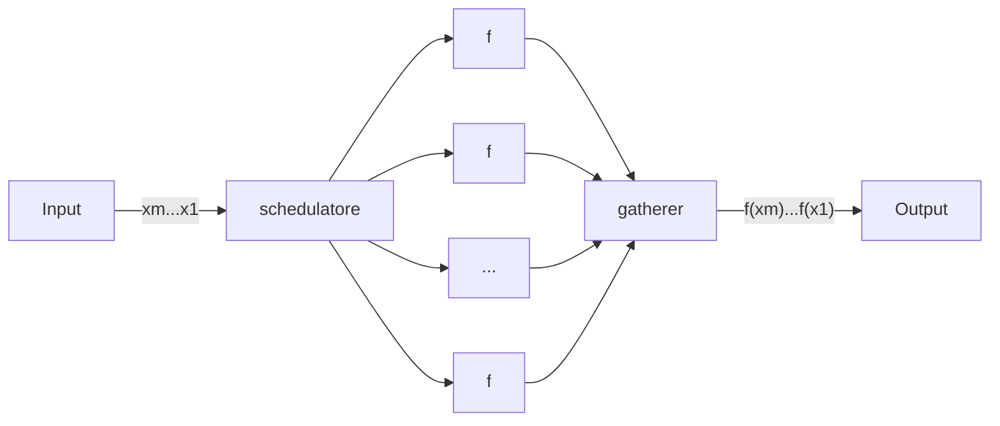

# Parallelismo

Se bisogna fare tre operazioni che richiedono una certa quantità di tempo ciascuno:
```
|-----|---|----|
```

**Parallelismo spaziale**: sarebbe più veloce poterle fare contemporaneamente:
```
|-----|
|---|
|----|
```

**Parallelismo temporale**: se non si può fare queste operazioni contemporaneamente, si può fare su entità diverse (immagina di preparare una torta, che ha bisogno di forno e poi altri operazioni, ma si ha un solo forno. Stile catena di montaggio):
```
 Forno
|-----|---|----|
       Forno
      |-----|---|----|
```

Il parallelismo spesso richiede risorse extra (*overhead*) rispetto alla teoria:
- Il tempo di startup (per esempio, si distribuisce il lavoro ai vari worker)
- Il tempo di raccolta (per esempio, dopo una somma fatta in parallelo, bisogna sommare le varie parti finali)

Misure primitive:
- Latenza
- Tempo di servizio (banda)

Dati:
- $nw$ numero di workers
- - $t_i$: latenza dello stadio $i$
- $k$ numero di stadi
- $m$ numero di task

Speedup: $sp(nw)=\cfrac{T_{miglior\_sequenziale}}{T_{parallelo(nw)}}=\cfrac{m(∑t_i)}{m(\max\{t_i\})}=\cfrac{∑t_i}{\max\{t_i\}}$

## Pipeline processore

```
--> F --> D --> E --> WB -->
   tf=1  td=2  te=3  twb=2
```

Latenza $L=t_f+t_d+t_e+t_{wb}$

Con 4 stadi ($F, D, E ,WB$), abbiamo $k=4$.

Il tempo di servizio si allinea sullo stadio più lungo. Con $m=3$:

```
>>> tf
 ->->-> td
   -->-->--> te
      -> -> -> twb

|------|-----|
   L   (m-1)Ts
```

- $T_{servizio}=\max\{t_f,t_d,t_e,t_{wb}\}$

### Genericamente

```
 Input      f1     f2     f3     f4     Output
xm...x1 --> s1 --> s2 --> s3 --> s4 -->
            t1     t2     t3     t4
```

- $L=∑\limits_{i=i}^4 t_i$
- $T_{servizio}=\max\{t_i\}$
- $T_{completamento}=∑\limits_{i=i}^4 t_i+(m-1)\max\{t_i\}$
	- Di solito nel mondo reale $m>>k$, quindi $T_C≈m(T_S)$
- $t_i$: latenza di $f_i$

Si può aumentare l'efficienza facendo lavorare più stati adiacente a uno stesso worker. Per esempio:


Lo speedup non è cambiato, in quanto $T_S$ è uguale. In questo modo $T_C$ rimane quasi uguale, però la latenza peggiora.

Questo è un caso particolare. Se per esempio $t=\{2,2,3,1\}$, avere meno di 4 worker può solo peggiorare $T_S$. Tuttavia, 2 o 3 worker hanno lo stesso miglior $T_S$ (cioè 4), quindi non è così semplice.

Il tempo per eseguire le funzioni può inoltre essere variabile per diversi motivi (es. ambientali). Nelle pipeline si mette quindi un registro tra le varie reti combinatorie, così che ciascuna aspetti che il segnale di clock (uguale per tutti) vada alto e non si metta a leggere durante la scrittura.

### Farm



Si può considerare come una pipeline di 3 stadi.

$T_S=\max\{t_{sched},t_f,t_{gath}\}$

Per le massime performance, dato $t_e$ come il tempo per assegnare un lavoro, ci bastano $nw≥\cfrac{t_f}{t_e}$. Qui si può vedere che dopo ogni $t_f$, lo scheduler è riuscito a dare lavoro a $nw$ lavoratori prima che uno spazio si liberasse, togliendo la necessità di lavoratori in più:
```
          > Il primo lavoratore ha finito
|-|-|-|-|-|-|-|-| sched
  |-------|-------| f
    |-------|-------| f
      |-------|-------| f
        |-------|-------| f
          |-|-|-|-|-|-|-|-| gath
```

$T_C=nw*t_e+\cfrac{m}{nw}t_f+t_{gath}$