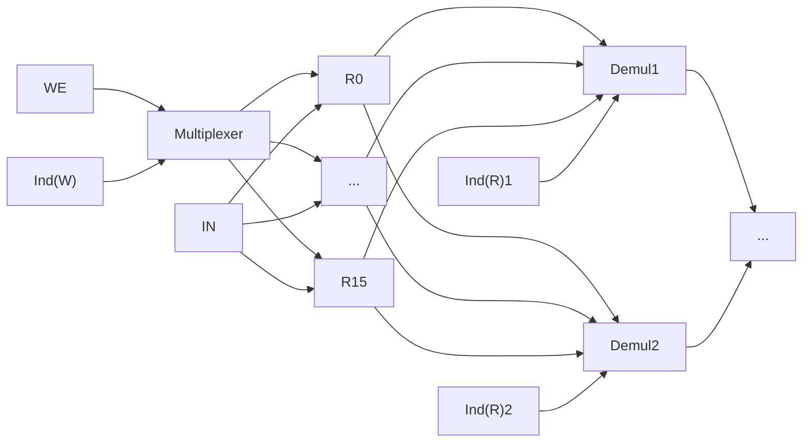

Insieme di componenti hardware che implementano un interprete per un certo ISA (per esempio [[Assembly|ARMv7]]).

Deve essere implementato a livello hardware:

```
while (true) {
    fetch
    decode
    execute
    WB
}
```

Più gli stati necessari (come PC e REG).

Esempio implementazione [[Memoria]]:



Bisogna anche implementare un **ALU** (Arithmetic Logic Unit), che deve anche setta il .