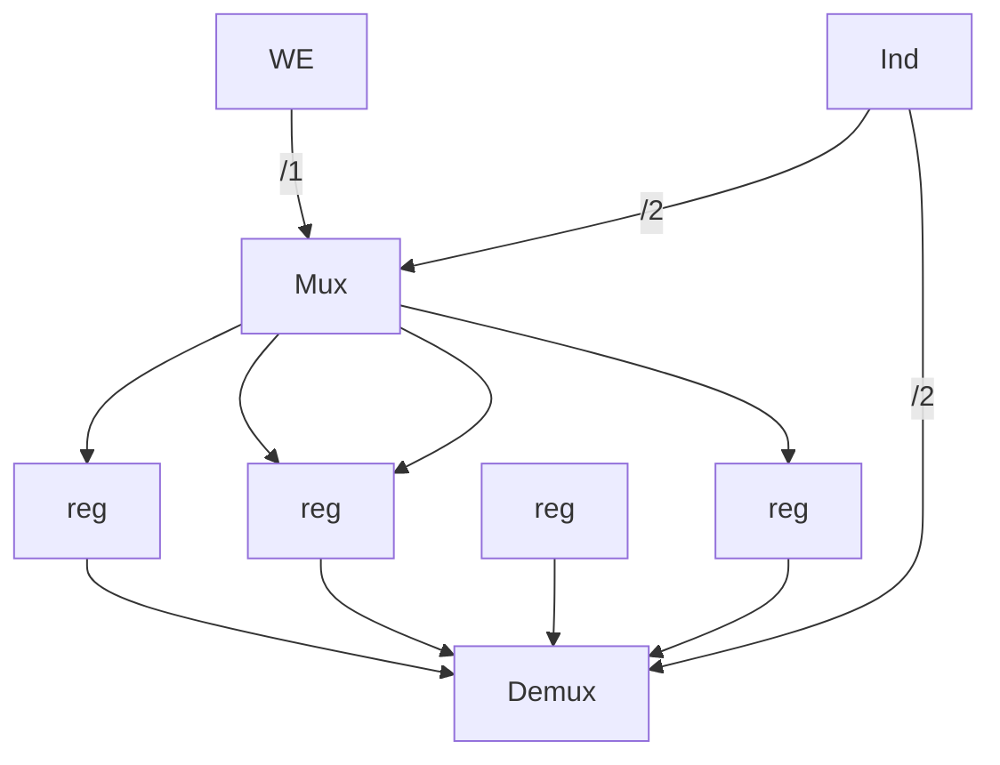

# Memoria

Vettore di parole (da 32 bit)
- `write(i,x)` scrivi nell'indirizzo `i` il contenuto `x`
- `read(i)` leggi il contenuto nell'indirizzo `i`

Implementazione TODO:

Questo è incridebilmente costoso. Dato che i [[Porte logiche]] costano più dei 