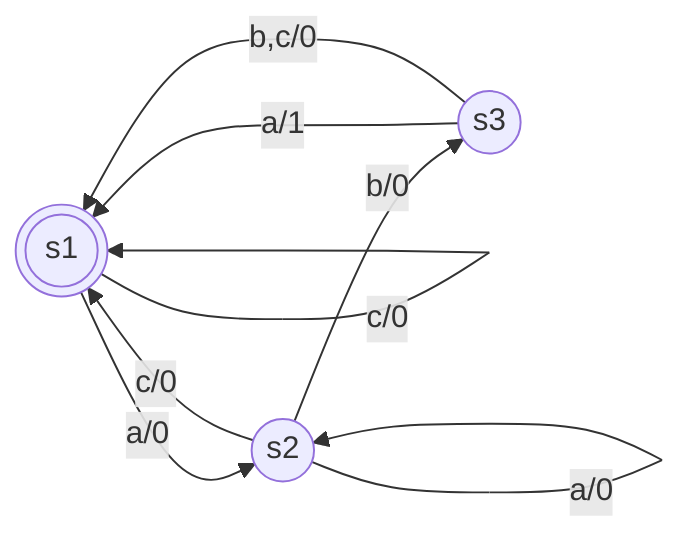
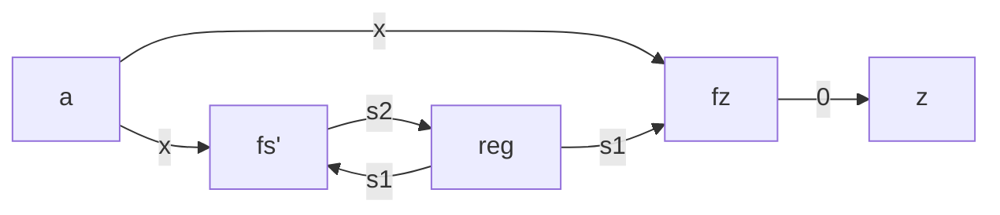
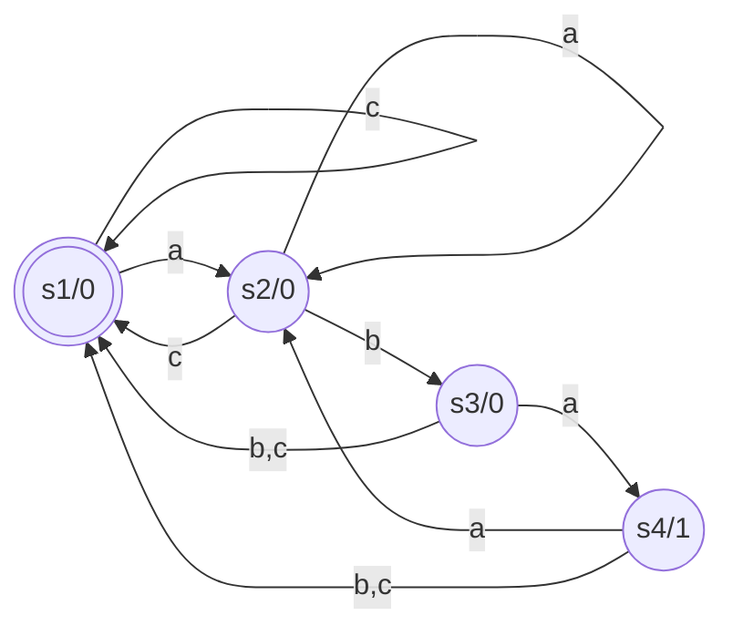

# Automi

- Automa di Mealy
	- $z=f_z(s,x)$
	- $s'=f_s(s,x)$
- Automa di Moore
	- $z=f_z(s)$
	- $s'=f_s(s,x)$

Entrambi gli automi hanno bisogno di un registro per memorizzare lo stato.

Vediamoli per riconoscere `aba` (alfabeto $\{a,b,c\}$) , in una stringa (come `abcabbaba`).

## Mealy

Con il carattere ($\{a,b,c\}$) rappresentato dai bit $x_1x_0$, lo stato corrente da $b_1b_0$, il nuovo stato da $b_1'b_0'$, e il valore di riporto (quello a destra dello `/`) con $z$:

| $x_1x_0$ | $b_1b_0$ | $b_1'b_0'$ |
| -------- | -------- | ---------- |
| 00       | 00       | 01         |
| 01       | 00       | 00         |
| 10       | 00       | 00         |
| 00       | 01       | 01         |
| 01       | 01       | 10         |
| 10       | 01       | 00         |
| 00       | 10       | 00         |
| 01       | 10       | 00         |
| 10       | 10       | 00         |

$b_1'=\bar{x_1}x_0\bar{b_1}b_0$

$b_0'=\bar{x_1}\bar{x_0}\bar{b_1}\bar{b_0}+\bar{x_1}\bar{x_0}\bar{b_1}b_0$

$f_z$

| $x_1x_0$ | $b_1b_0$ | $z$ |
| -------- | -------- | --- |
| 00       | 10       | 1   |

$z=\bar{x_1}\bar{x_0}b_1\bar{b_0}$

## Moore

$z=b_1b_0$

| $x_1x_0$ | $b_1b_0$ | $b_1'b_0'$ |
| -------- | -------- | ---------- |
| 00       | 00       | 01         |
| 01       | 00       | 00         |
| 10       | 00       | 00         |
| 00       | 01       | 01         |
| 01       | 01       | 10         |
| 10       | 01       | 00         |
| 00       | 10       | 11         |
| 01       | 10       | 00         |
| 10       | 10       | 00         |
| 00       | 11       | 01         |
| 01       | 11       | 00         |
| 10       | 11       | 00         | 

%%
$b_1'=\bar{x_1}x_0\bar{b_1}b_0+\bar{x_1}\bar{x_0}b_1\bar{b_0}$

$b_0'=\bar{x_1}\bar{x_0}$
%%

TODO: Riguardare seconda parte