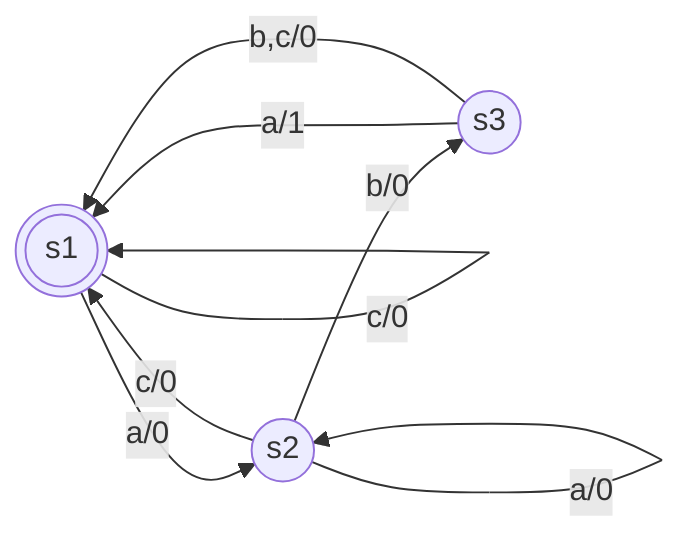
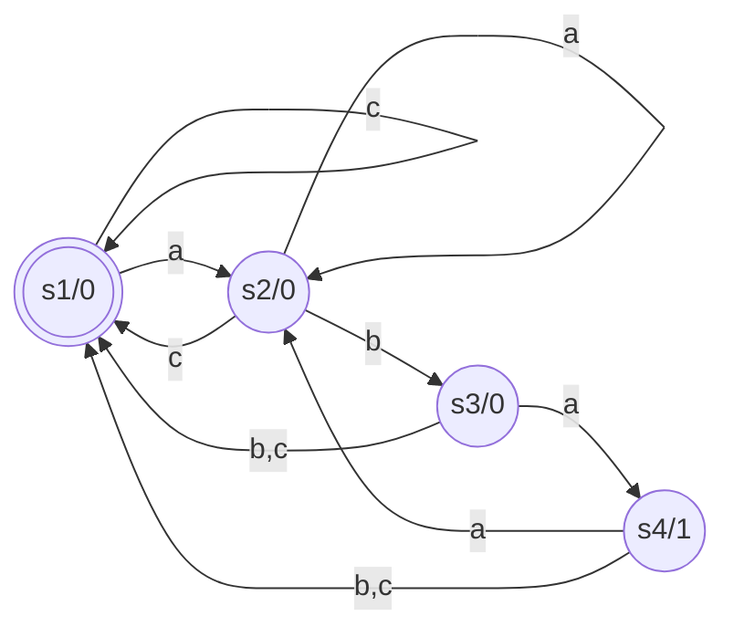

# Automi

Riconosce `aba` (alfabeto $\{a,b,c\}$) in `abcabbaba`

- Automa di Mealy
	- $z=f_z(s,x)$
	- $s'=f_s(s,x)$
- Automa di Moore
	- $z=f_z(s)$
	- $s'=f_s(s,x)$

Entrambi gli automi hanno bisogno di un registro per memorizzare lo stato.

## Mealy

## Moore

