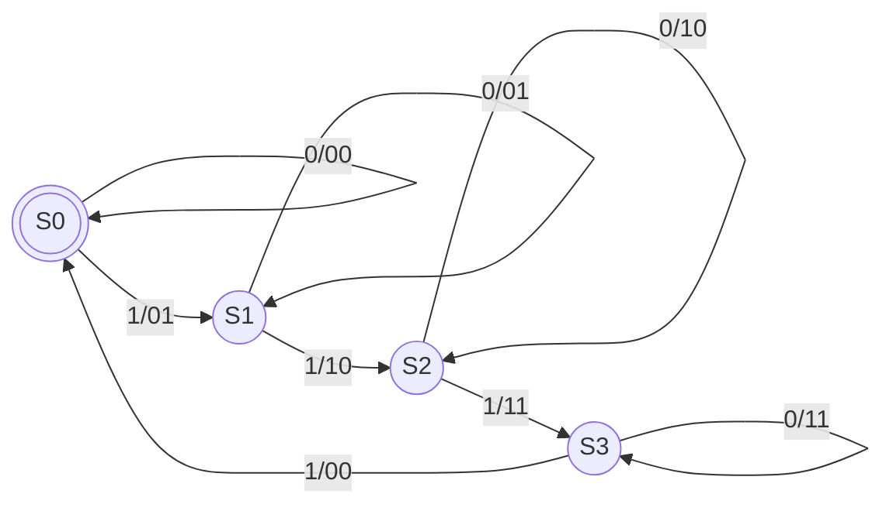
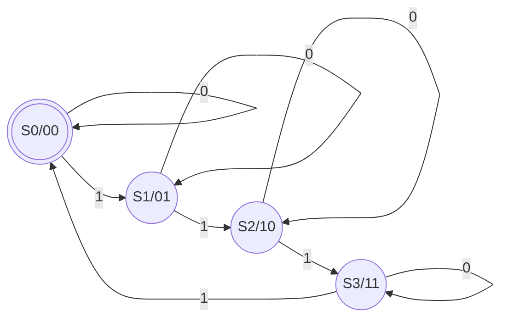

# Esercizio contatore

## Approccio strutturale

- Definiamo una codifica per i simboli di entrata e di uscita
- Costruiamo una macchina a stati finiti
- Deriviamo la tabella di verità delle transizioni di stato e delle uscite
- Ricaviamo la formula combinatorie per le uscite e per lo stato ovvero implementiamo un modulo Verilog per le uscite e per lo stato
- Determiniamo il numero di registri necessari in base agli stati da memorizzare, ovvero implementiamo un modulo registro in Verilog
- Connettiamo le reti combinatorie per realizzare la rete sequenziale, ovvero creiamo un `module` con componenti `wire` che invoca opportunamente gli altri moduli e definiamo il `module` `test`

Quindi:
- Ingressi $I=\{0,1\}$ Uscite $U=\{00,01,10,11\}$ Stati $S=\{S0,S1,S2,S3\}$
- Costruiamo la macchina a stati finiti

### Automa di Mealy



### Automa di Moore



### Tabella di verità

| $S1_{old}$ | $S0_{old}$ | $X$ | $S1_{new}$ | $S0_{new}$ | $Z1$ | $Z0$ |
| ---------- | ---------- | --- | ---------- | ---------- | ---- | ---- |
| 0          | 0          | 0   | 0          | 0          | 0    | 0    |
| 0          | 0          | 1   | 0          | 1          | 0    | 1    |
| 0          | 1          | 0   | 0          | 1          | 0    | 1    |
| 0          | 1          | 1   | 1          | 0          | 1    | 0    |
| 1          | 0          | 0   | 1          | 0          | 1    | 0    |
| 1          | 0          | 1   | 1          | 1          | 1    | 1    |
| 1          | 1          | 0   | 1          | 1          | 1    | 1    |
| 1          | 1          | 1   | 0          | 0          | 0    | 0    |

$Z0=\bar{S0}X+S0\bar{X}$

$Z1=\bar{S1}S0X+S1\bar{S0}+S1S0\bar{X}$

### [[Verilog]]

```Verilog
module statouscita(output [1:0]z, input [1:0]s, input x);
    assign z[0] = (~s[0] & x) | (s[0] & ~x);
    assign z[1] = (~s[1] & s[0] & x) | (s[1] & ~s[0]) | (s[1] & s[0] & ~x);
endmodule
```

Ci serve un modulo registro a due bit per memorizzare $S$:

```Verilog
module registro(output [N-1:0]z, input [N-1:0]inval, input we, input clock);
    parameter N=2;

    reg[N-1:0] S;

    initial
        begin
            S = 2'b00;
        end

    always @(posedge clock)
        begin
            if (we==1) S = inval;
        end

    assign z = S;
endmodule
```

Infine ci verve un modulo che fa il wiring dei moduli e dei registri

```Verilog
module countermod4(output [N-1:0]z, input x, input clock);
    parameter N=2;

    wire [N-1:0] rin;
    wire [N-1:0] rout;

    registro #(N) regs(rout, rin, 1'b1, clock);
    statouscita newst(rin, rout, x);
    assign
        z = rin;
endmodule
```

Ora ci mancano solo i testbench.

## Approccio behavioral

Si programma direttamente la rete sequenziale utilizzando assegnamenti, blocchi `always`, `if-then-else`, `generate`...

```Verilog
module countermod4(output [1:0]z, input x, input clock);
    reg [1:0] s, news;

    initial begin
        s <= 0;
        news <= 0;
    end

    always @(posedge clock)
        s <= news;

    always @(x,s)
        news <= s+x;

    assign
        z = news;
endmodule
```