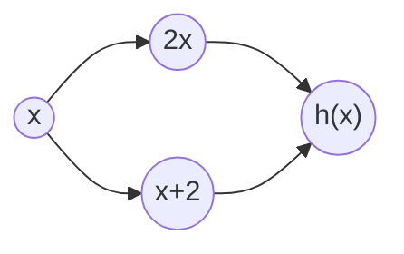
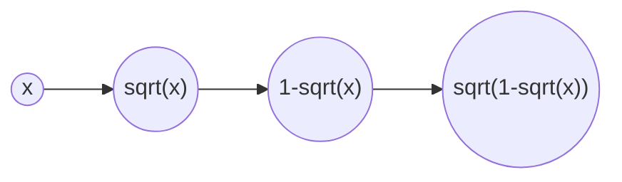

Dobbiamo interagire con queste funzioni, che insieme porteranno a un errore più grande che individualmente.

$g(x)=\log(x+1)$

$f(x)=\frac{2x}{x+2}\quad -\frac{1}{2}≤x≤0$

Errore analitico di approssimazione $ε_{AN}=|\frac{f(x)-g(x)}{g(x)}|$

Si può vedere quanto sono simili tra loro con lo sviluppo di Taylor (nessuna delle due ora è un polinomio).

Con $x_0=0$. L'ultimo pezzo è il *resto di Lagrange*.

$g(x)=g(0)+g'(0)x+\frac{g''(0)}{2}x^2+\frac{g'''(ξ)}{6}x^3\quad |ξ|<|x|$
- $g'(x)=\frac{1}{x+1}$
- $g''(x)=-\frac{1}{(x+1)^2}$
- $g'''(x)=\frac{2}{(x+1)^3}$
$g(x)=0+x-\frac{x^2}{2}+\frac{1}{(ξ+1)^3}\frac{x^3}{3}$

$f(x)=f(0)+f'(0)x+\frac{f''(0)}{2}x^2+\frac{f'''(η)}{6}x^3\quad |η|<|x|$
- $f'(x)=\frac{2(x+2)-2x}{(x+2)^2}=\frac{4}{(x+2)^2}$
- $f''(x)=-\frac{8}{(x+2)^3}$
- $f'''(x)=\frac{24}{(x+2)^4}$
$f(x)=0+x-\frac{x^2}{2}+\frac{4}{(η+2)^4}x^3$

Vogliamo diminuire il più possibile l'errore.

$|f(x)-g(x)|=|\frac{x^3}{3}(\frac{12}{(η+2)^4}-\frac{1}{(ξ+1)^3})|$

La funzione ha valore più grande con $ξ=η=-\frac{1}{2}$ (le due frazioni sono decrescenti tra $-\frac{1}{2}≤x≤0$):

$≤\frac{|x^3|}{3}(\frac{12}{(-\frac{1}{2}+2)^4}+\frac{1}{(-\frac{1}{2}+1)^3})≤\frac{|x^3|}{3}(\frac{12·2^4}{3^4}+2^3)=\frac{|x^3|}{3}8(\frac{8}{27}+1)<\frac{16}{3}|x^3|$

E con questo abbiamo il limite dell'errore assoluto. Ci vuole quello relativo.

$|\frac{f(x)-g(x)}{g(x)}|≤\frac{16}{3}\frac{|x^3|}{|\log(x+1)|}=\frac{16}{3}\frac{x^2}{|\frac{\log(1+x)}{x}|}<\frac{16}{3}\frac{1}{4}=\frac{4}{3}$

## Condizionamento del calcolo

$ε_{IN}=\frac{f(\tilde{x})-f(x)}{f(x)}$

$\tilde{x}=x(1+ε_x)\quad |ε_x|<u$

$C_x=\frac{x}{f(x)}f'(x)=\frac{x(x+2)}{2x}·\frac{4}{(x+2)^2}=\frac{2}{x+2} \quad -\frac{1}{2}≤x≤0$

$|C_x|=|\frac{2}{x+2}|≤\frac{4}{3}$

$|ε_{IN}|≤\frac{4}{3}u$

### Stabilità

$h(x)=(2⊗︀x)⊘(x⊕2)$

$ε_{alg}=ε_2+1δ^{(1)}+1δ^{(2)}=ε_2-ε_1$
($ε_1$ è l'errore di $x+2$)

$|ε_{alg}|≤|ε_2|+|ε_1|≤2u$

---

$f(x)=\sqrt{1-\sqrt{x}}\quad x≥0$

Supponiamo di avere una funzione di libreria `sqrt` che ha un errore $<u$:

$|\frac{sqrt(x)-\sqrt{x}}{\sqrt{x}}|<u \quad ∀x$

$|ε_{IN}|=|\frac{x}{\sqrt{1-\sqrt{x}}}·\frac{1}{2\sqrt{1-\sqrt{x}}}(-\frac{1}{2}\frac{1}{\sqrt{x}})||ε_x|=|-\frac{1}{4}\frac{\sqrt{x}}{1-\sqrt{x}}||ε_x|$

Il problema è malcondizionato $x→1^-$

