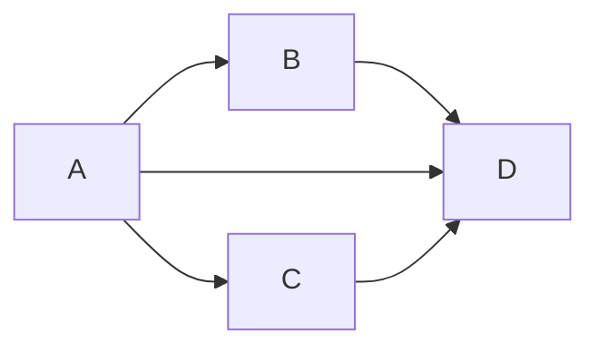

$$
p(x)=x^2+3x+6 \\
(=\lambda x.x^2+3x+6)5 \\
=5^2+3*5+6
$$

In Javascript sarebbe:

```javascript
function foo(x) {
    return x*x+3*x+6;
}
foo(a);
```

## Sostituzioni

Cosa vuol dire $t[s/x]$?

È il termine ottenuto sostituendo tutte le occorrenze *libere* di $x$ in $t$ con $s$.

- $x[s/x]=s$
- $y[s/x]=y \quad (y \neq x)$
- $(tu)[s/x]=t[s/x]u[s/x]$
- $(\lambda x.t)[s/x]=\lambda x.t$
- $(\lambda y.t)[s/x]=\lambda y.t[s/x]$

### Problema

Questo *non* è vero: $\lambda x.t \equiv \lambda y.t[y/x]$

Esempio: $(\lambda x.y)[x/y]=\lambda x.x$

Non dobbiamo consentire alla funzione di catturare variabili.

### Due casi

- $(\lambda x.t)[s/x]= \lambda x.t$
- $(\lambda y.t)[s/x]=\lambda y.t[s/x] \quad (\text{se } y \not \in FV(s))$
- $(\lambda y.t)[s/x]=(\lambda z.t[z/y])[s/x]=\lambda z.t[z/y][s/x] \quad (\text{se } z \not \in FV(t) \land z \not \in FV(s))$

### Esercizi

- $(\lambda y.x)[y/x]=(\lambda z.x[z/y])[y/x]=(\lambda z.x)[y/x]=\lambda z.y$
- $(\lambda y.x (\lambda w.vwx))[uv/x]=\lambda y.x[uv/x](\lambda w.vwx)[uv/x]=\lambda y.uv(\lambda w.(vwx)[uv/x]))=\lambda y.uv(\lambda w.vwuv)$
- $(\lambda y.x (\lambda x.x))[\lambda y.xy/x]=\lambda y.x[\lambda y.xy/x](\lambda x.x)[\lambda y.xy/x]=\lambda y.\lambda y.xy(\lambda x.x)$
- $(\lambda x.zy)[uv/x]=\lambda x.zy$

## $\alpha$-conversione

$$
\frac{}{\lambda x.t =_\alpha \lambda y.t[y/x]} \quad (x \not \in FV(t))
$$

Formalmente, la relazione $=_\alpha \subseteq \Lambda \times \lambda$

$$
\frac{}{t=_\alpha t} \text{ riflessiva} \quad \frac{t=_\alpha s}{s=_\alpha t} \text{ simmetrica} \quad \frac{t=_\alpha s \quad s=_\alpha u}{t=_\alpha u} \text{ transitiva}
$$

$$
\frac{t=_\alpha t' \quad s=_\alpha s'}{ts=_\alpha t's'} \quad \frac{t=_\alpha s}{\lambda x.t=_\alpha \lambda x.s}
$$

### Esempi

- `function succ(x) {x+1}` $=_\alpha$ `function succ(y) {y+1}`
- $\lim\limits_{x \to +\infty} e^{-x}=_\alpha \lim\limits_{y \to +\infty} e^{-y}$
- $\lambda xy.x(xy)=_\alpha \lambda ab.a(ab)$
	- $\lambda y.x(xy) =_\alpha \lambda b.x(xb)$
	- $\Rightarrow \lambda x.\lambda y.x(xy)=_\alpha \lambda x.\lambda b.x(xb) =_\alpha \lambda a.\lambda b.a(ab)$

### Lemma

$$
\frac{t =_\alpha t' \quad s=_\alpha s'}{t[s/x]=_\alpha t'[s'/x]}
$$

#### NB

Ogni volta che definiamo un'operazione sul λ-calcolo (come sostituzione, ottimizzazione...), bisogno dimostrare che l'operazione è invariante per l'$\alpha$-equivalenza (non dipende dalla scelta dei nomi dei parametri formali.)

$F: \Lambda^n \rightarrow \Lambda$

$t_1=_\alpha s_1,..., t_n =_\alpha s_n \Rightarrow F(t_1,...,t_n)=_\alpha F(s_1,...,s_n)$

## $\beta$-riduzione

$(\lambda x.t)s \rightarrow_\beta t[s/x]$

(Redex → Contractum)

Formalmente, la relazione $\rightarrow_\beta \subseteq \Lambda \times \Lambda$

$$
\frac{}{(\lambda x.t)s \rightarrow_\beta t[s/x]}
$$

$$
\frac{t \rightarrow_\beta s}{tu \rightarrow_\beta su} \quad \frac{t \rightarrow_\beta s}{ut \rightarrow_\beta us} \quad
\frac{t \rightarrow_\beta s}{\lambda x.t \rightarrow_\beta \lambda x.s}
$$

### $\beta$-conversione
$(\lambda x.t)s=_\beta t[s/x]$

$t=_\beta s \iff t (_\beta \leftarrow u \rightarrow_\beta)^\star s$

### Esempi

$(\lambda x.x(xy))t \rightarrow_\beta t(ty)$

La $\beta$-riduzione non è deterministica nei passaggi:

$A=(\lambda x.(\lambda y.yx)z)v$

$B=(\lambda y.yv)z$

$C=(\lambda x.zx)v$

$D=zv$



La $\beta$-riduzione, nonostante il nome, può *allungare* l'espressione. Ciò può rendere difficile ottimizzare questo processo per i calcolatori.

Per esempio:

- $(\lambda x.xx)t \rightarrow_\beta tt$
- $(\lambda x.xx)(\lambda x.xx) \rightarrow_\beta (\lambda x.xx)(\lambda x.xx) \rightarrow_\beta ...$

### Forma normale
Un termine è in forma normale se non si può $\beta$-ridurre.

Un termine $t$ ha una forma normale se esiste un termine $s$ tale che $t$ $\beta$-riduce ad $s$ in un numero finito di passi.

$\exists s \in NF.t \longrightarrow^\star_\beta s$.

## Numerali di Church

Codifica che consente ai numeri $n \in \mathbb{N}$ e alle loro operazioni di essere rappresentati con il λ-calcolo: $\mathbb{N}\longrightarrow\Lambda$

Ad ogni $n \in \mathbb{N}$ associo un termine $c_n= \lambda f.\lambda x.f^n(x)$

- $f^0x = x$
- $f^nx = f(f^{n-1})$ 

Esempi:

- $c_0 = \lambda f.\lambda x.x$
- $c_1 = \lambda f.\lambda x.fx$;
- $c_2 = \lambda f.\lambda x.f(fx)$;

Generica procedura $F: \mathbb{N}^k\longrightarrow\mathbb{N}$ che itera un numero di volte una funzione: $t_Fc_{n_1}...c_{n_k}\longrightarrow_\beta c_F(n_1...n_k)$.

#### Esercizi: 
$SUCC = \lambda n.\lambda f.\lambda x.f(nfx)$

$\beta$-ridurre:
* $SUCC \: c_0 \rightarrow_\beta \lambda f. \lambda x. f(c_0fx) = \lambda f. \lambda x. f((\lambda f.\lambda x.x)fx) \rightarrow_\beta \lambda f.\lambda x. fx$
* $SUCC \: c_1 \rightarrow_\beta \lambda f. \lambda x. f(c_1fx) = \lambda f. \lambda x. f((\lambda f.\lambda x.fx)fx) \rightarrow_\beta \lambda f.\lambda x. f(fx)$
* $SUCC \: c_2 \rightarrow_\beta \lambda f. \lambda x. f(c_1fx) = \lambda f. \lambda x. f((\lambda f.\lambda x.f(fx))fx) \rightarrow_\beta \lambda f.\lambda x. f(f(fx))$

Dimostra:
- $SUCC \: c_n \rightarrow_\beta c_{n+1}$

$ADD=\lambda n. \lambda m. \lambda f. \lambda y. nf(mfx)$

Calcolare $ADD \: c_2c_3$
$$
= (\lambda n. \lambda m. \lambda f. \lambda y. (nf(mfx)))(\lambda f.\lambda x.f(fx))(\lambda f.\lambda x.f(f(fx))) \\
\rightarrow_\beta (\lambda m. \lambda f. \lambda y. (\lambda f.\lambda x.f(fx))f(mfx))(\lambda f.\lambda x.f(f(fx))) \\
\rightarrow_\beta (\lambda f. \lambda y. (\lambda f.\lambda x.f(fx))f(\lambda f.\lambda x.f(f(fx)))fx) \\
\rightarrow_\beta (\lambda f. \lambda y. (\lambda f.\lambda x.f(fx))f(f(f(fx)))) \\
\rightarrow_\beta (\lambda f. \lambda y. (\lambda x.f(fx))(f(f(fx)))) \\
\rightarrow_\beta (\lambda f. \lambda y. f(f(f(f(fx)))))
$$
