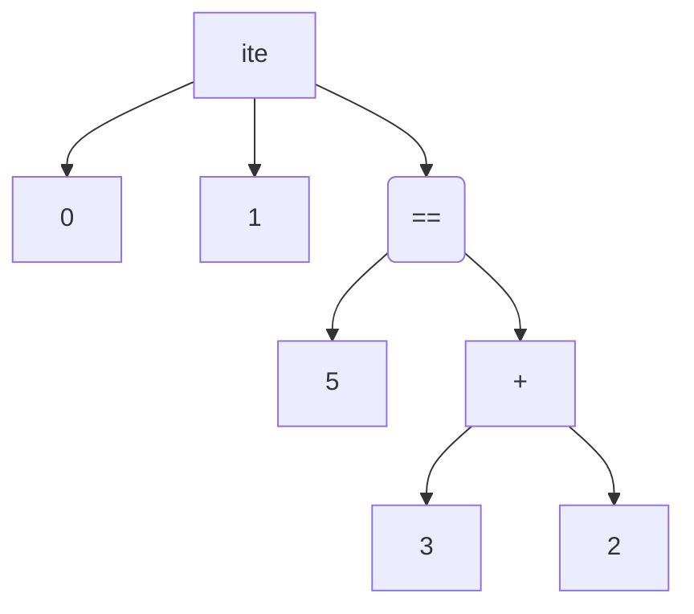

# OCaml

$ML→CAML→OCaml$

Linguaggio [[Programmazione funzionale|funzionale]] compilato in bytecode, eseguito da un interprete (per le $→_β$).

Consente di scrivere:

```OCaml
(* Dichiarazioni *)
let eta = 18;;
let anno: int = 2022;;
(* Espressioni *)
eta * anno;;
```

## [[Tipi]]

### Base

```
- int
- unit
- float
- bool
- char
- string
- 'a
- T -> S
- T_1*…*T_n
- T list
- {tag1: T_1,…, tagn: Tn}
- T1 [of S1]|…|Tn [of Sn]
```

### Casting

int + float (come `3 + 3.2`) non si può fare implicitamente:

$$
\cfrac{Γ⊢t:int \quad Γ⊢s:int}{Γ⊢t+s:int}
$$

Bisogna usare funzioni come `int_to_float` o `float_to_int` per convertire esplicitamente da un tipo all'altro (es. `(int_to_float 3) + 3.2 : float`.

### Tipi composti

Funzioni $T→S$

Tuple $T_1*T_2*…*T_n$

Record $\{tag_1: T_1, …, tag_n: T_n\}$

La parte "interna" dei tipi composti è immutabile, perché sennò rappresenterebbero stati.

Per esempio:
```OCaml
let x: int*bool*string = (10, true, "hello");;

fun x -> t: int -> int;;
(fun x -> t) s u;;
fun x -> fun y -> x + y;;
(* equivalente a... *) fun x y -> x + y;;

let p: {x: float; y: float} = {x = 4.0; y = -3.0}
let distanza p q =
    let dx = (p.x-q.x)**2.0
        dy + (p.y-q.y)**2.0
    in sqrt (dx + dy)
```

Si possono creare tipi per rendere il codice più chiaro:
```OCaml
type Punto = {x: float; y: float}
let p: Punto = {x = 4.0; y = -3.0}
```

### Unione

$x∈A∪B⇔x∈A∨x∈B$

Disgiunta: $z∈A+B=\{z.a|a∈A\}∪\{z.b|b∈B\}$

```ocaml
type num_string =
    | txt of string
    | num of int
```

$$
\cfrac{s∈string}{txt \: s∈num\_string} \quad \cfrac{n∈int}{num \: n∈num\_string}
$$

## Let

$\text{let }x=t;;→〈Σ,s〉$

$$
\cfrac{〈Σ,t〉→〈Σ',v〉}{〈Σ,\text{let }x=t;;〉→〈Σ',x↦v〉}
$$

Permette anche di destrutturare i tipi composti:
```OCaml
let p: float*float = (.2, .3);;
let (x, y) = p in x + y
```

## Funzioni

Zucchero sintattico:

```OCaml
let id (x: int) = x (*int -> int*)
(* let id = fun (x:int) -> x *)
```

Esempi:

```OCaml
let scambia (x,y) = (y,x) (* 'a*'b -> 'b*'a *)
(* let scambia = fun (x,y) -> (y,x) *)

let scambia_add (x,y) = (y+5,x+5) (* -> int *)
(* +: int -> int *)
```

Anche le funzioni possono destrutturare i tipi composti:

```OCaml
fun f n -> f n + 1;;
f (fun (x,y) -> x + y) (2,3) (* 6 *)
```

### Tipi generici

Il tipo generico è scritto come `'a`, e può rimpiazzato da qualunque tipo. Generalmente usato nelle funzioni, che lo rimpiazzano nella dichiarazione (se possibile) o nell'esecuzione (altrimenti).

Per esempio:

```OCaml
let maggiore x y = if x > y then x else y
```

Che tipo sono $'a → 'b → ?$? Abbiamo questi vincoli:
- `if else` devono ritornare variabili dello stesso tipo, e può ritornare o `'a` o `'b`, quindi `'a='b` e `?='a`. La funzione è semplificata al tipo `'a->'a->'a`.
- `>:'a->'a->bool`, tuttavia `>` non si può fare su tutti i tipi (come le funzioni)
	- OCaml *non* previene l'utilizzo di tipi incompatibili, prende solo il tipo più generico possibile, che vuol dire che si può avere errori di runtime (altri linguaggi come Haskell o Rust invece hanno meccanismi per prevenirlo)

Nota che il corpo della funzione non viene eseguito finché non viene eseguita. Queste due funzioni sono diverse:

```OCaml
fun x -> x + 2
fun x -> x + (1+1)
```

In altre parole, OCaml *non* riduce le funzioni alla forma normale, quindi *non* fa questo:

$$
\cfrac{t→_βs}{λx.t→_βλx.s}
$$

### Option

Per ogni tipo è definibile l'unione `'a option`

```OCaml
type 'a option =
    | None
    | Some of 'a;;
```

## Liste

Lista ≜ Sequenza *finita*, *ordinata* e *immutabile* di espressioni *dello stesso tipo* (mentre le tuple possono avere i tipi che vogliono)

```OCaml
[1;2;3]: int list
[true;true && false]: bool list
[]: 'a list
[[2;3];[3;4];[]]: (int list) list
```

Che tipo è questo?
```OCaml
[[];[fun x -> x]]
```

Vincoli:
- Il primo elemento `'a list`
- Il secondo elemento `'a->'a list`
- Combinandoli, si sceglie quello più restrittivo, quindi otteniamo `('a->'a list) list`

L'operatore *cons* crea una nuova lista, con un nuovo elemento di fronte alla lista:
```Ocaml
1 :: [2; 3] (* [1; 2; 3] *)
```

Per utilizzare gli elementi di una lista si usa il pattern matching:
```OCaml
let f (x:'a list) =
    match x with
        | [] -> (**)
        | y::ys -> (**);;
```

Esempi con ricorsione:
```OCaml
let rec sum_list(xs: int list) =
    match xs with
        | [] -> 0
        | y::ys -> y + sum_list ys;;

let rec filter xs p =
    match xs with
        | [] -> []
        | y::ys -> if (p y) then y::(filter ys p) else (filter ys p);;

let rec append xs ys =
    match xs with
        | [] -> ys
        | z::zs -> z::(append zs ys)

let rec fold_left f a xs =
    match xs with
        | [] -> a
        | y::ys -> fold_left f (f a y) ys
```

$map:('a→'b)→'a \: list→'b \: list$

```OCaml
let rec map f xs =
    match xs with
        | [] -> []
        | y::ys -> (f y)::(map f ys);;
```

### Tipi ricorsivi

```OCaml
type list_int =
    | Nil
    | Concat of int * list_int

Nil : list_int
Concat(5, Nil) : list_int
Concat(3, Concat(5, Nil)): list_int
```

$Nil⤳[]$

$Concat(n,ns)⤳n::ns$

Quindi, si può dire che le liste in OCaml sono costruite come:

```OCaml
type 'a list =
    | Nil
    | Concat of 'a * 'a list
```

Si può fare il pattern matching:

```OCaml
let rec elem x xs =
    match xs with
        | Nil -> false
        | Concat(y, ys) -> if(x=y) then true else elem x ys;;
(* elem: 'a->'a list'->bool *)
```

Un albero binario:

```OCaml
type 'a tree =
    | Leaf of 'a
    | Node of 'a * 'a tree * 'a tree
```

```OCaml
let rec leaves t =
    match t with
        | Leaf x -> [x]
        | Node(x, t1, t2) -> (leaves t1)@(leaves t2)
```

### Interprete

$e::=true|false|n|o(e,e)|ite(e,e,e)$

$op::=+|\&|==$

Noi scriviamo $ite(3+2==5,0,1)$, ma l'interprete vede questo albero di derivazione astratta (AST):



Sintassi:

```OCaml
type val =
    | Valb of bool
    | Valn of int;;

type op =
    | Add
    | And
    | Eq;;

type exp =
    | Val of val
    | Op of op * exp * exp;;
    | Ite of exp * exp * exp

eval(Ite(Op(Eq,Op(Add,Valn 3,Valn 2),Valn 5),Valn 0,Valn 1))
```

`eval` è definito come $eval:exp→val \; option$

```OCaml
let rec eval e =
    match e with
        | Val v -> Some v
        | Op(f,e1,e2) -> 
            let v1 = eval e1
                v2 = eval e2
            in
            match v1,v2 with
                | None,_ | _, None -> None
                | Some w1, Some w2 ->
                    match f with
                        | Add -> match w1, w2 with
                            | Valn n1, Valn n2 -> Some Valn(n1+n2)
                            | _, _ -> None;;
(* ... *)
```

Inferenza di tipo

```OCaml
type ty =
    | Tybool
    | Tyint
```

```OCaml
let rec tyinf e =
    match e with
        | Val v -> match v with
            | Valb b -> Some Tybool
            | Valn n -> Some Tyint
        | Op (Add,e1,e2) ->
            let t1 = tyinf e1
                t2 = tyinf e2
            in
            match t1,t2 with
                | Some Tyint, Some Tyint -> Some Tyint
                | _, _ -> None
(* ... *)
```