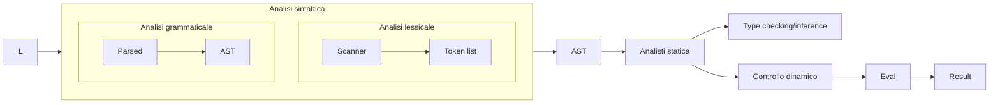
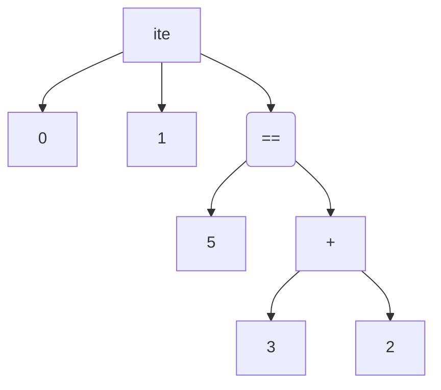

# Interprete

Definizione di $Γ$:
- $e::=n|e \: op \: e|(e)$
- $op::=+|*|-|/$



$eval::exp→int$

$syntax::string→exp$

## Sintassi in [[OCaml]]

### Scanner

Dalla stringa (di codice), genera i seguenti token:

```OCaml
type token =
    | Tkn_num of int
    | Tkn_op of string
    | Tkn_lpar
    | Tkn_rpar
    | Tkn_end

exception ParseError of string * string
```

$scanner::string→token \: list$

$L_Γ∋s∈Σ*$

Implementazione:

```OCaml
let scanner s =
    let rec scanner_rec s pos =
        if pos = String.length s then [Tkn_end]
        else
            let c = String.sub s pos 1 in
            let tokens = scanner_rec s (pos + 1)
            match c with
                | " " -> tokens
                | "(" -> Tkn_lpar::tokens
                | ")" -> Tkn_rpar::tokens
                | "+"|"-"|"*"|"/" -> (Tkn_op c)::tokens
                | "0"|"1"|(*...*)|"9" -> match tokens with
                    (* Concatena la cifra con quelle precendenti*)
	                | (Tkn_num n)::tokens -> (Tkn_num (int_of_string(c^(string_of_int n))))::tokens
	                | _ -> (Tkn_num (int_of_string c))::tokens
	            | _ -> raise (ParseError ("Parse error: ", c)
	in scanner_rec s 0
```

### Parser

$parser::token \: list→exp$

Per assicurarsi di avere una grammatica deterministica (non ambigua), definiamo:
- Espressione $e:=t+e|t-e|t$
- Termine $t:=f*t|f/t|t$
- Fattore $f:=n|(e)$

```OCaml
let parse s =
    let tokens = ref (scanner s) in
    let lookahed = match !tokens with
        | [] -> raise (**)
        | t::__
    
```

### AST

Generato grazie ai token (questi esempi usano una grammatica diversa perché il professore non riesce a essere coerente):

```OCaml
type val =
    | Valb of bool
    | Valn of int

type op =
    | Add
    | And
    | Eq

type exp =
    | Val of val
    | Op of op * exp * exp
    | Ite of exp * exp * exp

eval(Ite(Op(Eq,Op(Add,Valn 3,Valn 2),Valn 5),Valn 0,Valn 1))
```

`eval` qui è definito come $eval:exp→val \; option$

```OCaml
let rec eval e =
    match e with
        | Val v -> Some v
        | Op(f,e1,e2) -> 
            let v1 = eval e1
            and v2 = eval e2
            in
            match v1,v2 with
                | None,_ | _, None -> None
                | Some w1, Some w2 ->
                    match f with
                        | Add -> match w1, w2 with
                            | Valn n1, Valn n2 -> Some Valn(n1+n2)
                            | _, _ -> None
(* ... *)
```

Per esempio, la stringa $ite(3+2==5,0,1)$ viene alla fine tradotto in questo albero di derivazione astratta (AST):



#### Inferenza di tipo

```OCaml
type ty =
    | Tybool
    | Tyint
```

```OCaml
let rec tyinf e =
    match e with
        | Val v -> match v with
            | Valb b -> Some Tybool
            | Valn n -> Some Tyint
        | Op (Add,e1,e2) ->
            let t1 = tyinf e1
            and t2 = tyinf e2
            in
            match t1,t2 with
                | Some Tyint, Some Tyint -> Some Tyint
                | _, _ -> None
(* ... *)
```

## Ottimizzazioni

^4a0b50

Grazie alla legge degli indiscernibili di Leibniz:

$e_1≈e_2⇒c[e_1]≈c[e_2]$

OCaml può applicare ottimizzazioni come questa:

$map \: f(map \: g \: xs) ≈ map (f∘g) xs$
