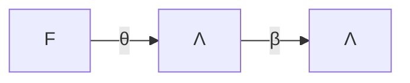

# Programmazione funzionale

- Diversamente dalla [[programmazione imperativa]], non c'è bisogno di *stato* o *memoria*
	- Niente variabili mutabili
- Programma = **espressioni**
	- Niente istruzioni
	- Due espressioni/programmi sono uguali se calcolano lo stesso risultato
- Computazione = riscrittura di espressioni

Non ci sono [[β-riduzione#^b5ae66|effetti collaterali]].

- Le espressioni rappresentano *funzioni*
- Programmazione *dichiarativa*
	- Non ci preoccupiamo di descrivere i passaggi in memoria, lo fa la macchina
- Basato sul [[λ-calcolo]]
	- [[Sostituzioni|Passaggio per nome/valore]]
	- Esecuzione: [[β-riduzione]]

$E::=0|1|…|true|false|E+E|E*E|\text{if } E \text{ then } E \text{ else }E|ite(E,E,E)\text{fun } x \Rightarrow E| EE|\text{let } x=E \text{ in }E|fix \: e|…$

## Codifica

Associare agli oggetti un λ-termine. Per esempio, i booleani $true$ e $false$ da soli sono inutili, ma possono essere sfruttati da altre espressioni:
- $ite(true,\square,\triangle)\rightarrow_\beta^\star\square$
- $ite(false,\square,\triangle)\rightarrow_\beta^\star\triangle$

Come si codificano nel λ-calcolo?
- $\overline{true}=\lambda xy.x$
- $\overline{false}=\lambda xy.y$
- $\overline{ite}=\lambda b.\lambda t.\lambda s.bts$

Esempio:
$$
\overline{ite} \: \overline{true} \: ts \\
=(\lambda b.\lambda x.\lambda y. bxy) \overline{true} \: ts \\
\rightarrow_\beta(\lambda x.\lambda y.\overline{true} \: xy)ts \\
\rightarrow_\beta(\lambda y.\overline{true} \: ty)s \\
\rightarrow_\beta \overline{true} \: ts \\
= (\lambda xy.x)ts \\
\rightarrow_\beta (\lambda y.t)s \\
\rightarrow_\beta t
$$



## Esempi

### Fattoriale:

```
FACT = fun n => if (n == 0) then 1 else n + FACT(n - 1)
// (fun x => e)(a) -> e[a/x]
// FACT(3) = (fun n => if(n==0,1,n*FACT(n-1)))(3)
// -> ite(3==0,1,3*FACT(3-1))
// -> ite(false,1,3*FACT(3-1))
// -> 3*FACT(3-1)
// -> 3*FACT(2)
// = 3*(fun n => ite(...))(2)
// ...
// -> 3 * 2 * 1
// -> 6
```

### Let

```
x=e
y=e'
e''
```

Di solito in un linguaggio funzionale si rappresenta con:

```
let x=e
    y=e'
in
    e''
```

$(\lambda x.\lambda y.e'')e(e')$

### Map

```
map f(map g x) // = map(f∘g)x
```

$\text{map } f(\text{map } g([x_1,…,x_n])) \rightarrow^\star \text{map } f [g(x_1),…,g(x_n)] \rightarrow^\star [f(g(x_1)),…,f(g(x_n))$
