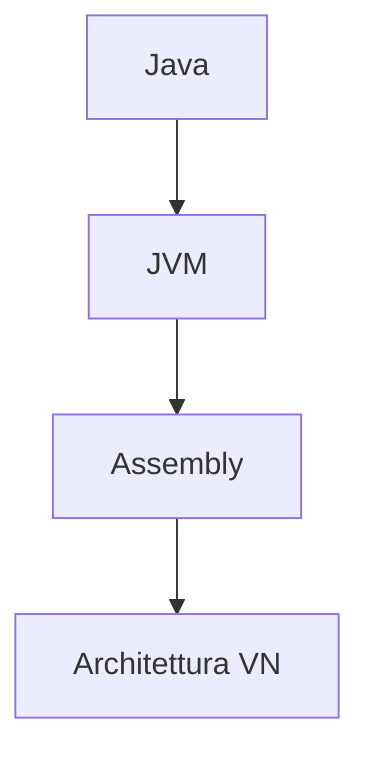

# Programmazione imperativa

Basata sulla [[macchina di Turing]]. Per ottenere un risultato si istruisce la macchina su *come* ottenerlo, sfruttando le funzionalità della [[Processore#^3ae1d1|macchina di Von Neumann]].
- Variabili mutabili
	- `x := x+1`
		- L-valore: indirizzo in memoria
		- R-valore: contenuto della memoria
- Assegnamento
	- `x := v`
- Programma: sequenza di **istruzioni**
	- Modificano lo stato/memoria della macchina
- Computazione = trasformazione di **stati**
	- Istruzioni: modificano lo stato
		- Esempi: $I::=skip|x:=E|\text{while } E \text{ do } I|I;I$
		- Dato $\sigma=\text{stato}$, $<\sigma,I> \rightarrow <\sigma',I'>$
	- Espressioni: non modificano lo stato
		- Esempi: $E:=n|b|E+E$

Imperativo: processo di astrazione della macchina fisica (stato & memoria)

Esempio:

Con la programmazione imperativa si può usare molto poco la matematica che dà garanzie di *correttezza*: l'utilizzo delle variabili mutabili (assenti in matematica), e altri meccanismi come l'I/O, hanno *effetti collaterali*.
