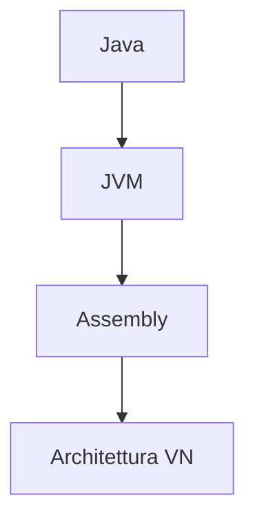

# Programmazione imperativa

Basata sulla [[macchina di Turing]]:
- Variabili mutabili
	- `x := x+1`
		- L-valore: indirizzo in memoria
		- R-valore: contenuto della memoria
- Assegnamento
	- `x := v`
- Programma: sequenza di **istruzioni**
	- Modificano lo stato/memoria della macchina
- Computazione = trasformazione di **stati**
	- Istruzioni: modificano lo stato
		- Esempi: $I::=skip|x:=E|\text{while } E \text{ do } I|I;I$
		- Dato $\sigma=\text{stato}$, $<\sigma,I> \rightarrow <\sigma',I'>$
	- Espressioni: non modificano lo stato
		- Esempi: $E:=n|b|E+E$

Imperativo: processo di astrazione della macchina fisica (stato & memoria)

Esempio:



È molto difficile gestire un programma con la programmazione imperativa: le variabili mutabili rendono difficile astrarre il tutto

## Esempio JavaScript
$$
p(x)=x^2+3x+6 \\
(=\lambda x.x^2+3x+6)5 \\
=5^2+3*5+6
$$

```javascript
function foo(x) {
    return x*x+3*x+6;
}
foo(a);
```
