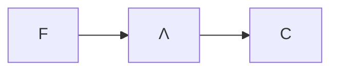

# Combinatori

- $I≜x.x$
- $k≜λx.λy.x$
- $Y ≜ λf.(λx.f(xx))(λx.f(xx))$
- $A≜λx.λy.y(xxy)$
- $Θ≜AA$
	- $Θt→_β^*t(Θt)$
- $O=λy.Θk$
	- $Θk=k(Θk)=(λx.λy.x)(Θk)→_β λy.Θk=O$ Ogre
$Ot→_β^* O$

TODO

$k,s≜λx.λy.λz.xz(yz)$
$kxy→_w x$
$sxyz →_w xz(yz)$
$t::=x|s|k|tt$

