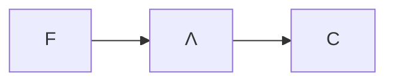

# Combinatori

- $I≜x.x$
- $K≜λx.λy.x$
- $Y ≜ λf.(λx.f(xx))(λx.f(xx))$
- $A≜λx.λy.y(xxy)$
- $Θ≜AA$
	- $Θt→_β^*t(Θt)$
- $O=λy.Θk$ (Ogre)
	- $Ot→_β^* O$
		- $Θk=k(Θk)=(λx.λy.x)(Θk)→_β λy.Θk=O$
- $S≜λx.λy.λz.xz(yz)$

Il λ-calcolo è equivalente a questo sistema di soli due simboli:

- $Kxy→_w x$ ($→_w$ è una *weak-reduction*)
- $Sxyz →_w xz(yz)$
$t::=x|S|K|tt$

