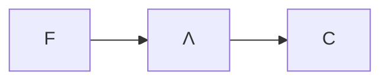

# Combinatori

- $I≜λx.x$
- $Δ=λx.xx$
- $Ω=ΔΔ$
	- $Ω→_βΩ$
- $K≜λx.λy.x$
- $Y ≜ λf.(λx.f(xx))(λx.f(xx))$
- $A≜λx.λy.y(xxy)$
- $Θ≜AA$
	- $Θt→_β^*t(Θt)$
- $O=λy.Θk$ (Ogre)
	- $Ot→_β^* O$
		- $ΘK=K(ΘK)=(λx.λy.x)(ΘK)→_β λy.ΘK=O$
- $S≜λx.λy.λz.xz(yz)$

## Risolvere il problema della [[sostituzione]]

Evitare di sostituire variabili libere rendendole accidentalmente legate è difficile. Come si risolve?

Il λ-calcolo è equivalente a questo sistema $C$ di soli due simboli ($→_w$ è una *weak-reduction*):

- $Kxy→_w x$
- $Sxyz →_w xz(yz)$

In questo modo, la complessità del λ-calcolo diventa solo: $t::=x|S|K|tt$

Non è il massimo però programmare solo con queste cose, ma si può lasciare questo lavoro ai compilatori/interpreti dei linguaggi di [[programmazione funzionale]]:

