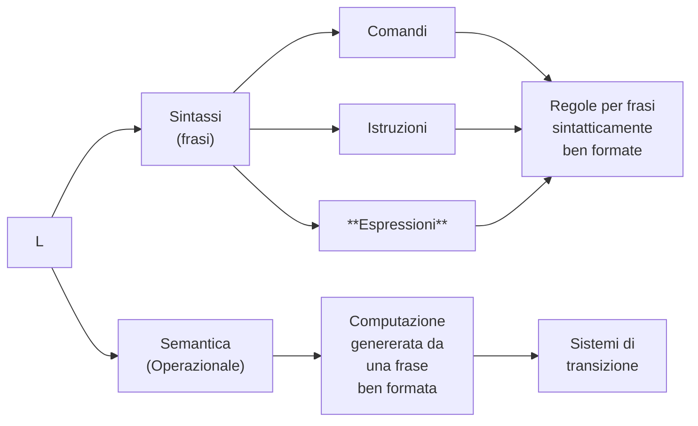

# Linguaggio di programmazione

```mermaid
flowchart LR
L --> SI["Sintassi\n(frasi)"] --> Comandi & Istruzioni & **Espressioni** --> RSI["Regole per frasi\nsintatticamente\nben formate"]
L --> SE["Semantica\n(Operazionale)"] --> RSE["Computazione\ngenererata da\nuna frase\nben formata"] --> STI[Sistemi di\ntransizione]
```
