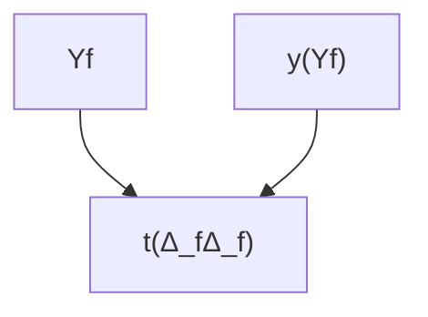

# Ricorsione

## Problema

Come si può definire nel [[λ-calcolo]] una funzione che chiama se stessa?

In un linguaggio $e::=z|succ(e)$, il principio di induzione per una funzione $F:Exp → ℕ$ si definisce come $∀e. P(e) ⇐arrow P(z) ∧ ∀x.P(x) → P(succ(x))$

In modo simile, si può costruire una funzione $φ: P(u) → P(u)$[^1], definita come $φ(A)=\{z\} ∪ \{succ(a)|a ∈ A\} ∪ A$. Per esempio:
- $φ(∅)=\{z\}$
- $φ(φ(∅))=\{z, succ(z)\}$
- $φ(φ(φ(∅)))=\{z, succ(z), succ(succ(z))\}$

Notevolmente:
- $φ(A)=A$
- $φ(Exp)=Exp$
	- $φ(B) ⊆ B⇒Exp ⊆ B$

## Punto fisso

Data una funzione $f:A → A$ , un punto fisso $x ∈ A$ della funzione $f$ ha la proprietà che $f(x)=x$.

Teorema: ogni λ-termine ha un punto fisso: $∀f ∈ Λ.∃ t ∈ Λ \quad ft=_β t$.[^2]

Dimostrazione: sia $f$ una funzione, e $H=λx.f(xx)$. Allora $HH →_β f((λx.f(xx))(λx.f(xx)))=_β f(HH)$, quindi $HH$ è un punto fisso di $f$.

## Fix

Questa cosa non si può fare: $t=_βλn.\underline{ite} \: (\underline{eq} \: n \: \underline{0}) \: \underline{1} \: (\underline{mult} \: n(t(\underline{prec} \: n)))$

Però si può fare $s=λf.λn.\underline{ite} \: (\underline{eq} \: n \: \underline{0}) \: \underline{1} \: (\underline{mult} \: n(f(\underline{prec} \: n)))$

Da qui ci vorrebbe un λ-termine $fix$ tale che $fix \: t →_β^* t(fix \: t)$.

$fix \: s →_β s(fix \: s) →_β λn.\underline{ite} \: (\underline{eq} \: n \: \underline{0}) \: \underline{1} \: (\underline{mult} \: n((fix \: s)(\underline{prec} \: n)))$

Eseguiamolo con 2:

$$
(fix \: s)2 \\
→_β^* \underline{ite} \: (\underline{eq} \: \underline{2} \: \underline{0}) \: \underline{1} \: (\underline{mult} \: n((fix \: s)(\underline{prec} \: \underline{2}))) \\
→_β^* \underline{mult} \: \underline{2}((fix \: s)\underline{1}) \\
→_β^* \underline{mult} \: \underline{2}(s(fix \: s)\underline{1}) \\
→_β^* \underline{mult} \: \underline{2}(\underline{mult} \: \underline{1}((fix \: s)\underline{0})) \\
→_β^* \underline{mult} \: \underline{2}(\underline{mult} \: \underline{1}(\underline{1})) \\
→_β^* \underline{2}
$$

Ora che tutto è definito, definiamo $F \: n=e[F]$[^3] come zucchero sintattico per $fix(λf.λn.e[f])$.

## Definizione Fix

Da $HH$$ si può creare il **combinatore Curry**: $Y ≜ λf.(λx.f(xx))(λx.f(xx))$.

Con $Δ_f ≜ λx.f(xx)$

Da qui:
- $Yf →_β (λx.f(xx))(λx.f(xx)) →_β f((λx.f(xx))(λx.f(xx)))=f(Δ_fΔ_f)$
- $f(Yf) →_β f((λf.(λx.f(xx))(λx.f(xx)))f) →_β f((λx.f(xx))(λx.f(xx)))=f(Δ_fΔ_f)$

Quindi $Yf =_β f(Yf)$. Tuttavia per $fix$ si cerca una β-riduzione, non una β-equivalenza.

Proviamo un'altra cosa:
- $A=λxy.y(xxy)$
- $Θ=AA$
- $Θf=(λxy.y(xxy))Af →_β (λy.y(AAy))f →_β f(AAf)=f(Θf)$

Quindi $fix=Θ$.

[^1]: Sarebbero l'insieme delle parti (l'insieme di tutti i sottoinsiemi) dell'universo
[^2]: Ciò implica che con il λ-calcolo non si può usare per implementare la *logica*, in quanto richiede che certe funzionalità (come le negazione logica) *non* abbiano alcun punto fisso.
[^3]: Vuol dire che $e$ utilizza $F$
