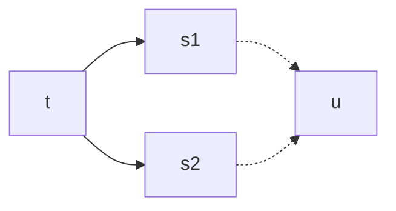

## Teorema di Church-Ross

$t \rightarrow_\beta^\star s_1 \land t \rightarrow_\beta^\star s_2 \Rightarrow \exists u. s_1 \rightarrow_\beta^\star n \land s_2 \rightarrow_\beta^\star u$

Se:
- $t \rightarrow_\beta^\star s_1$
- $t \rightarrow_\beta^\star s_2$
- $s_1,s_2 \in NF$

Allora $s_1=_\alpha s_2$.

### Corollario 1
Unicità forme normali (modulo $=_\alpha$)

### Corollario 2
$t =_\beta s \iff \exists u.t \rightarrow_\beta^\star u  _\beta^\star\leftarrow s$

### Corollario 3
Ordine $\beta$-riduzioni è irrilevante.