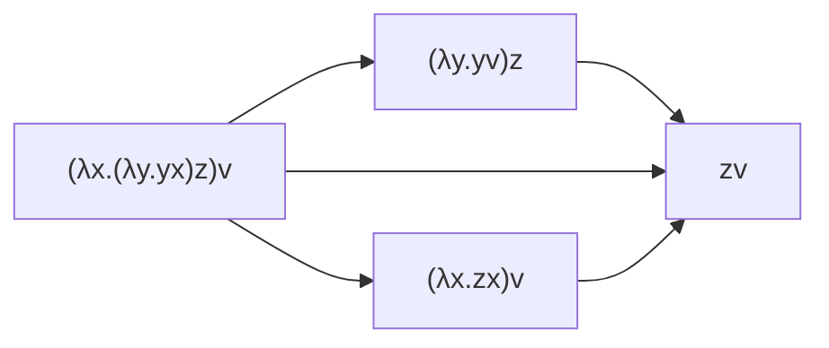
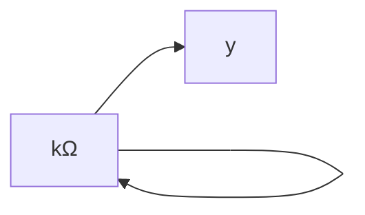
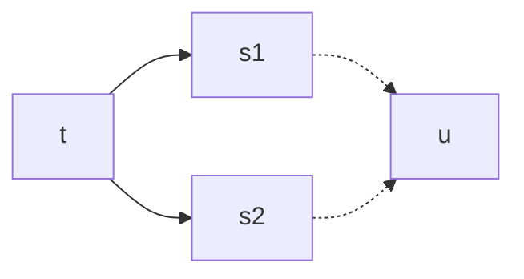

# β-riduzione

La più importante regola di riscrittura del [[λ-calcolo]].

$(λx.t)s →_β t[s/x]$

(Redex → Contractum)

Formalmente, la relazione $→_β ⊆ Λ ⨉ Λ$

$$
\frac{}{(λx.t)s →_β t[s/x]}
$$

$$
\frac{t →_β s}{tu →_β su} \quad \frac{t →_β s}{ut →_β us} \quad
\frac{t →_β s}{λx.t →_β λx.s}
$$

## Esempi

$(λx.x(xy))t →_β t(ty)$

La β-riduzione non è deterministica nei passaggi:

%%
$A=(λx.(λy.yx)z)v$

$B=(λy.yv)z$

$C=(λx.zx)v$

$D=zv$
%%

La β-riduzione, nonostante il nome, può *allungare* l'espressione. Ciò può rendere difficile ottimizzare questo processo per i calcolatori.

Per esempio:

- $Δ = (λx.xx)$
- $Δ t →_β tt$
- $Ω = Δ Δ →_β Δ Δ →_β …$

Altro esempio:

- $k = λx.y$
- $kΩ = (λx.y)(Δ Δ)$

## Teorema di Church-Rosser

$t →_β^* s_1 ∧ t →_β^* s_2 ⇒ ∃ u. s_1 →_β^* n ∧ s_2 →_β^* u$

Se:
- $t →_β^* s_1$
- $t →_β^* s_2$
- $s_1,s_2 ∈ NF$

Allora $s_1=_α s_2$.

### Corollario 1

Unicità forme normali (modulo $=_α$).

### Corollario 2

$t =_β s ⟺ ∃ u.t →_β^* u _β^*← s$

### Corollario 3

L'ordine delle β-riduzioni è irrilevante.

Ciò rende facilmente parallelizzabile il λ-calcolo.

## β-conversione

$(λx.t)s=_β t[s/x]$

$t=_β s ⟺ t (_β ← u →_β)^* s$

## Forma normale

Un termine è in forma normale se non si può β-ridurre.

Un termine $t$ ha una forma normale se esiste un termine $s$ tale che $t$ β-riduce ad $s$ in un numero finito di passi.

$∃ s ∈ NF.t \longrightarrow^*_β s$.

## Effetti collaterali

^b5ae66

Un effetto collaterale è un qualsiasi cosa che fa sì che il programma non sia una catena di β-riduzioni.

Se due espressioni hanno effetti collaterali, allora non possono mai essere uguali.

Esempio: $e_1+e_2=e_2+e_1$ sono uguali, ma non se ci sono effetti collaterali:
- $e_1≜print(a);return(2)$
- $e_2≜print(b);return(3)$
- $e_1+e_2$ scrive $ab$, poi ritorna $5$
- $e_1+e_2$ scrive $ba$, poi ritorna $5$

### Trasparenza referenziale

L'assenza di effetti collaterali, dove se $e →^* v$ allora usare $v$ o $e$ non fa differenza.

## Strategie di valutazione

$(λx.x^2+2x+3)(\underline{2+3}))$

- Chiamata per nome (CbN): rimpiazza $x$ con $2+3$
	- $→_β t[s/x]$
- Chiamata per valore (CbV): valuta $2+3$, e rimpiazza $x$ con il risultato
	- $→^*(λx.t)v →_β t[v/x]$

### Teoremi

Ci sono $t↓_{CbN}$ ($t$ termina) e $t↑_{CbV}$ ($t$ non termina).
- $KIΩ ≜ (λx.λy.x)IΩ$
	- CbV: $KIΩ$
	- CbN: $(λy.I)Ω$
		- CbV: $(λy.I)Ω$
		- CbN: $I$

Non vale viceversa. Teorema: se $t→_β^* s \not →_β$ allora $t \xrightarrow{CbN}_β^* s$

CbV però è più efficiente.

Call-by-Need (lazy): inizialmente CbN, ma valuta il valore appena serve valutarlo. Utile per qualsiasi cosa infinita (come gli iteratori), dato che evita calcoli inutili.

CbN e Call-by-Need si comportano in maniera imprevedibile (o indesiderabile) con gli effetti collaterali. Se li si vuole avere, CbV è l'unica scelta sensata.

### Definizione formale

$(λx.t)s \xrightarrow{CbV}_β t[s/x] \quad (\text{se } s \not \xrightarrow{CbV}_β)$

$$
\frac{t \xrightarrow{CbV}_β s}{λx.t \xrightarrow{CbV}_β λx.s}
$$
$$
\frac{t \xrightarrow{CbV}_β t'}{ts \xrightarrow{CbV}_β t's} \quad
\frac{s \xrightarrow{CbV}_β s' \quad t \not \xrightarrow{CbV}_β}{ts \xrightarrow{CbV}_β ts'}
$$
Per esempio, dati:
- $K ≜ λx.λy.x$
- $M ≜ K(II)((λx.xx)(λy.yz)u)$
- $N ≜ (λx.xx)(λy.yz)u$

$$
M=(KII)N \\
\xrightarrow{CbV}_β(KI)N \\
\xrightarrow{CbV}_β(λy.I)N \\
=(λy.I)((λx.xx)((λy.yz)u)) \\
\xrightarrow{CbV}_β (λy.I)((λx.xx)(uz)) \\
\xrightarrow{CbV}_β ((λy.I)(uz))(uz) \\
\xrightarrow{CbV}_β I(uz) \\
\xrightarrow{CbV}_β uz
$$
