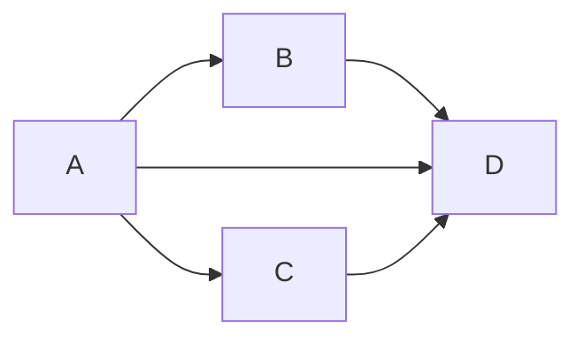

# β-riduzione

$(\lambda x.t)s \rightarrow_\beta t[s/x]$

(Redex → Contractum)

Formalmente, la relazione $\rightarrow_\beta \subseteq \Lambda \times \Lambda$

$$
\frac{}{(\lambda x.t)s \rightarrow_\beta t[s/x]}
$$

$$
\frac{t \rightarrow_\beta s}{tu \rightarrow_\beta su} \quad \frac{t \rightarrow_\beta s}{ut \rightarrow_\beta us} \quad
\frac{t \rightarrow_\beta s}{\lambda x.t \rightarrow_\beta \lambda x.s}
$$

## β-conversione

$(\lambda x.t)s=_\beta t[s/x]$

$t=_\beta s \iff t (_\beta \leftarrow u \rightarrow_\beta)^\star s$

## Esempi

$(\lambda x.x(xy))t \rightarrow_\beta t(ty)$

La β-riduzione non è deterministica nei passaggi:

$A=(\lambda x.(\lambda y.yx)z)v$

$B=(\lambda y.yv)z$

$C=(\lambda x.zx)v$

$D=zv$

La β-riduzione, nonostante il nome, può *allungare* l'espressione. Ciò può rendere difficile ottimizzare questo processo per i calcolatori.

Per esempio:

- $(\lambda x.xx)t \rightarrow_\beta tt$
- $(\lambda x.xx)(\lambda x.xx) \rightarrow_\beta (\lambda x.xx)(\lambda x.xx) \rightarrow_\beta …$

TODO: Omega

$\Omega = (\lambda x.xx)(\lambda x.xx)$

## Forma normale

Un termine è in forma normale se non si può β-ridurre.

Un termine $t$ ha una forma normale se esiste un termine $s$ tale che $t$ β-riduce ad $s$ in un numero finito di passi.

$\exists s \in NF.t \longrightarrow^\star_\beta s$.

#### Esercizi:

[[Esercizi β-riduzione]]