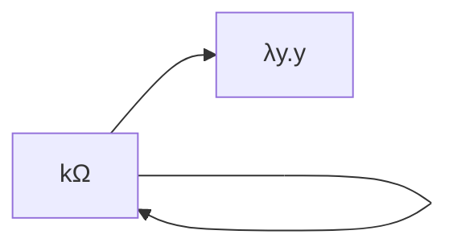

# β-riduzione

La più importante regola di riscrittura del [[λ-calcolo]].

$(\lambda x.t)s \rightarrow_\beta t[s/x]$

(Redex → Contractum)

Formalmente, la relazione $\rightarrow_\beta \subseteq \Lambda \times \Lambda$

$$
\frac{}{(\lambda x.t)s \rightarrow_\beta t[s/x]}
$$

$$
\frac{t \rightarrow_\beta s}{tu \rightarrow_\beta su} \quad \frac{t \rightarrow_\beta s}{ut \rightarrow_\beta us} \quad
\frac{t \rightarrow_\beta s}{\lambda x.t \rightarrow_\beta \lambda x.s}
$$

## Esempi

$(\lambda x.x(xy))t \rightarrow_\beta t(ty)$

La β-riduzione non è deterministica nei passaggi:

%%
$A=(\lambda x.(\lambda y.yx)z)v$

$B=(\lambda y.yv)z$

$C=(\lambda x.zx)v$

$D=zv$
%%

La β-riduzione, nonostante il nome, può *allungare* l'espressione. Ciò può rendere difficile ottimizzare questo processo per i calcolatori.

Per esempio:

- $\Delta = (\lambda x.xx)$
- $\Delta t \rightarrow_\beta tt$
- $\Omega = \Delta \Delta \rightarrow_\beta \Delta \Delta \rightarrow_\beta …$

Altro esempio:

- $k = \lambda xy.y$
- $I=\lambda x.x$
- $k \Omega = (\lambda xy.y)(\Delta \Delta)$

## Teorema di Church-Rosser

$t \rightarrow_\beta^\star s_1 \land t \rightarrow_\beta^\star s_2 \Rightarrow \exists u. s_1 \rightarrow_\beta^\star n \land s_2 \rightarrow_\beta^\star u$

Se:
- $t \rightarrow_\beta^\star s_1$
- $t \rightarrow_\beta^\star s_2$
- $s_1,s_2 \in NF$

Allora $s_1=_\alpha s_2$.

### Corollario 1

Unicità forme normali (modulo $=_\alpha$).

### Corollario 2

$t =_\beta s \iff \exists u.t \rightarrow_\beta^\star u _\beta^\star\leftarrow s$

### Corollario 3

L'ordine delle β-riduzioni è irrilevante.

Ciò rende facilmente parallelizzabile il λ-calcolo.

## Effetti collaterali

^b5ae66

Un effetto collaterale è un qualsiasi cosa che fa sì che il programma non sia una catena di β-riduzioni.

Se due espressioni hanno effetti collaterali, allora non possono mai essere uguali.

Esempio: $e_1+e_2=e_2+e_1$ sono uguali, ma non se ci sono effetti collaterali:
- $e_1=print(a);return(2)$
- $e_2=print(b);return(3)$
- $e_1+e_2$ scrive $ab$, poi ritorna $5$
- $e_1+e_2$ scrive $ba$, poi ritorna $5$

### Trasparenza referenziale

L'assenza di effetti collaterali, dove se $e \rightarrow^\star v$ allora usare $v$ o $e$ non fa differenza.

## β-conversione

$(\lambda x.t)s=_\beta t[s/x]$

$t=_\beta s \iff t (_\beta \leftarrow u \rightarrow_\beta)^\star s$

## Forma normale

Un termine è in forma normale se non si può β-ridurre.

Un termine $t$ ha una forma normale se esiste un termine $s$ tale che $t$ β-riduce ad $s$ in un numero finito di passi.

$\exists s \in NF.t \longrightarrow^\star_\beta s$.
