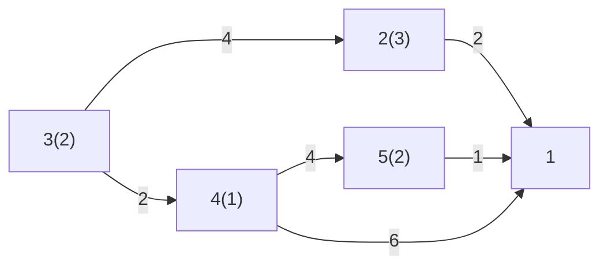

# Esempio [[Problemi di ottimizzazione|ottimizzazione]] acqua

I numeri tra parentesi sono la quantità d'acqua che viene sporcata in quel nodo, identificato dal numero fuori dalla parentesi.

Tutta questa acqua deve essere mandata nel depuratore (a destra), minimizzando i costi (mostrati negli archi, per unità d'acqua).

Per esempio:

Dati:
- $x_{ij}$ m³ acqua che transitano attraverso $(i,j)$

Vincoli:
- $x_{21}+x_{41}+x_{51}=8$

Funzione obiettivo min: $∑\limits_{i,j ∈ A} c_{ij}x_{ij}$
