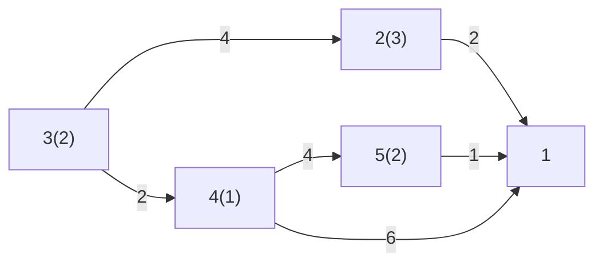

# Esempio [[Problemi di ottimizzazione|ottimizzazione]] acqua

I numeri tra parentesi sono la quantità d'acqua che viene sporcata in quel nodo, identificato dal numero fuori dalla parentesi.

Tutta questa acqua deve essere mandata nel depuratore (a destra), minimizzando i costi (mostrati negli archi, per unità d'acqua).

Per esempio:

Dati:
- $x_{ij}$ m³ acqua che transitano attraverso $(i,j)$

Vincoli:
- L'acqua deve tutta andare al depuratore:
	- Non il modo migliore per implementarlo: $x_{21}+x_{41}+x_{51}=8$
	- E il nodo 3? Deve passare per più nodi, ciò rende le cose difficili.
		- $x_{34}+1=x_{41}+x_{45}$
	- Come si generalizza?
- $∑\limits_{j∈BN(i)} x_{ji} + b_i=∑\limits_{j∈FN(i)} x_{ij} \quad i ∈ N$
	- Stella dei nodi entranti: $BN(i)=\{j ∈ N : (j,i) ∈ A\}$
	- $FN(i)=\{j ∈ N : (i,j) ∈ A\}$

Funzione obiettivo min: $∑\limits_{i,j ∈ A} c_{ij}x_{ij}$
