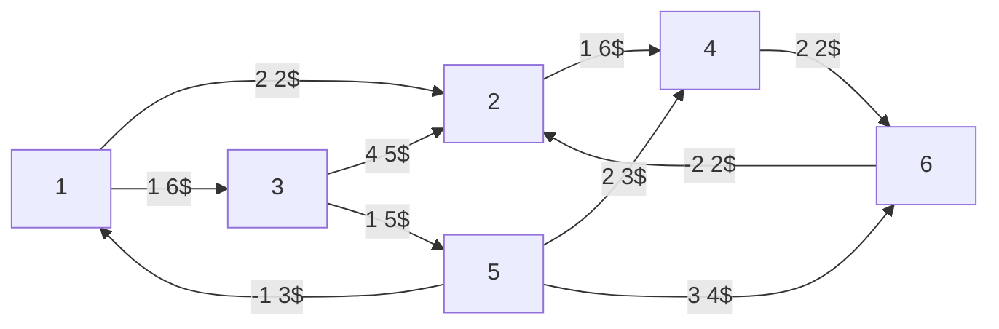

# Esempio [[Problemi di ottimizzazione|ottimizzazione]] flusso di costo minimo

[[Ottimizzazione grafi]] su questo grafo, ma gli archi costano:

I $b_i$ sono:
- $-4$ per $i=1$
- $-2$ per $i=5$
- $3$ per $i=4$
- $3$ per $i=6$
- $0$ per tutto il resto

$x=(x_{ij})∈ℝ^n$ pseudoflusso se $0≤x_{ij}≤u_{ij}$