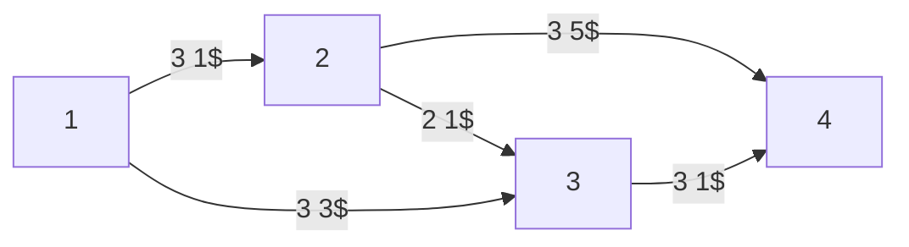

# Esempio [[Problemi di ottimizzazione|ottimizzazione]] flusso di costo minimo

Gli archi hanno una capacità $u_{ij}$ e una costo di $c_{ij}$$.

I $b_i$ sono:
- Sorgenti:
	- $-4$ per $i=1$
	- $-2$ per $i=5$
- Pozzi
	- $3$ per $i=4$
	- $3$ per $i=6$
- $0$ per tutto il resto

Abbiamo i soliti vincoli di [[ottimizzazione grafi]]. Se avere più di una sorgente o più di un pozzo può dare fastidio, basta immaginare una super sorgente $s$ con $b_s=-4-2=-6$ collegata a costo 0 alle vere sorgenti, e idem per i pozzi.

## Version più semplice

$x=(x_{ij})∈ℝ^n$ pseudoflusso se $0≤x_{ij}≤u_{ij}$