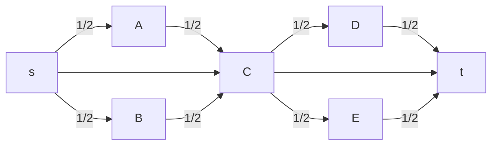

# Esempio [[Problemi di ottimizzazione|ottimizzazione]] trasmissione rete

Dati:
- Rete descritta da grafo $G=(N,A)$, con linee $(i,j)∈A$
- $u_{ij}∈ℕ$ capacità di trasmissione per la linea (in numero di pacchetti)
- $c_{ij}>0$ prezzo della linea
- $p∈ℕ$ pacchetti da inviare dalla sorgente $s∈N$ alla destinazione $t∈N$

Quali linee affittare e come inviare i pacchetti utilizzando le linee affittate, per minimizzare il costo?

Da trovare:
- $x_{ij}∈ℕ$ numero di pacchetti che facciamo attraversare su $(i,j)$
- $y_{ij}=\begin{cases} 1 &\text{se si affitta la linea } (i,j)∈A \\ 0 &\text{altrimenti} \end{cases}$

Vincoli:
- Vincoli di capacità: $x_{ij}≤y_{ij}u_{ij} \quad (i,j)∈A$
- Conservazione del flusso: $∑\limits_{j∈BN(i)} x_{ji} - ∑\limits_{j∈FN(i)} x_{ij} = \begin{cases} -p &\text{se } i=s \\ p &\text{se } i=t \\ 0 &\text{altrimenti} \end{cases} \quad i ∈ N$
	- Stella entrante: $BN(i)=\{j ∈ N : (j,i) ∈ A\}$
	- Stella uscente: $FN(i)=\{j ∈ N : (i,j) ∈ A\}$

Funzione obiettivo min: $∑\limits_{(i,j)∈A}y_{ij}c_{ij}$

## Variante

Cosa cambia se $p=1$? Abbiamo un problema di cammino minimo.

Da trovare:
- $x_{ij}=\begin{cases} 1 &\text{se si affitta la linea } (i,j)∈A \\ 0 &\text{altrimenti} \end{cases}$

Vincoli:
- Conservazione del flusso: $∑\limits_{j∈BN(i)} x_{ji} - ∑\limits_{j∈FN(i)} x_{ij} = \begin{cases} -1 &\text{se } i=s \\ 1 &\text{se } i=t \\ 0 &\text{altrimenti} \end{cases} \quad i ∈ N$

Funzione obiettivo min: $∑\limits_{(i,j)∈A}x_{ij}c_{ij}$

### Problema non intero

Questi vincoli lo rendono un problema di programmazione lineare intera: i vincoli di interezza (di $x_{ij}$ in questo caso) rendono il calcolo della soluzione più complicato. Si può fare invece con $0≤x_{ij}≤1$?

Per esempio, immaginiamo che in questo grafo questa sia la soluzione ottima:

Non è un cammino. Però:
- I bilanci nel vincolo di conservazione sono soddisfatti
- Assumiamo che con il vincolo di interezza la soluzione ottima sia $s→C→t$, e che sia peggiore.
	- Ciò dovrebbe voler dire che il costo di ½ cammino sopra + ½ cammino sotto < cammino centrale.
	- Inoltre, i cammini sopra e sotto dovrebbero costare uguali, sennò sarebbe meglio prendere interamente uno dei due.
		- Ma a questo punto si può anche prendere interamente uno dei due cammini e non cambierebbe il costo.

Quindi, rimuovere il vincolo di interezza non cambia il costo totale. I cammini con $x_{ij}$ frazionario sono semplicemente strade alternative.

#### Altra variante
La radice $s$ deve trasmettere un pacchetto a tutti i nodi. Gli archi inoltre vanno comprati ogni volta che ci si passa.

Vincoli:
- Conservazione del flusso: $∑\limits_{j∈BN(i)} x_{ji} - ∑\limits_{j∈FN(i)} x_{ij} = b_i \quad i ∈ N$
	- $b_i=\begin{cases} -(|N|-1) &\text{se } i=s \\ 1 &\text{altrimenti} \end{cases}$

$x_{ij}$ sarà il numero di cammini che usano l'arco $(i,j)$, quindi $x_{ij} ∉ \{0,1\}$.