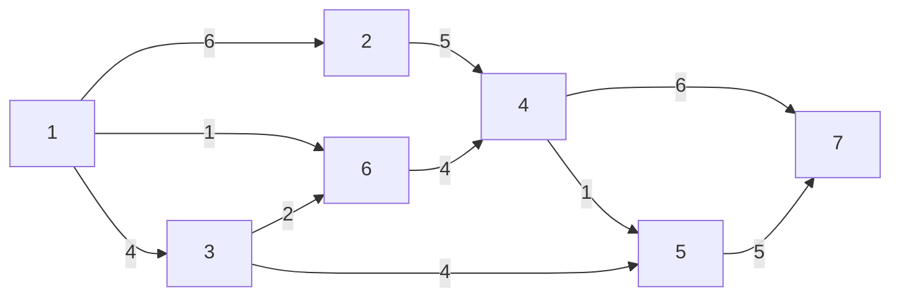
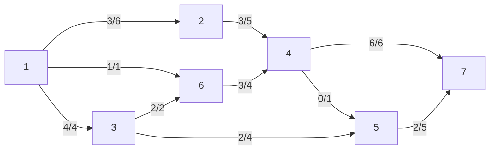

# Esempio ottimizzazione trasporto massimo

L'obiettivo è di trasportare la maggior quantità di flusso possibile da $1$ e $7$. Tuttavia, i tubi hanno una capacità massima nel trasporto di acqua, e tutti gli altri nodi non ammettono di ricevere più acqua di quella mandano (e ovviamente anche il contrario). Come si distribuisce il flusso?

Dati:
- $s=1$ origine
- $t=7$ destinazione
- $b_i = \begin{cases} -V &\text{se } i=s \\ V &\text{se } i=t \\ 0 &\text{altrimenti} \end{cases}$

Funzione obiettivo max: $V$

Proviamo una soluzione ammissibile:

In questo caso la soluzione ammissibile è $V=8$. Si può fare di meglio?

Si potrebbe aumentare la quantità di flusso lungo questo cammino orientato: $P=\{1,2,4,5,7\}$.