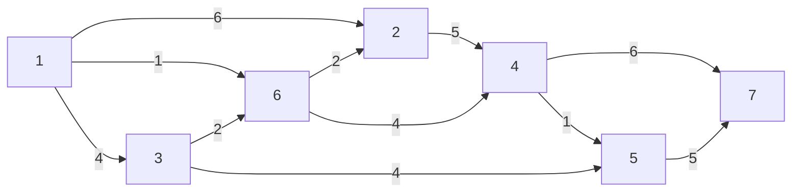
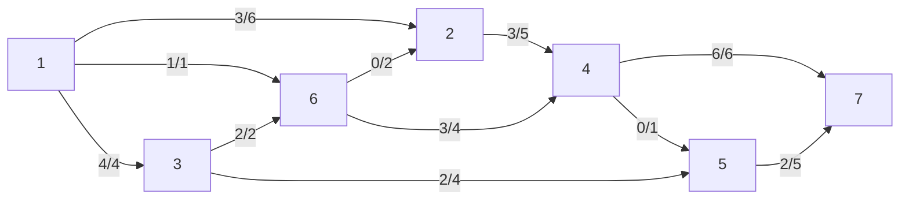
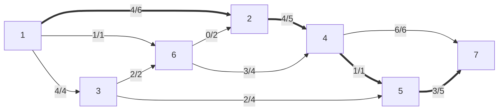

# Esempio ottimizzazione trasporto massimo

L'obiettivo è di trasportare la maggior quantità di flusso possibile da $1$ e $7$. Tuttavia, i tubi (archi) hanno una capacità massima nel trasporto di acqua ($u_{ij}$), e i nodi non ammettono di ricevere più acqua di quella mandano (e ovviamente anche il contrario). Come si distribuisce il flusso?

Dati:
- $s=1$ origine
- $t=7$ destinazione
- $b_i = \begin{cases} -V &\text{se } i=s \\ V &\text{se } i=t \\ 0 &\text{altrimenti} \end{cases}$

Funzione obiettivo max: $V$

Proviamo una soluzione ammissibile (negli archi c'è scritto $x_{ij}/u_{ij}$):

In questo caso la soluzione ammissibile è $V=8$. Si può fare di meglio?

Si potrebbe aumentare la quantità di flusso lungo questo cammino orientato:
$P=\{1,2,4,5,7\}$ (cammino aumentante)

Di quanto si aumenta? Del minimo della capacità residua degli archi.

$θ=\min\{u_{ij}-x_{ij}:(i,j)∈P\}$, che in questo caso è 1.

$(i,j)$ è **saturo** se $x_{ij}=u_{ij}$

Ora $V=8+1=9$

Si può fare ancora di più? Sembra quasi che si potrebbe aumentare il flusso in $\{1,2,4,7\}$, ma $(4,7)$ è già saturo, quindi in $4$ si accumula un'unità di flusso. Possiamo allora riportare questo eccesso indietro, verso il nodo $6$, causando ora un eccesso di 1 lì. Si può rifare la stessa cosa verso il nodo $3$, che però ha spazio libero in $(3,5)$, come c'è spazio in $(5,7)$