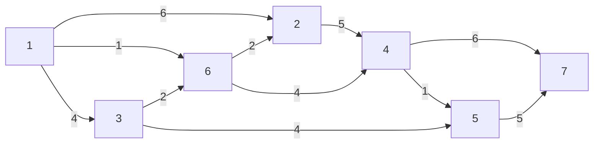
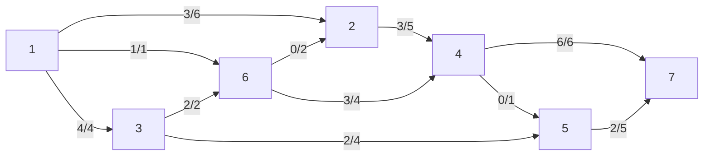
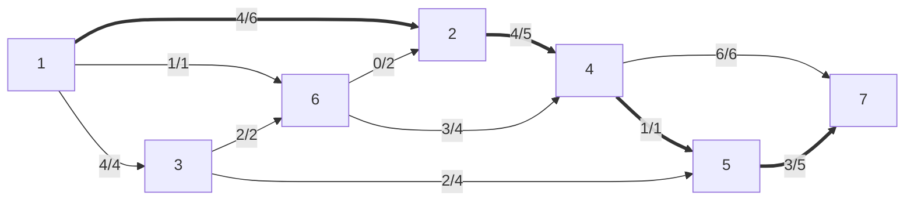
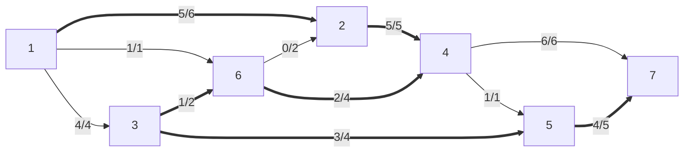
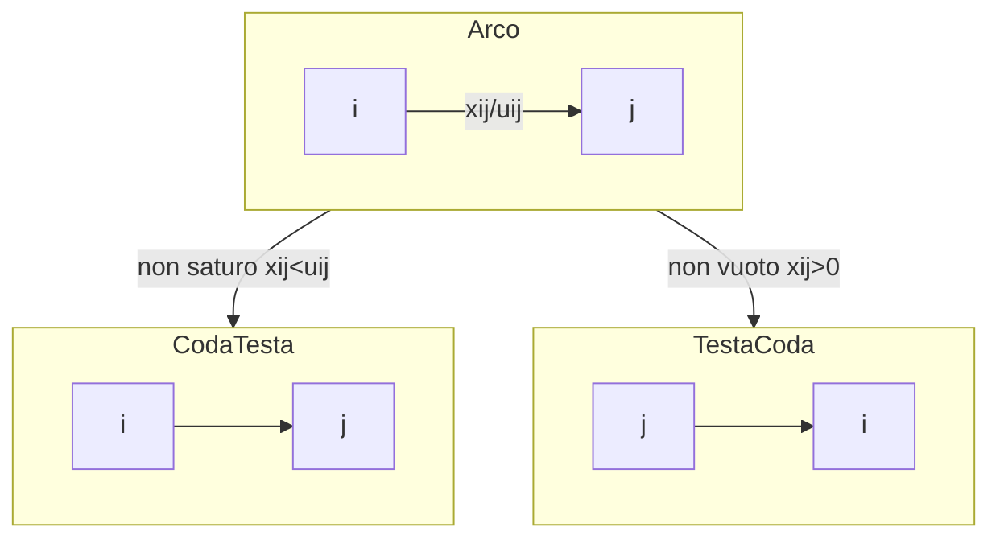
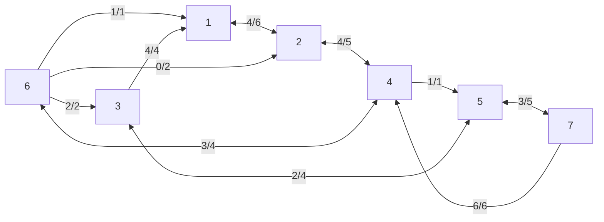

# Esempio [[Problemi di ottimizzazione|ottimizzazione]] trasporto massimo



L'obiettivo è di trasportare la maggior quantità di flusso possibile da $1$ e $7$. Tuttavia, i tubi (archi) hanno una capacità massima nel trasporto di acqua ($u_{ij}$), e i nodi non ammettono di ricevere più acqua di quella mandano (e ovviamente anche il contrario). Come si distribuisce il flusso?

Dati:
- $s=1$ origine
- $t=7$ destinazione
- $b_i = \begin{cases} -V &\text{se } i=s \\ V &\text{se } i=t \\ 0 &\text{altrimenti} \end{cases}$

Funzione obiettivo max: $V$

Proviamo una soluzione ammissibile (negli archi c'è scritto $x_{ij}/u_{ij}$):



In questo caso la soluzione ammissibile è $V=8$. Si può fare di meglio?

Si potrebbe aumentare la quantità di flusso lungo questo cammino orientato:
$P=\{1,2,4,5,7\}$ (cammino aumentante)

Di quanto si aumenta? Del minimo della capacità residua degli archi.

$θ=\min\{u_{ij}-x_{ij}:(i,j)∈P\}$, che in questo caso è 1.

$(i,j)$ è **saturo** se $x_{ij}=u_{ij}$



Ora $V=8+1=9$

Si può fare ancora di più? Sembra quasi che si potrebbe aumentare il flusso in $\{1,2,4,7\}$, ma $(4,7)$ è già saturo, quindi in $4$ si accumula un'unità di flusso. Possiamo allora riportare questo eccesso indietro, verso il nodo $6$, causando ora un eccesso di 1 lì. Si può rifare la stessa cosa verso il nodo $3$, che però ha spazio libero in $(3,5)$, come c'è spazio in $(5,7)$. Abbiamo quindi questo cammino con $V=10$, anche se non è orientato.



- $P=\{1,2,4,6,3,5,7\}$
- $P^+ \; (1,2) \; (2,4) \; (3,5) \; (5,7)$ Concordi con il verso del cammino.
	- Il flusso è *aumentato* ↑
- $P^- \; (6,4) \; (3,6)$ Concordi con il verso del cammino
	- Il flusso è *diminuito* ↓
- $θ^+=\min\{u_{ij}-x_{ij}:(i,j)∈P^+\}$
- $θ^-=\min\{x_{ij}:(i,j)∈P^-\}$
- $θ=\min\{θ^+,θ^-\}$

$P$ è un *cammino aumentante* se:
- $P$ è un cammino da $s$ a $t$
- $θ>0$

### [[Ottimizzazione grafi#^64bc6c|Tagli]]

Si può fare ancora meglio? Facendo un taglio che separa l'origine da tutto e prendendo gli archi diretti nel taglio, sembra che al massimo si possa ottenere $6+1+4=11$, idem separando la destinazione da tutto, $6+5=11$. Tuttavia il taglio che separa $\{1,2\}$ da tutto il resto dice un altra storia: $5+1+4=10$ (si esclude l'arco inverso nel taglio $(6,2)$), e abbiamo già raggiunto un $V=10$.

Generalmente:
- $(N_s,N_t)$ taglio che separa $s$ da $t$
	- $(N_s,N_t)$ taglio
	- $s∈N_s,t∈N_t$
- $A^+(N_s,N_t)=\{(i,j∈A:i∈N_s,j∈N_t\}$ archi diretti nel taglio
- $A^-(N_s,N_t)=\{(i,j∈A:i∈N_t,j∈N_s\}$ archi inversi nel taglio
- $u(N_s,N_t)=∑\limits_{(i,j)∈A^+(N_s,N_t)}u_{ij}$


### Bilanci

```
--------->
+θ    +θ
--> i -->


--------->
+θ     -θ
--> i <--


<---------
-θ    -θ
--> i -->


--------->
 -θ   +θ
<-- i -->
```

Un flusso $x$ è di valore massimo
⇔
Non esistono cammini aumentanti rispetto al flusso $x$

### Grafo residuo

Per rilevare potenziali cammini, si ragiona così:



Applichiamolo al grafo di prima mentre $V=9$:
%%TODO https://github.com/mermaid-js/mermaid/issues/3208%%

