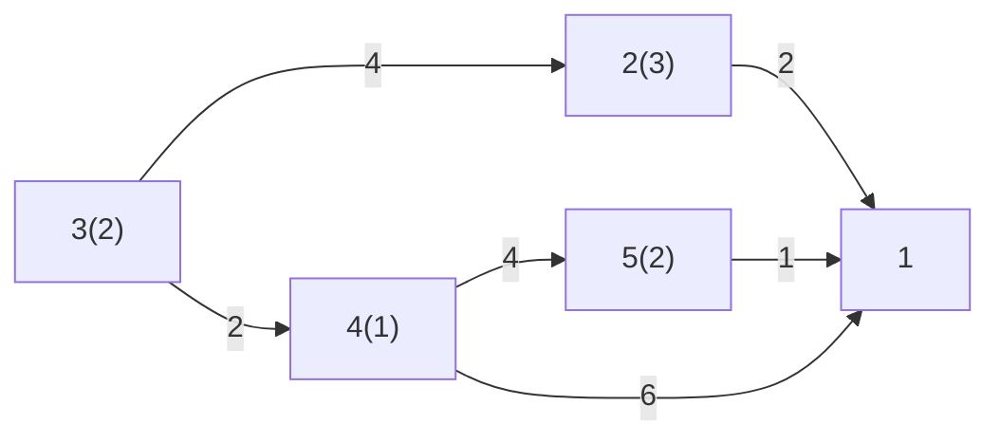

# Esempio [[Problemi di ottimizzazione|ottimizzazione]] acqua

Dati:
- $A$ archi
- $b_i$ bilancio del nodo $i$
	- Positivo: pozzo, esce meno acqua di quello che entra
	- Negativo: sorgente, esce più acqua di quello che entra

Da trovare:
- $x_{ij}$ m³ acqua che transitano attraverso $(i,j)∈A$

Problemi nel creare i vincoli:
- L'acqua deve tutta andare al depuratore:
	- Non il modo migliore per implementarlo: $x_{21}+x_{41}+x_{51}=8$
	- E il nodo 3? Deve passare per più nodi, ciò rende le cose difficili.
		- $x_{34}+1=x_{41}+x_{45}$
	- Come si generalizza?

Vincoli:
- Conservazione del flusso: $∑\limits_{j∈BN(i)} x_{ji} - ∑\limits_{j∈FN(i)} x_{ij} = b_i \quad i ∈ N$
	- Stella entrante: $BN(i)=\{j ∈ N : (j,i) ∈ A\}$
	- Stella uscente: $FN(i)=\{j ∈ N : (i,j) ∈ A\}$
- Bilanci nodi: $∑\limits_{i∈N}b_i=0$
%%- Vincoli di capacità $0≤x_{ij}≤u_{ij} \quad (i,j)∈A$%%
Funzione obiettivo min: $∑\limits_{(i,j) ∈ A} c_{ij}x_{ij}$
