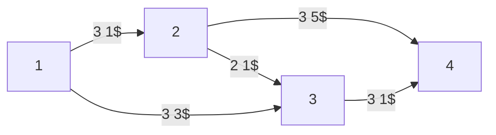
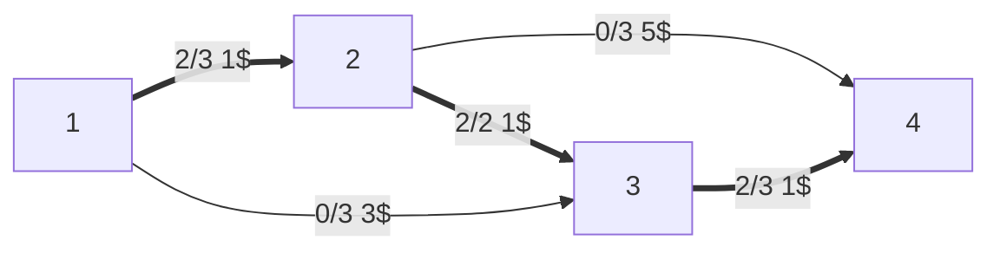
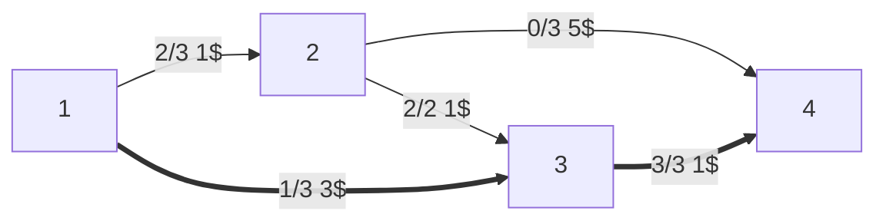
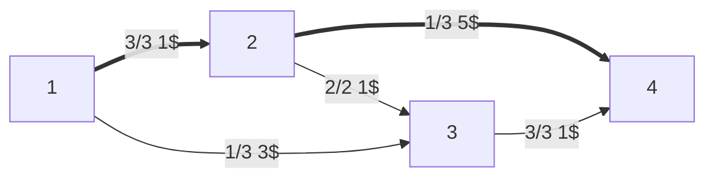
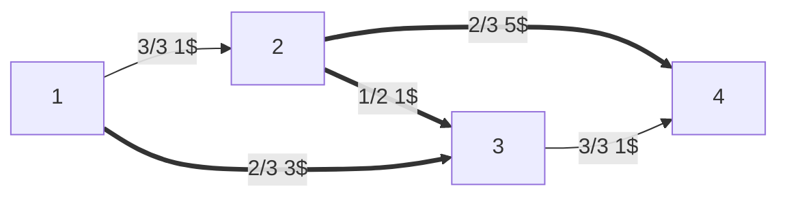

# [[Problemi di ottimizzazione|Ottimizzazione]] flusso di costo minimo

Gli archi hanno una capacità $u_{ij}$ e una costo di $c_{ij}$$ per ogni unità trasportata.

Abbiamo i soliti vincoli di [[ottimizzazione grafi]].



- $b_1=-5$
- $b_4=5$
- $b_i=0$ per tutti gli altri $i$

Proviamo a vedere questo pseudoflusso, di costo 6$:



Ciò creerà questo [[Ottimizzazione trasporto massimo#^8639e2|grafo residuo]]:

```mermaid
flowchart LR
1 --> |1 1$| 2
1 <-- |2 -1$| 2
2 <-- |2 -1$| 3
1 --> |3 3$| 3
2 --> |3 5$| 4
3 --> |1 1$| 4
3 <-- |2 -1$| 4
```

Il cammino di costo minimo è $1→3→4$, aggiungiamoci un'unità:



Costo $=6+1+3=10$, ma mancano ancora 2 unità.

Grafo residuo:

```mermaid
flowchart LR
1 --> |1 1$| 2
1 <-- |2 -1$| 2
2 <-- |2 -1$| 3
1 --> |2 3$| 3
1 <-- |1 -3$| 3
2 --> |3 5$| 4
3 <-- |3 -1$| 4
```

Il cammino di costo minimo è $1→2→4$, spingiamoci un'altra unità:




Costo $=10+1+5=16$, manca un'ultima unità.

Grafo residuo:

```mermaid
flowchart LR
1 <-- |3 -1$| 2
2 <-- |2 -1$| 3
1 --> |2 3$| 3
1 <-- |1 -3$| 3
2 --> |2 5$| 4
2 --> |1 -5$| 4
3 <-- |3 -1$| 4
```

Il grafo mostra chiaramente un unico cammino rimasto per l'ultima unità: $1→3→2→4$.



Costo: $16+3-1+5=23$.

$x=(x_{ij})∈ℝ^n$ pseudoflusso se rispetta i vincoli di capacità $0≤x_{ij}≤u_{ij}$

Sbilanciamento del nodo $i$ rispetto alle pseudoflusso $x$: se è $0$, il flusso è bilanciato: $e_i(x)=∑\limits_{j∈BN(i)} x_{ji} - ∑\limits_{j∈FN(i)} x_{ij} - b_i$

Nodi con accesso di flusso (surplus): $O_x=\{i∈N:e_i(x)>0\}$

Nodi con difetto di flusso (deficit): $D_x=\{i∈N:e_i(x)<0\}$

Sbilanciamento complessivo di $x$ $∑\limits_{i∈O_x}e_i(x)$

Se nel grafo residuo c'è un ciclo aumentante di costo negativo, allora il flusso non può essere di costo minimo:

$x$ flusso ammissibile di costo minimo
⇔
$x$ non ammette cicli aumentanti di costo negativo

## Un grafo più complesso

```mermaid
flowchart LR
1 --> |2 2$| 2
1 --> |6 1$| 3
1 <-- |3 -1$| 5
3 --> |5 4$| 2
3 --> |5 1$| 5
2 <-- |2 -2$| 6
2 --> |6 1$| 4
5 --> |3 2$| 4
4 --> |2 2$| 6
5 --> |4 3$| 6
```

I $b_i$ sono:
- Sorgenti:
	- $b_1=-4$
	- $b_5=-2$
- Pozzi
	- $b_4=b_6=3$
- $b_i=0$ per tutti gli altri $i$

Se avere più di una sorgente o più di un pozzo può dare fastidio, basta immaginare una super sorgente $s$ con $b_s=-4-2=-6$ collegata a costo 0 alle vere sorgenti, e idem per i pozzi.

Proviamo questo pseudoflusso:

```mermaid
flowchart LR
1 --> |2| 2
1 --> |2| 3
1 <-- |3| 5
3 --> |2| 2
3 --> |2| 5
2 <-- |2| 6
2 --> |6| 4
5 --> |0| 4
4 --> |1| 6
5 --> |2| 6
```

Ciò creerà questo grafo residuo (i nodi sono rimpiazzati dagli sbilanciamenti):

```mermaid
flowchart LR
1[3] <-- |2 -2$| 2[0]
1 --> |4 1$| 3[-2]
1 <-- |2 -1$| 3
1 --> |3 -1$| 5[-1]
3 --> |3 4$| 2
3 <-- |2 -4$| 2
3 --> |3 1$| 5
3 <-- |2 -1$| 5
2 --> |2 2$| 6[-2]
2 <-- |6 -1$| 4[2]
5 --> |3 2$| 4
4 --> |1 2$| 6
4 <-- |1 -2$| 6
5 --> |2 3$| 6
5 <-- |2 -3$| 6
```

Il ciclo $\{2,3,5,4\}$ è aumentante: costo $=-4+1+2-1=-2$, con capacità $2$: si può risparmiare un costo $-2*2=-4$ senza cambiare il bilanciamento.

### Pseudoflusso minimale

Pseudoflusso di costo minimo tra tutti gli pseudoflussi con gli stessi sbilanciamenti

$x$ pseudoflusso minimale
⇔
$x$ non ammette cicli aumentanti di costo negativo

#### Algoritmo dei cammini minimi successivi

Inizializzazione: $x$ pseudoflusso minimale
1. Se $x$ è ammissibile ($g(x)=0$) allora STOP
2. Ricerca di un cammino aumentante di costo minimo
	- Se non esiste alcun cammino aumentante, allora STOP (non esistono soluzioni ammissibili)
	- Altrimenti "aumentare" di $θ$ unità il flusso lungo il cammino trovato dove $θ=\min\{\text{capacità sul cammino},e_x(s),-e_x(t)\}$, con $s∈O_x$ origine del cammino e $t∈D_x$ destinazione del cammino
3. Ritornare a 1.

Si basa sulla proprietà:

$x$ pseudoflusso minimale, $p$ cammino aumentante di costo minimo tra tutti i cammini da $s∈O_x$ e $t∈O_x$
⇓
Inviando flusso sul cammino si ottiene un altro pseudoflusso minimale (con sbilanciamento complessivo diminuito di $θ$)

(E ovviamente con tutti i flussi a 0 si parte con uno pseudoflusso minimale. escludendo cicli aumentanti di costo negativo)

$\bar{x_{ij}}=\begin{cases}0 & \text{se } c_{ij}≥0 \\ u_{ij} & \text{se }c_{ij}<0 \end{cases}$

Nel suo grafo residuo: costi ≥ 0
↓
Pseudoflusso minimale

Complessità:
- SPT.L - Bellman-For per iterazione $O(mn)$
- \# iterazione $g(x)=∑\limits_{i∈O_x}e_i(x)≤∑\limits_{(i,j)∈A:c_{ij}<0}u_{ij}+∑\limits_{i∈N:b_i>0}b_i$

Complessivamente: $O(\bar{g}mn)$