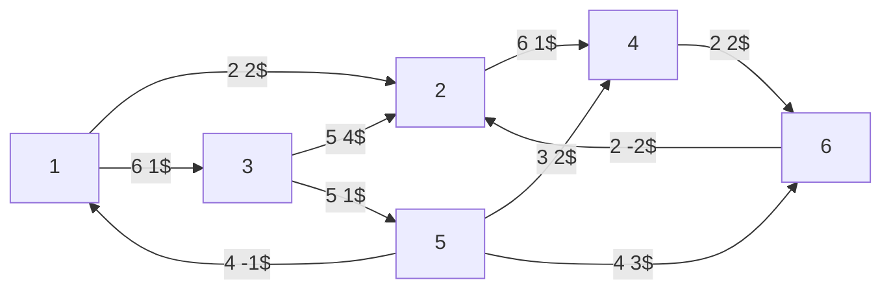
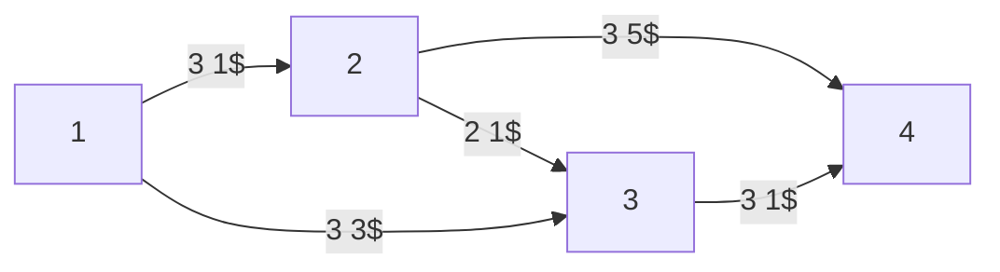
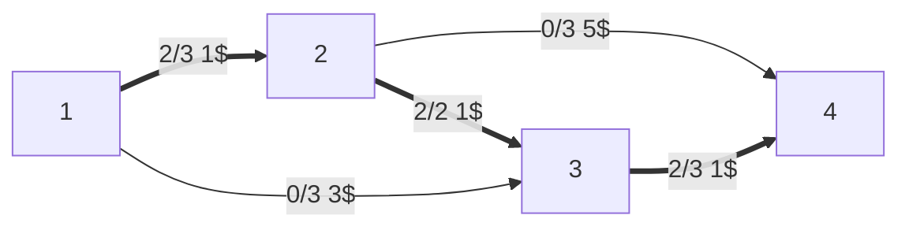
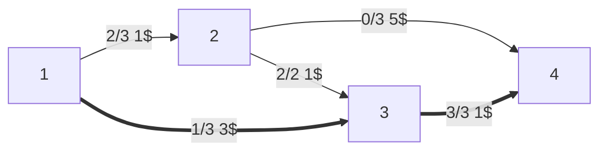
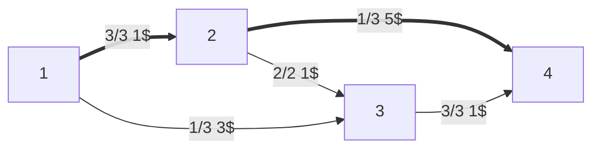
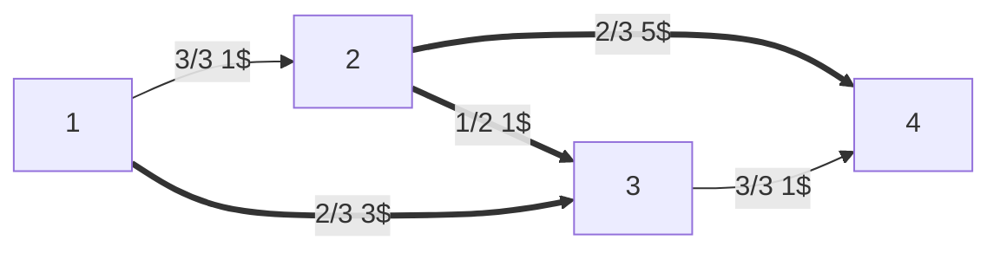

# [[Problemi di ottimizzazione|Ottimizzazione]] flusso di costo minimo

Gli archi hanno una capacità $u_{ij}$ e una costo di $c_{ij}$$ per ogni unità trasportata.



I $b_i$ sono:
- Sorgenti:
	- $b_1=-4$
	- $b_5=-2$
- Pozzi
	- $b_4=b_6=3$
- $0$ per tutto il resto

Abbiamo i soliti vincoli di [[ottimizzazione grafi]]. Se avere più di una sorgente o più di un pozzo può dare fastidio, basta immaginare una super sorgente $s$ con $b_s=-4-2=-6$ collegata a costo 0 alle vere sorgenti, e idem per i pozzi.

## Versione più semplice passo-passo



- $b_1=-5$
- $b_4=5$

Proviamo a vedere questo pseudoflusso, di costo 6$:



Ciò creerà questo [[Ottimizzazione trasporto massimo#^8639e2|grafo residuo]]:

```mermaid
flowchart LR
1 --> |1 1$| 2
1 <-- |2 -1$| 2
2 <-- |2 -1$| 3
1 --> |3 3$| 3
2 --> |3 5$| 4
3 --> |1 1$| 4
3 <-- |2 -1$| 4
```

Il cammino di costo minimo è $1→3→4$, aggiungiamoci un'unità:



Costo $=6+1+3=10$, ma mancano ancora 2 unità.

Grafo residuo:

```mermaid
flowchart LR
1 --> |1 1$| 2
1 <-- |2 -1$| 2
2 <-- |2 -1$| 3
1 --> |2 3$| 3
1 <-- |1 -3$| 3
2 --> |3 5$| 4
3 <-- |3 -1$| 4
```

Il cammino di costo minimo è $1→2→4$, spingiamoci un'altra unità:




Costo $=10+1+5=16$, manca un'ultima unità.

Grafo residuo:

```mermaid
flowchart LR
1 <-- |3 -1$| 2
2 <-- |2 -1$| 3
1 --> |2 3$| 3
1 <-- |1 -3$| 3
2 --> |2 5$| 4
2 --> |1 -5$| 4
3 <-- |3 -1$| 4
```

Il grafo mostra chiaramente un unico cammino rimasto per l'ultima unità: $1→3→2→4$.



Costo: $16+3-1+5=23$.

$x=(x_{ij})∈ℝ^n$ pseudoflusso se rispetta i vincoli di capacità $0≤x_{ij}≤u_{ij}$

Sbilanciamento del nodo $i$ rispetto alle pseudoflusso $x$: se è $0$, il flusso è bilanciato: $e_i(x)=∑\limits_{j∈BN(i)} x_{ji} - ∑\limits_{j∈FN(i)} x_{ij} - b_i$

Nodi con accesso di flusso (surplus): $O_x=\{i∈N:e_i(x)>0\}$

Nodi con difetto di flusso (deficit): $D_x=\{i∈N:e_i(x)<0\}$

Sbilanciamento complessivo di $x$ $∑\limits_{i∈O_x}e_i(x)$