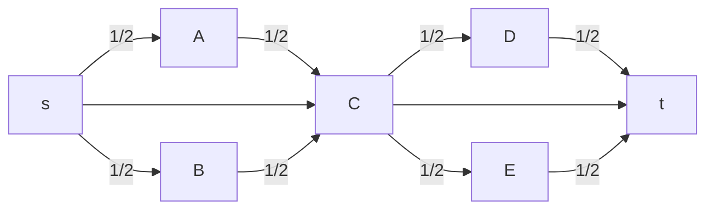
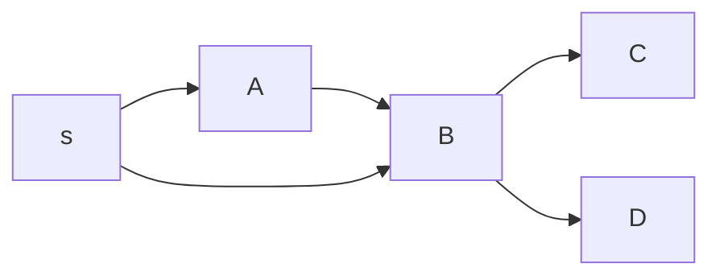
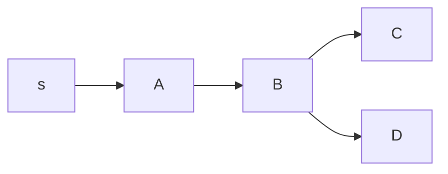
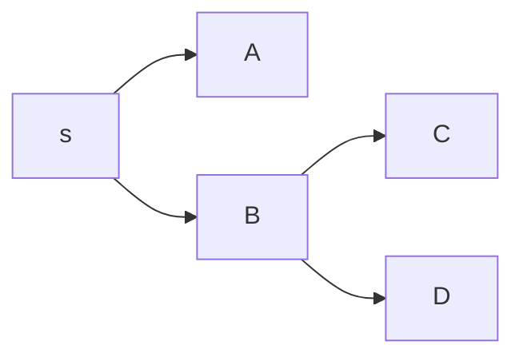
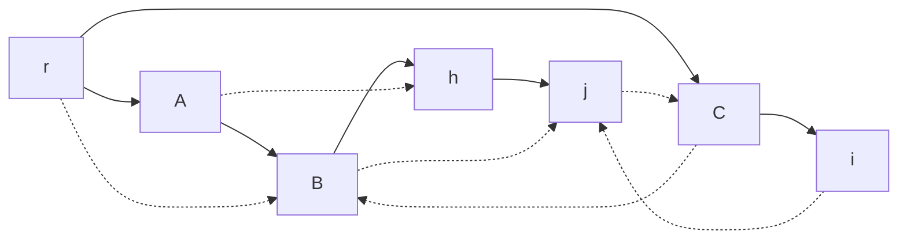
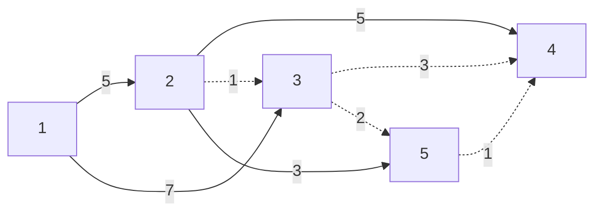
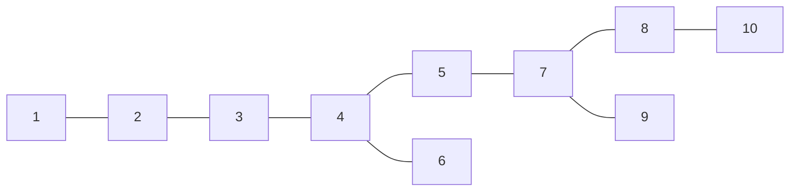
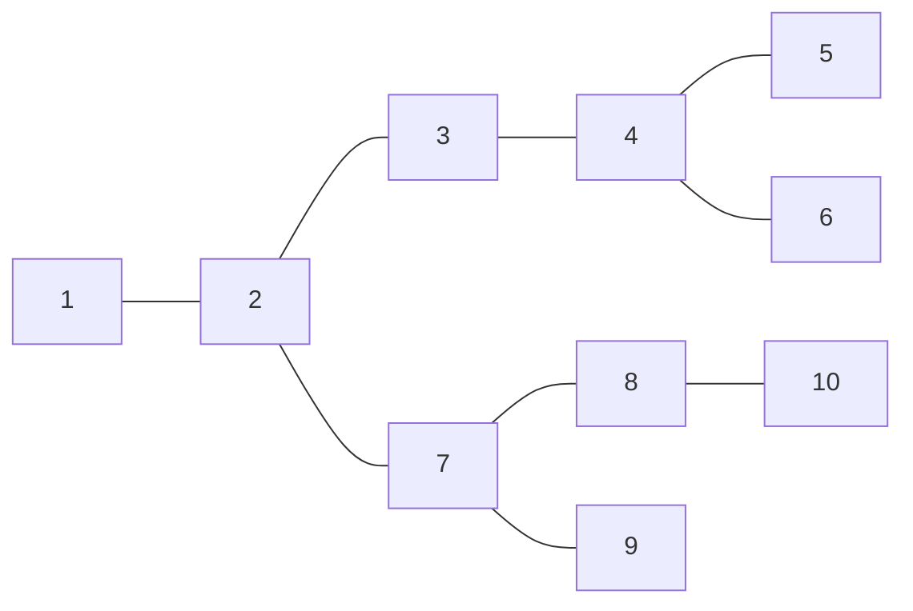

# Grafi

In un [[Problemi di ottimizzazione|problema di ottimizzazione]] di un grafo $G=(N,A)$, con archi $(i,j)∈A$, di solito si hanno questi dati:
- $x_{ij}$ flusso nell'arco $(i,j)$
- $b_i$ come il bilancio del nodo $i$
	- $b_i$ può essere positivo o negativo per scegliere a piacere tra *pozzo* o *sorgente*

Generalmente si ha questo vincolo:
- Conservazione del flusso: $∑\limits_{j∈BN(i)} x_{ji} - ∑\limits_{j∈FN(i)} x_{ij} = b_i \quad i ∈ N$
	- Stella entrante: $BN(i)=\{j ∈ N : (j,i) ∈ A\}$
	- Stella uscente: $FN(i)=\{j ∈ N : (i,j) ∈ A\}$

## Cammino minimo

Abbiamo una sorgente $s∈N$ e una destinazione $t∈N$ a cui dobbiamo trasmettere un singolo elemento, gli archi che hanno un costo $c_{ij}$.

Da qui si può rappresentare un problema di cammino minimo con:

Vincoli:
- Conservazione del flusso: $∑\limits_{j∈BN(i)} x_{ji} - ∑\limits_{j∈FN(i)} x_{ij} = \begin{cases} -1 &\text{se } i=s \\ 1 &\text{se } i=t \\ 0 &\text{altrimenti} \end{cases} \quad i ∈ N$

Da trovare:
- $x_{ij}=\begin{cases} 1 &\text{se si passa per l'arco } (i,j)∈A \\ 0 &\text{altrimenti} \end{cases}$

Funzione obiettivo min: $∑\limits_{(i,j)∈A}x_{ij}c_{ij}$

### Problema non intero

Questi vincoli lo rendono un problema di programmazione lineare intera: i vincoli di interezza (di $x_{ij}$ in questo caso) rendono il calcolo della soluzione più complicato. Si può fare invece con $0≤x_{ij}≤1$?

Per esempio, immaginiamo che in questo grafo questa sia la soluzione ottima:


Non è un cammino. Però:
- I bilanci nel vincolo di conservazione sono soddisfatti
- Assumiamo che con il vincolo di interezza la soluzione ottima sia $s→C→t$, e che sia peggiore.
	- Ciò dovrebbe voler dire che il costo di ½ cammino sopra + ½ cammino sotto < cammino centrale.
	- Inoltre, i cammini sopra e sotto dovrebbero costare uguali, sennò sarebbe meglio prendere interamente uno dei due.
		- Ma a questo punto si può anche prendere interamente uno dei due cammini e non cambierebbe il costo.

Quindi, rimuovere il vincolo di interezza non cambia il costo totale. I cammini con $x_{ij}$ frazionario sono semplicemente strade alternative.

#### Distribuendo a tutti

La radice $s$ deve trasmettere un pacchetto a tutti i nodi. Gli archi inoltre vanno comprati ogni volta che ci si passa.

Vincoli:
- Conservazione del flusso: $∑\limits_{j∈BN(i)} x_{ji} - ∑\limits_{j∈FN(i)} x_{ij} = b_i \quad i ∈ N$
	- $b_i=\begin{cases} -(|N|-1) &\text{se } i=s \\ 1 &\text{altrimenti} \end{cases}$

$x_{ij}$ sarà il numero di cammini che usano l'arco $(i,j)$, quindi $x_{ij} ∉ \{0,1\}$, bensì $x≥0$.

Nota che è possibile che il grafo non sia connesso, in questo caso non esisterà soluzione. Si può risolvere creando un arco esageratamente costoso (se $+∞$ non si potesse fare, $(|N|-1)(\max\limits_{(i,j)∈A} c_{ij})+1$ va bene) dalla radice a tutti i nodi.

Stiamo anche assumendo che non ci siano cicli di costo negativo.

### Albero dei cammini minimi

Questo percorso non è di cammino minimo:



Però uno di questi due potrebbe esserlo:

Se s→A→B è meglio rispetto a s→B:




Se s→B è meglio rispetto a s→A→B:



---

Prendiamo questo grafo, dove le linee non tratteggiate sono di commini minimi:



$d_h \; d_j \; d_i$ Costo dei cammini da $r$ sull'albero

$d_h+c_{hj}=d_j$

$d_i+c_{ij}≥d_j$

Quindi:
- Condizioni di Bellman
	- $(N,A_T)$ è un albero dei cammini minimi ⇔ $d_i+c_{ij}≥d_j \quad ∀(i,j)∈A$
- Etichetta del nodo $i$
	- $d_i=$ costo dell'unico cammino da $r$ a $i$ sull'albero ($d_r=0$)

#### Verifica

Questo albero è dei cammini minimi?



- $d_1=0$
- $d_2=5$
- $d_3=7$
- $d_4=10$
- $d_5=8$

Dobbiamo verificare la condizione di Bellman per ogni arco che non è dell'albero.
- $d_2+c_{23}=5+1=6<7=d_3$

E abbiamo già verificato che la condizione di Bellman non è verificata: l'albero non è dei cammini minimi.

Per certificare che l'albero non è di cammini minimi basta solo trovare una condizione non soddisfatta. Attenzione: non tutte le etichette sbagliate hanno per forza la condizione non soddisfatta, per esempio:

$d_4=d_2+c_{24}=5+5=10=d_3+c_{34}=7+3=10$ soddisfa la condizione (avevamo visto che dovrebbe essere $d_3=6$, e $6+3=9<10=d_4$, ma dato che controlliamo con il $d_3$ sbagliato non si nota che anche $d_4$ è sbagliato)

#### Algoritmo SPT (SHortest Path Tree)

- Inizializzazione (albero fittizio)
	- $p_r=-, d_i=0, p_i=r,d_i=M \quad i≠r \quad Q=\{r\}$
		- $p_i$ nodo padre rispetto al nodo $i$
		- $Q=\{\text{coda di archi che potrebbero violare 'Bellman'}\}$
- Procedura
	1. Se $Q=∅$ allora STOP
	2. Scegliere $u∈Q$
	3. $Q=Q∖\{u\}$
	4. Per ogni arco $(u,v)∈A$: se $d_u+c_{uv}<d_v$, allora
		- $p_v=u$
		- $d_v=d_u+c_{uv}$
		- Se $v∉Q$ allora $Q=Q∪\{v\}$
	5. Ritornare a 1.

Inizializzazione alternativa: qualsiasi albero di cammini (mantenendo le etichette), così si risparmia sulle iterazioni.

##### Implementazione di Q

Coda di priorità (Dijkstra): $u∈Q \text{ t.c. } d_u=\min\{d_i:i∈Q\}$

Lista (Bellman-Ford): Fila→FIFO

Teorema: Se $c_{ij}≥0$ per ogni $(i,j)∈A$,a allora nell'algoritmo di Dijkstra ogni nodo viene inserito e conseguentemente estratto da $Q$ al più 1 volta.

###### Complessità

- Iterazioni iniziale: "al più" $O(n)$ (\# nodi)
- Selezione etichetta $O(n)$
- Verifica Bellman + aggiornamenti $O(m)$ (\# archi)

$O(n^2)$ selezione etichette + $O(m)$ "operazioni" = $O(n^2)$ (dato che $m≤n^2$)

Heap binario: $O(m \log n$): $\begin{matrix} m≅n & ← & \text{Sparso} \\ m≅n^2 & ← & \text{Denso} \end{matrix}$

Teorema: Se nel grafo non sono presenti cicli di costo (complessivo) negativo, allora nell'algoritmo di Bellman-Ford ogni nodo viene inserito e conseguentemente estratto da $Q$ al più $(n-1)$ volte → $O(mn)$

Si può aumentare il costo di tutti gli archi per una costante per renderli tutti positivi, ed avere un problema equivalente?

$c_{ij}≥0$: sia $M≥0$ t.c. $\widehat{c_{ij}}=c_{ij}+M≥0 \quad ∀(i,j)∈A$

$∑\limits_{(i,j)∈A}\widehat{c_{ij}}x_{ij}=∑\limits_{(i,j)∈A}c_{ij}x_{ij}+M∑\limits_{(i,j)∈A}x_{ij}=∑\limits_{(i,j)∈A}c_{ij}x_{ij}+M(n-1)$

Non è restrittivo supporre $c_{ij}≥0$. Questo *non* è vero per l'albero dei cammini minimi.

### Albero di copertura

$G=(N,A)$ grafo non orientato $(i,j)≡(j,i)$ (si preferisce $i<j$)

Gli archi hanno un costo $c_{ij}$, con $(i,j)∈A$

$(N,A_T)$ Albero di copertura (sottografo connesso privo di cicli)

Costo di $A_T=∑\limits_{(i,j)∈A_T}c_{ij}$

$x_{ij}∈\{0,1\} \quad x_{ij}=\begin{cases} 1 & \text{se } (i,j) \text{ appartiene all'albero} \\ 0 & \text{altrimenti} \end{cases}$

Vincoli:
- Ogni nodo è connesso ad almeno un altro nodo $∑\limits_{(j∈A(i)}x_{ij}≥1 \quad i∈N$
	- $A(i)=\{j∈N:(i,j)∈A\}$
- Il numero di archi è minimo, così non ci sono cicli $∑\limits_{((i,j)∈A}x_{ij}=n-1$

#### Taglio

```
1 --- 2 --- 3 --- 4    N'
      |
------x------------ A(N',N'')
      |
5 --- 6 --- 7 --- 8    N''
```

$(N',N'') \text{ t.c. } \begin{cases} N'∩N''=∅ \\ N'∪N''=N \end{cases}$

Insieme degli archi che passano attraverso taglio: $A(N',N'')=\{(i,j)∈A:i∈N',j∈N'' \text{ oppure } i∈N'',j∈N'\}$

Vincoli:
- In ogni taglio ci deve essere almeno un arco $∑\limits_{(i,j)∈A(N',N'')}x_{ij}≥1 \quad ∀(N',N') \text{ taglio}$
- Il numero di archi è minimo, così non ci sono cicli $∑\limits_{(i,j)∈A}x_{ij}=n-1$

Se vogliamo essere generici, questi vincoli rimpiazzano quelli precedenti.

#### MST (Minimum Spanning Tree)

Un albero di copertura t.c. questa funzione sia minima: $∑\limits_{(i,j)∈A}c_{ij}x_{ij}$

#### Esempio



Se non è di costo minimo, magari sarebbe meglio togliere un arco e metterne un altro, per esempio:



##### Ottimalità per cicli

$(N,A_T)$ albero di copertura di costo minimo
⇔
costo di ciascun arco $(i,j)∉A_T$ è ≥ costo di ciascun arco del ciclo che si viene a creare aggiungendo l'arco $(i,j)$ a $A_T$

##### Ottimalità per tagli

$(N,A_T)$ albero di copertura di costo minimo
⇔
costo di ciascun arco $(i,j)∈A_T$ è ≤ costo di ciascun arco del ciclo che si viene a creare rimuovendo l'arco $(i,j)$ da $A_T$

#### Greedy MST

- Costruzione dell'albero arco per arco
	- $S=\{\text{archi inseriti}\} \quad R=\{\text{archi scartati}\}$
- Inserzione
	- Selezionare un taglio $A(N',N'') \text{ t.c. } A(N',N'')∩S=∅$
	- Inserire in $S$ l'arco $(i,j)∈A(N',N'')$ t.c.
		- $(i,j)∉R$
		- $c_{ij}=\min\{c_{ke}:(k,e)∈A(N',N'')∖R\}$ (non può essere ∅)
- Cancellazione
	- Selezionare ciclo $C$ t.c. $C∩R=∅$
	- Scartare $(i,j)∈C$ t.c.
		- $(i,j)∉S$
		- $c_{ij}=\max\{c_{ke}:(k,e)∈C∖S\}$ (non può essere ∅)

Iterazione: effettuare una inserzione oppure ima cancellazione finché $|S|=n-1$

Proprietà di Greedy MST: se $(S,R)$ sono tale che esiste un albero di costo $(N,A_T)$ minimo per cui $S≤A_T$ e $R∩A_T=∅$, allora effettuando una inserzione oppure una cancellazione si ottiene un $(S',R')$ che soddisfa la medesima proprietà, (ovvero esiste un albero di copertura di costo minimo $(N,A_T')$ t.c $S'⊆A_T'$ e $R'∩A_T'=∅$).

##### Algoritmo di Kruskal

- Si ordinano gli archi per non decrescente
- Si esaminano gli archi in quell'ordine
- Se l'arco esaminato non forma un ciclo con $S$, allora si aggiunge ad $S$, altrimenti a $R$