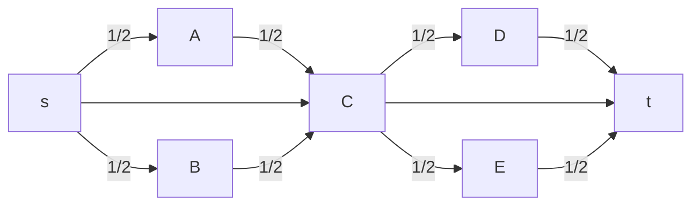
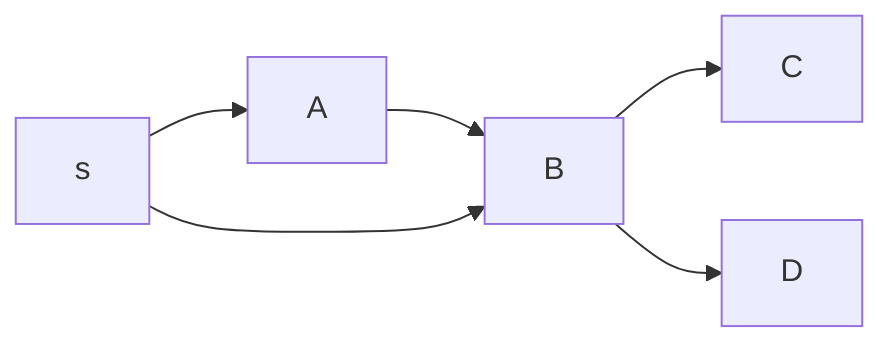
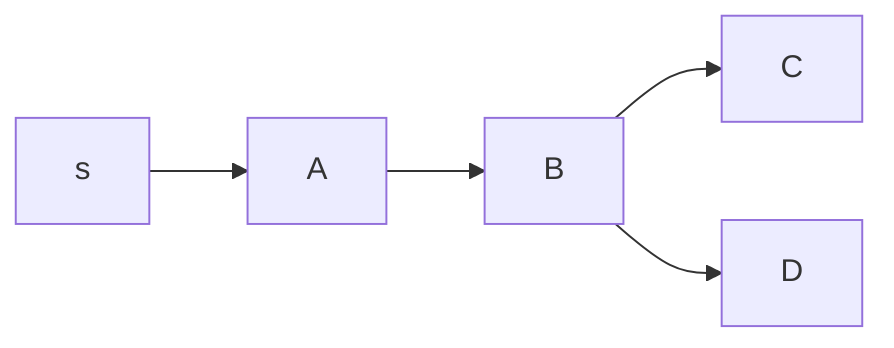
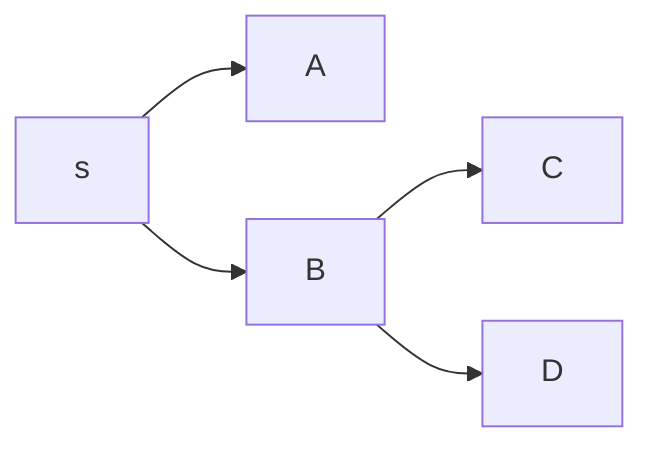

# Grafi

In un [[Problemi di ottimizzazione|problema di ottimizzazione]] di un grafo $G=(N,A)$, con archi $(i,j)∈A$, di solito si hanno questi dati:
- $x_{ij}$ flusso nell'arco $(i,j)$
- $b_i$ come il bilancio del nodo $i$
	- $b_i$ può essere positivo o negativo per scegliere a piacere tra *pozzo* o *sorgente*

Generalmente si ha questo vincolo:
- Conservazione del flusso: $∑\limits_{j∈BN(i)} x_{ji} - ∑\limits_{j∈FN(i)} x_{ij} = b_i \quad i ∈ N$
	- Stella entrante: $BN(i)=\{j ∈ N : (j,i) ∈ A\}$
	- Stella uscente: $FN(i)=\{j ∈ N : (i,j) ∈ A\}$

## Cammino minimo

Abbiamo una sorgente $s∈N$ e una destinazione $t∈N$ a cui dobbiamo trasmettere un singolo elemento, gli archi che hanno un costo $c_{ij}$.

Da qui si può rappresentare un problema di cammino minimo con:

Vincoli:
- Conservazione del flusso: $∑\limits_{j∈BN(i)} x_{ji} - ∑\limits_{j∈FN(i)} x_{ij} = \begin{cases} -1 &\text{se } i=s \\ 1 &\text{se } i=t \\ 0 &\text{altrimenti} \end{cases} \quad i ∈ N$

Da trovare:
- $x_{ij}=\begin{cases} 1 &\text{se si passa per l'arco } (i,j)∈A \\ 0 &\text{altrimenti} \end{cases}$

Funzione obiettivo min: $∑\limits_{(i,j)∈A}x_{ij}c_{ij}$

### Problema non intero

Questi vincoli lo rendono un problema di programmazione lineare intera: i vincoli di interezza (di $x_{ij}$ in questo caso) rendono il calcolo della soluzione più complicato. Si può fare invece con $0≤x_{ij}≤1$?

Per esempio, immaginiamo che in questo grafo questa sia la soluzione ottima:

Non è un cammino. Però:
- I bilanci nel vincolo di conservazione sono soddisfatti
- Assumiamo che con il vincolo di interezza la soluzione ottima sia $s→C→t$, e che sia peggiore.
	- Ciò dovrebbe voler dire che il costo di ½ cammino sopra + ½ cammino sotto < cammino centrale.
	- Inoltre, i cammini sopra e sotto dovrebbero costare uguali, sennò sarebbe meglio prendere interamente uno dei due.
		- Ma a questo punto si può anche prendere interamente uno dei due cammini e non cambierebbe il costo.

Quindi, rimuovere il vincolo di interezza non cambia il costo totale. I cammini con $x_{ij}$ frazionario sono semplicemente strade alternative.

#### Distribuendo a tutti

La radice $s$ deve trasmettere un pacchetto a tutti i nodi. Gli archi inoltre vanno comprati ogni volta che ci si passa.

Vincoli:
- Conservazione del flusso: $∑\limits_{j∈BN(i)} x_{ji} - ∑\limits_{j∈FN(i)} x_{ij} = b_i \quad i ∈ N$
	- $b_i=\begin{cases} -(|N|-1) &\text{se } i=s \\ 1 &\text{altrimenti} \end{cases}$

$x_{ij}$ sarà il numero di cammini che usano l'arco $(i,j)$, quindi $x_{ij} ∉ \{0,1\}$, bensì $x≥0$.

Nota che è possibile che il grafo non sia connesso, in questo caso non esisterà soluzione. Si può risolvere creando un arco esageratamente costoso (se $+∞$ non si potesse fare, $(|N|-1)(\max\limits_{(i,j)∈A} c_{ij})+1$ va bene) dalla radice a tutti i nodi.

Stiamo anche assumendo che non ci siano cicli di costo negativo.

##### Albero dei cammini minimi

Questo percorso non è di cammino minimo:

Però uno di questi due potrebbe esserlo:

Se s→A→B è meglio rispetto a s→B

Se s→B è meglio rispetto a s→A→B

