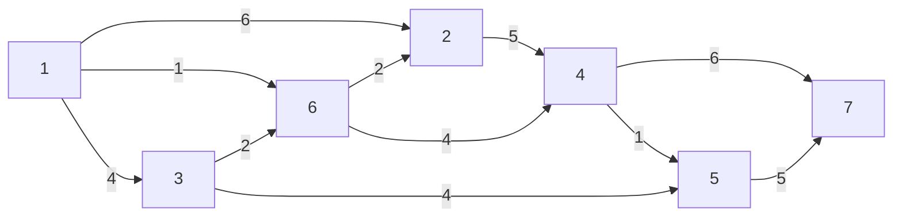
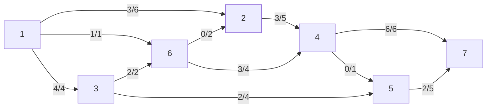
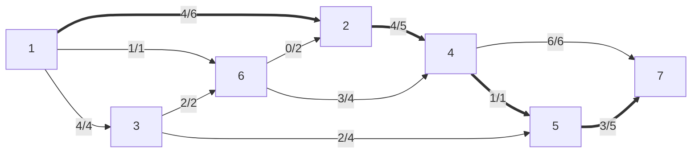
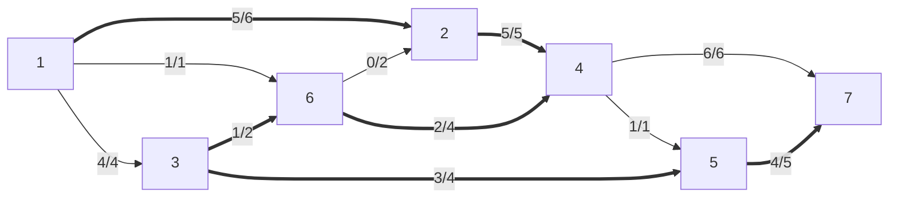
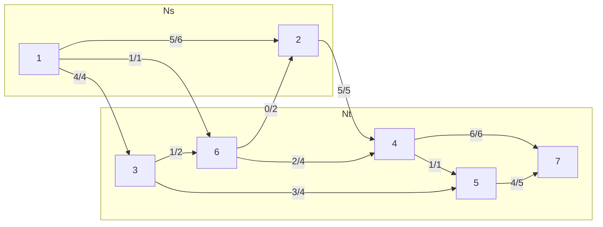
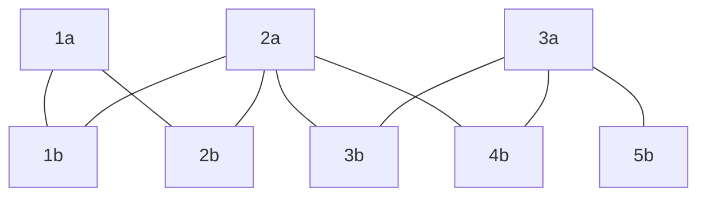
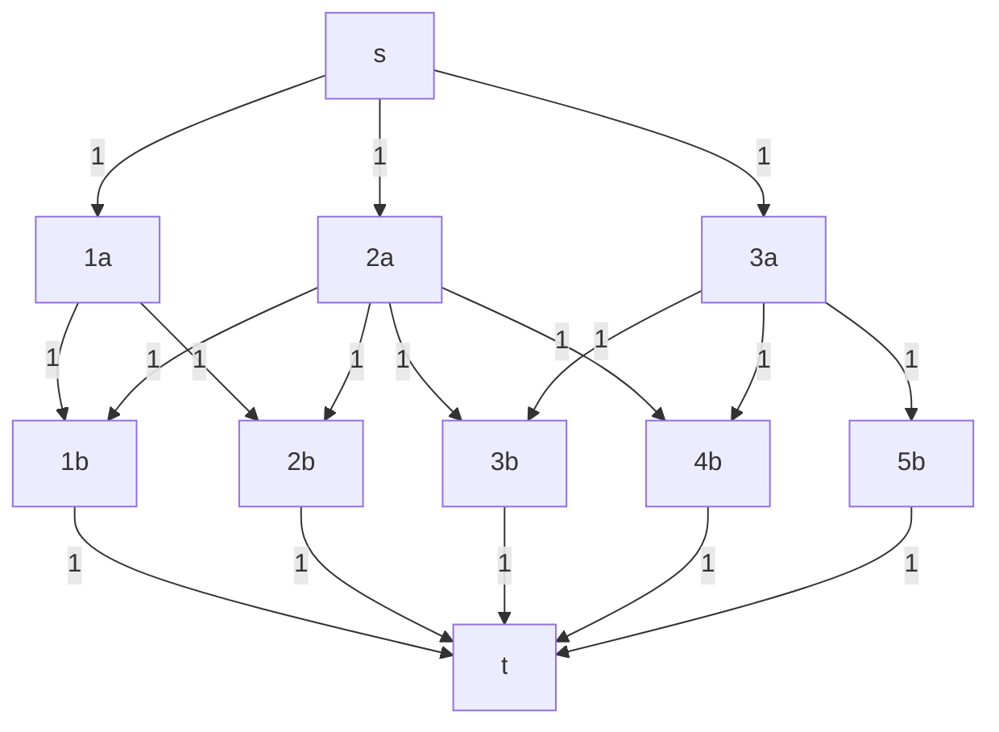

# [[Problemi di ottimizzazione|Ottimizzazione]] trasporto massimo



L'obiettivo è di trasportare la maggior quantità di flusso possibile da $1$ e $7$. Tuttavia, i tubi (archi) hanno una capacità massima nel trasporto di acqua ($u_{ij}$), e i nodi non ammettono di ricevere più acqua di quella mandano (e ovviamente anche il contrario). Come si distribuisce il flusso?

Dati:
- $s=1$ origine
- $t=7$ destinazione
- $b_i = \begin{cases} -V &\text{se } i=s \\ V &\text{se } i=t \\ 0 &\text{altrimenti} \end{cases}$

Funzione obiettivo max: $V$

Proviamo una soluzione ammissibile (negli archi c'è scritto $x_{ij}/u_{ij}$):



In questo caso la soluzione ammissibile è $V=8$. Si può fare di meglio?

Si potrebbe aumentare la quantità di flusso lungo questo cammino orientato:
$P=\{1,2,4,5,7\}$ (cammino aumentante)

Di quanto si aumenta? Del minimo della capacità residua degli archi.

$θ=\min\{u_{ij}-x_{ij}:(i,j)∈P\}$, che in questo caso è 1.

$(i,j)$ è **saturo** se $x_{ij}=u_{ij}$



Ora $V=8+1=9$

Si può fare ancora di più? Sembra quasi che si potrebbe aumentare il flusso in $\{1,2,4,7\}$, ma $(4,7)$ è già saturo, quindi in $4$ si accumula un'unità di flusso. Possiamo allora riportare questo eccesso indietro, verso il nodo $6$, causando ora un eccesso di 1 lì. Si può rifare la stessa cosa verso il nodo $3$, che però ha spazio libero in $(3,5)$, come c'è spazio in $(5,7)$. Abbiamo quindi questo cammino con $V=10$, anche se non è orientato.



- $P=\{1,2,4,6,3,5,7\}$
- $P^+ \; (1,2) \; (2,4) \; (3,5) \; (5,7)$ Concordi con il verso del cammino.
	- Il flusso è *aumentato* ↑
- $P^- \; (6,4) \; (3,6)$ Concordi con il verso del cammino
	- Il flusso è *diminuito* ↓
- $θ^+=\min\{u_{ij}-x_{ij}:(i,j)∈P^+\}$
- $θ^-=\min\{x_{ij}:(i,j)∈P^-\}$
- $θ=\min\{θ^+,θ^-\}$

$P$ è un *cammino aumentante* se:
- $P$ è un cammino da $s$ a $t$
	- Più genericamente, da un nodo con surplus verso un nodo con deficit
- $θ>0$

## [[Ottimizzazione grafi#^64bc6c|Tagli]]

Si può fare ancora meglio? Facendo un taglio che separa l'origine da tutto e prendendo gli archi diretti nel taglio, sembra che al massimo si possa ottenere $6+1+4=11$, idem separando la destinazione da tutto, $6+5=11$. Tuttavia il taglio che separa $\{1,2\}$ da tutto il resto dice un altra storia: $5+1+4=10$ (si esclude l'arco inverso nel taglio $(6,2)$), e abbiamo già raggiunto un $V=10$.

Generalmente:
- $(N_s,N_t)$ taglio che separa $s$ da $t$
	- $(N_s,N_t)$ taglio
	- $s∈N_s,t∈N_t$
- $A^+(N_s,N_t)=\{(i,j∈A:i∈N_s,j∈N_t\}$ archi diretti nel taglio
- $A^-(N_s,N_t)=\{(i,j∈A:i∈N_t,j∈N_s\}$ archi inversi nel taglio
- $u(N_s,N_t)=∑\limits_{(i,j)∈A^+(N_s,N_t)}u_{ij}$ capacità nel taglio
- $x(N_s,N_t)=∑\limits_{(i,j)∈A^+(N_s,N_t)}x_{ij}-∑\limits_{(i,j)∈A^-(N_s,N_t)}x_{ij}$ flusso nel taglio

**Proposizione**: sia $y$ il valore di un flusso ammissibile $x=(x_{ij}$) e sia $(N_s.N_t)$ un taglio che separa $s$ da $t$. Allora $v=x(N_s,N_t)≤u(N_s,N_t)$.

Se $v=x(N_s,N_t)=u(N_s,N_t)$, allora il flusso è di valore massimo e il taglio è di capacità minima. (Nota: è possibile che esista più di un flusso massimo)

Quindi formalmente, proviamo a trovare un cammino aumentante. L'unico arco possibile è $(1,2)$, e il cammino è già terminato.

- $N_s=\{\text{nodi visitati}\}=\{1,2\}$
- $N_t=\{\text{nodi non visitati}\}=\{3,4,5,6,7\}$



Abbiamo che:
- $(i,j)∈A^+(N_s,N_t)→x_{ij}=u_{ij}$
- $(i,j)∈A^-(N_s,N_t)→x_{ij}=0$

Quindi:
$$
v=x(N_s,N_t)=∑\limits_{(i,j)∈A^+(N_s,N_t)}x_{ij}-∑\limits_{(i,j)∈A^-(N_s,N_t)}x_{ij}=∑\limits_{(i,j)∈A^+(N_s,N_t)}u_{ij}=u(N_s,N_t)
$$

Questo dimostra il ⇐ di:

### Teorema flusso massimo - taglio di capacità minima (max flow - min cut)

Un flusso $x$ è di valore massimo
⇔
Non esistono cammini aumentanti rispetto al flusso $x$

Il massimo valore dei flussi ammissibili è uguale alla minima capacità dei tagli che separano $s$ a $t$.

Ciò si può sfruttare per:

#### Algoritmo dei cammini aumentanti (*Ford-Fulkerson*)

1. Ricerca di un cammino aumentante (visita del grafo)
	* Se ∄ un cammino aumentante, allora STOP
2. "Aumentare" il flusso lungo il cammino di $θ$
	* $+θ$ su cammini concordi del cammino
	* $-θ$ su cammini discordi del cammino
3. Ritornare a 1.

Assumendo un $x$ iniziale "intero" ($x_{ij}∈ℤ_+$) e una capacità del taglio finita ($u_{ij}∈ℤ_+)$:
- $u(\{s\},N∖\{s\})≤(n-1)U$
- $U=\max\{u_{ij}:(i,j)∈A\}$
- Complessità: $O(nmu)$
	- Numero di iterazioni: $O(nU)$
	- Costo iterazione: $O(m)$

Si può garantire la finitezza con la variante di *Edmonds-Karp*, con visite FIFO:
- Complessità: $O(nm^2)$
	- Numero di iterazioni: $O(nm)$
	- Costo iterazione: $O(m)$

## Bilanci

```
--------->
+θ    +θ
--> i -->


--------->
+θ     -θ
--> i <--


<---------
-θ    -θ
--> i -->


--------->
 -θ   +θ
<-- i -->
```

### Grafo residuo

^8639e2

Per rilevare potenziali cammini, si ragiona così:

```mermaid
flowchart TB
subgraph Arco
i --> |xij/uij| j
end
Arco --> |"non saturo xij&lt;uij"| CodaTesta
subgraph CodaTesta
i1[i] --> j1[j]
end
Arco --> |"non vuoto xij&gt;0"| TestaCoda
subgraph TestaCoda
i2[j] <-- j2[i]
end
```

Applichiamolo al grafo di prima mentre $V=9$:
```mermaid
flowchart LR
1 <-- |4| 2 <-- |4| 4 <-- |6| 7
1 --> |2| 2 --> |1| 4
1 <-- |1| 6 <-- |3| 4 <-- |1| 5
6 --> |1| 4
1 <-- |4| 3 <-- |2| 5 <-- |3| 7
3 --> |2| 5 --> |2| 7
3 <-- |2| 6 --> |2| 2
```

## Altro

### Numero di cammini che non condividono alcun arco

Se si cerca in un normale grafo orientato il numero di cammini da $s$ a $t$ che non condividono nessun arco, si può replicare il problema con un problema di flusso massimo in cui tutti gli archi hanno un costo di $1$.

### Accoppiamento di massima cardinalità

L'accoppiamento è un insieme di archi senza nodi comuni.

Per esempio, con questo grafo:



Si può replicare il problema con un problema di flusso massimo con questo grafo:

