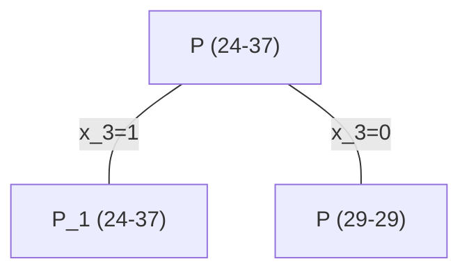
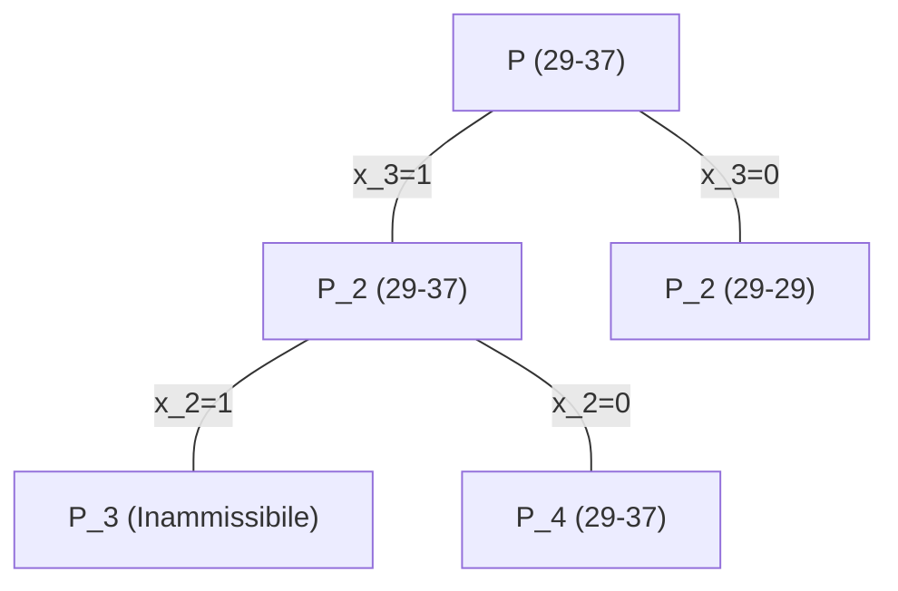
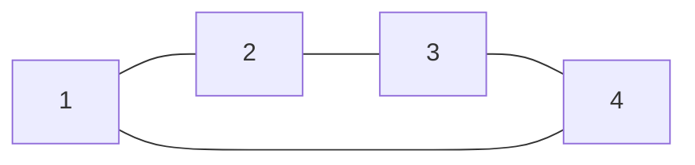
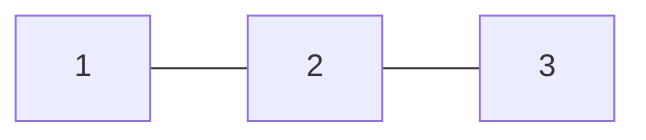
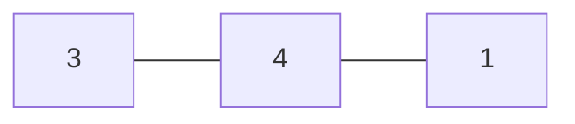

# Metodi enumerativi

- Problemi di [[programmazione lineare intera]] con numero finito di (possibili) soluzioni
- Analisi diretta o indiretta di tutte le soluzioni
- Possibilità di enumerare "facilmente" le soluzioni

Particolarmente idonei per i problemi combinatori, ovvero con variabili binarie ($x∈\{0,1\}^n$).

Un esempio stupido è di prendere tutti i punti ammissibili e confrontare il valore della funzione obiettivo.

## Albero di enumerazione totale

Ogni nodo rappresenta un sottoproblema (che ha variabili fissate a seconda del percorso fatto per raggiungere il nodo). Si può "potare" in anticipo se si vede che un ramo non porterà un risultato ottimo (*branch and bound*). L'albero è costruito eventualmente in maniera dinamica.

### Branch and bound

Ricorda che:
- Soluzione ammissibile ≤ Valore ottimo
- Rilassamento ≥ Valore ottimo

1. Una soluzione ammissibile (di partenza) ← tecniche euristiche ad-hoc
2. Regola di ramificazione (per costruire dinamicamente l'albero)
3. Un rilassamento del problema (per essere più facile da risolvere)
4. Regole di potatura
	- Il valore ottima del rilassamento del sottoproblema è peggiore/non-migliore del valore della mia soluzione corrente
	- La soluzione ottima del rilassamento del sottoproblema è ammissibile anche se non rilassato
	- Il sottoalbero non contiene soluzioni ammissibili per il problema

#### Esempio [[Ottimizzazione problema dello zaino|problema dello zaino]]

Il problema dello zaino rilassato è facile.

(P)
Funzione obiettivo: $\max c·x$
Vincoli:
- $Ax≤b$
- $x≥0$

Si converte in:

(D)
Funzione obiettivo: $\min yb$
Vincoli:
- $yA≥c$
- $y≥0$

La soluzione ottima, essendo $y∈ℝ^1$, è $y=\max\limits_i \cfrac{c_i}{a_i}=\cfrac{c_k}{a_k}$ (con $k$ opportuno).

Quindi $x=\begin{cases}\cfrac{b}{a_i} & \text{se } i=k \\ 0 & \text{altrimenti}\end{cases}$ è soluzione ottima.

$\cfrac{c_i}{a_i}=$ beneficio unitario dell'oggetto $i$ (*rendimento*)


>[!info]
>##### Tecnica euristica dei rendimenti decrescenti
>
>Riordinamento: $\cfrac{c_1}{a_1}≥\cfrac{c_2}{a_2}≥…≥\cfrac{c_n}{a_n}$
>
>$\hat{x}=1$
>
>Per $j=2…n \quad \hat{x}_j=1⇔a_j≤b-∑\limits_{i=1}^{j-1}a_i\hat{x}_i$ (prendo $\hat{x}_j$ se e solo se è rimasto ancora spazio nello zaino dopo aver preso i precedenti)

Abbiamo ottenuto una buona euristica, ma ora è il caso di rimettere un vincolo che abbiamo tolto con il rilassamento:
- $0≤x_i≤1$

Passare al problema duale è molto più difficile, dato che abbiamo aggiunto $n$ vincoli. Arriviamo direttamente alla soluzione ottima (passaggi nelle note del professore), con gli scarti complementari.

Riordinamento: $\cfrac{c_1}{a_1}≥\cfrac{c_2}{a_2}≥…≥\cfrac{c_n}{a_n}$

Definiamo $h=\{1,...,n-1\}$ tale che $∑\limits_{i=1}^{h}a_i≤b$ e $∑\limits_{i=1}^{h+1}a_i>b$.

La soluzione ottima è $\bar{x}$ t.c. $\bar{x}_i=\begin{cases}1 & \text{se } i≤k \\ (∑\limits_{i=1}^{h+1}a_i)∕a_{h+1} & \text{se } i=h+1 \\ 0 & \text{se } i>h+1\end{cases}$

(È scritto difficile, ma in pratica è semplicemente prendi interamente tutti gli oggetti con miglior beneficio finché puoi, poi prendi quanto possibile del prossimo)

##### Esempio

Funzione obiettivo: $\max 11x_1+23x_2+18x_3+6x_4$

Vincoli:
- $7x_1+6x_2+3x_3+2x_4≤8$
- $x_1,x_2,x_3,x_4∈\{0,1\}$

Rendimenti: $\begin{matrix}\frac{11}{7} & \frac{23}{6} & 6 & 3\end{matrix}$
Ordinamento: $\begin{matrix}x_3 & x_2 & x_4 & x_1\end{matrix}$

Soluzione ammissibile: $\begin{bmatrix}0 & 0 & 1 & 1\end{bmatrix}$, valore $24$ (valutazione inferiore $V_I=24$)
Soluzione ottima rilassamento: $\begin{bmatrix}0 & \frac{5}{6} & 1 & 0\end{bmatrix}$, valore $37+\frac{1}{6}$ (valutazione superiore $V_S=37$)



$P_1$) Soluzione ottima rilassamento: $\begin{bmatrix}0 & \frac{5}{6} & 1 & 0\end{bmatrix}$, $V_S=37$. Non ci dice niente di utile. Non si può potare l'albero.
$P_2$) Soluzione ottima rilassamento: $\begin{bmatrix}0 & 1 & 0 & 1\end{bmatrix}$, $V_S=29$. Essendo ammissibile per $P$, si può potare l'albero.

$\begin{bmatrix}0 & 1 & 0 & 1\end{bmatrix}$ è la nuova soluzione ammissibile corrente, $V_I=29$



$P_3$ non contiene soluzione ammissibili per $P$. Si può potare.
$P_4$) Soluzione ottima rilassamento: $\begin{bmatrix}\frac{3}{7} & 0 & 1 & 1\end{bmatrix}$, valore $28+\frac{5}{7}$. Si può potare perché $V_S=28<29=V_I$

L'albero è totalmente potato: la soluzione corrente $\begin{bmatrix}0 & 1 & 0 & 1\end{bmatrix}$ è ottima.

#### Esempio problema del commesso viaggiatore (Traveling Salesman Problem, TSP)

C'è un commesso viaggiatore che, deve visitare un numero di città in sequenza, una dopo l'altra, per poi tornare a casa. Vuole trovare il percorso minimo per farlo.

- $G=(N,A)$
	- Non orientato
	- Completo: se due città non sarebbero connesse, prendere l'arco significa che il commesso ignorerà le città da cui passerebbe
- $c_{ij}$ costo arco $(i,j)∈A$ (e.g. tempo di percorrenza)

Ciclo hamiltoniano ≡ Ciclo che passa da tutti i nodi una e una sola volta

$x_{ij}=\begin{cases} 1 &\text{se } (i,j) \text{ appartiene al ciclo} \\ 0 &\text{altrimenti} \end{cases}$

Funzione obiettivo: $\min ∑\limits_{(i,j)∈A}c_{ij}x_{ij}$

Vincoli:
- $∑\limits_{(k,l)∈A(i)}x_{kl}=2 \quad ∀i∈N$
	- $A(i)=\{\text{archi incidenti in } i\}$
- $∑\limits_{(i,j)∈A(N',N'')}x_{ij}=2 \quad ∀(N',N'')$ [[Ottimizzazione grafi#^64bc6c|taglio]]
	- Per evitare di avere due cicli separati
- $x_{ij}∈\{0,1\}$

Tecnica greedy: scelgo un nodo di partenza e vado nel nodo più vicino, e continuo ad andare nei nodi più vicini. (È per questo che abbiamo reso il grafo completo.)

Tecnica del nodo più vicino → Soluzione ammissibile

Si può rimuovere un nodo da un ciclo hamiltoniano per trasformarlo in un [[Ottimizzazione grafi#^e2b662|albero di copertura]]. Per esempio:

Ciclo hamiltoniano

≡
Albero di copertura (grafo ristretto $N'=\{1,2,3\}$)

+
2 archi incidenti nel nodo rimosso (4)


>[!warning]
>Non vale per forza l'opposto. Per esempio:
>
>4-albero (si chiama così anche se non è un albero!)
>```mermaid
>flowchart LR
>1 --- 2 --- 3 & 4
>3 --- 4
>```
>≡
>```mermaid
>flowchart LR
>1 --- 2 --- 3
>```
>\+
>```mermaid
>flowchart LR
>2 --- 4 --- 3
>```

k-albero ≡ albero di copertura su $N∖\{k\}$ + 2 archi incidenti in $k$

Il problema del k-albero di costo minimo è un rilassamento del ciclo hamiltoniano di costo minimo.

I cicli hamiltoniani sono tutti e soli i k-alberi (per $k$ qualsiasi) in cui ogni nodo ha grado 2.

$\{\text{cicli hamiltoniani}\}⊊\{\text{k-alberi}\}$ per qualsiasi $k$

TODO 07 Dicembre 2022