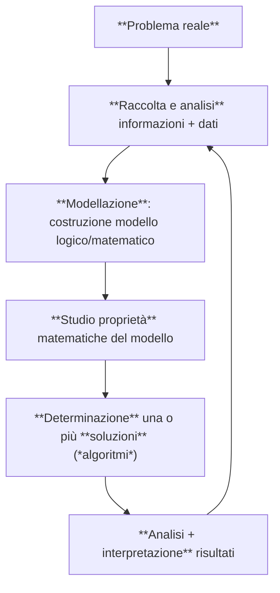

# Ricerca operativa

```mermaid
flowchart TD
A[**Problema reale**] --> B[**Raccolta e analisi** informazioni + dati] --> C[**Modellazione**: costruzione modello logico/matematico] --> D[**Studio proprietà** matematiche del modello] --> E["**Determinazione** una o più **soluzioni** (*algoritmi*)"] --> F[**Analisi + interpretazione** risultati] --> B
```
Vedi [[Problemi di ottimizzazione]]
