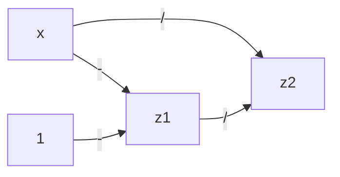
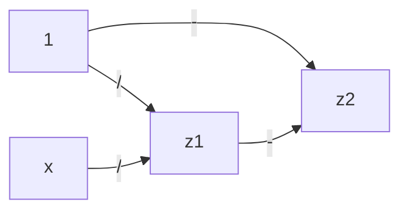
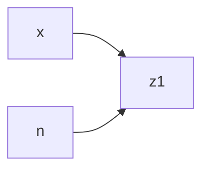
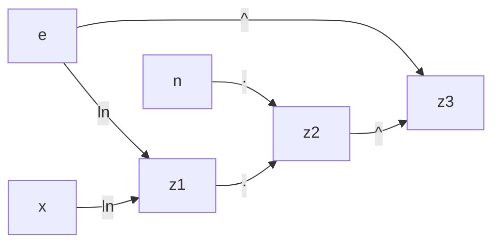
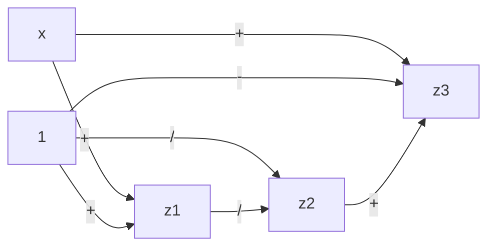
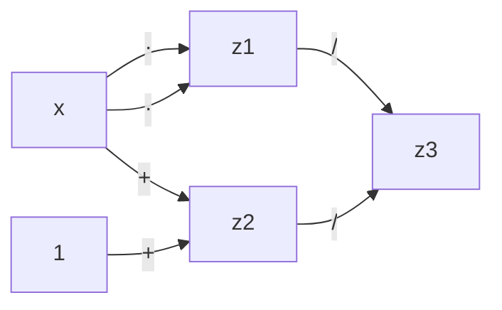

$f(x)=\frac{x-1}{x}=1-\frac{1}{x}$

%%$ψ(\tilde{x})=\frac{(x(1+ϵ_x)-1)(1+ϵ^{(1)})}{x(1+ϵ_x)}(1+ϵ^{(2)})=(1+ϵ^{(1)}-\frac{1+ϵ^{(1)}}{x(1+ϵ_x)})(1+ϵ^{(2)})=1+ϵ^{(1)}-\frac{1+ϵ^{(1)}}{x(1+ϵ_x)}+ϵ^{(2)}-\frac{ϵ^{(2)}}{x(1+ϵ_x)}$
$ϵ_{tot}=(1+ϵ^{(1)}-\frac{1+ϵ^{(1)}}{x(1+ϵ_x)}+ϵ^{(2)}-\frac{ϵ^{(2)}}{x(1+ϵ_x)}-1+\frac{1}{x})\frac{x}{x-1}=\frac{(ϵ^{(1)}+ϵ^{(2)})x+1}{x-1}-\frac{1+ϵ^{(1)}+ϵ^{(2)}}{(x-1)(1+ϵ_x)}$
TODO%%
$ϵ_{tot}≐ϵ^{(2)}+(ϵ^{(1)}+\frac{x}{x-1}ϵ_x)-ϵ_x=ϵ^{(2)}+ϵ^{(1)}+(\frac{x}{x-1}-1)ϵ_x=ϵ^{(2)}+ϵ^{(1)}+\frac{1}{x-1}ϵ_x$
$ϵ_{alg}≐ϵ^{(2)}+ϵ^{(1)}$

$ϵ_{tot}=ϵ^{(2)}+\frac{\frac{1}{x}}{\frac{1}{x}-1}(ϵ^{(1)}-ϵ_x)=ϵ^{(2)}+\frac{1}{1-x}ϵ^{(1)}+\frac{1}{x-1}ϵ_x$
$ϵ_{alg}=ϵ^{(2)}+\frac{1}{1-x}ϵ^{(1)}$

---
$f(x)=x^n=e^{n·\ln x}$
Assumo che $n$ non abbia errori di rappresentazione.

$ϵ_{tot}=ϵ^{(1)}+nϵ_x$
L'algoritmo è stabile, se $n$ non è troppo grande.

$ϵ_{tot}=ϵ^{(3)}+(n·\ln x)ϵ_e+c_1(ϵ^{(2)}+(ϵ^{(1)}+\frac{1}{\ln x}ϵ_x+c_2ϵ_e))=ϵ^{(3)}+eϵ^{(2)}+eϵ^{(1)}+(n·\ln x-e)ϵ_e+\frac{e}{\ln x}ϵ_x$

Dove:
- $c_2=\frac{e(-\frac{\ln x}{e·\ln^2 e})}{\ln x}=-1$
- $c_1=\frac{e·e^{n·\ln x}}{e^{n·\ln x}}=e$

L'algoritmo è instabile per $x$ piccolo.

---

$f(x)=x-1+\frac{1}{x+1}$

$ϵ_{tot}=ϵ^{(3)}+c^{(3)}_1ϵ_x+c^{(3)}_3ϵ^{(2)}_{tot}=ϵ^{(3)}+\frac{x+1}{x}ϵ_x+\frac{1}{x^2}(ϵ^{(2)}-(ϵ^{(1)}+\frac{x}{x+1}ϵ_x))=ϵ^{(3)}+\frac{x+1}{x}ϵ_x+\frac{1}{x^2}ϵ^{(2)}-\frac{1}{x^2}ϵ^{(1)}-\frac{1}{x(x+1)}ϵ_x=ϵ^{(3)}+\frac{1}{x^2}ϵ^{(2)}-\frac{1}{x^2}ϵ^{(1)}-\frac{x+2}{x+1}ϵ_x$
$c^{(3)}_1=\frac{x}{x-1+\frac{1}{x+1}}=\frac{x+1}{x}$
$c^{(3)}_3=\frac{\frac{1}{x+1}}{x-1+\frac{1}{x+1}}=\frac{1}{x^2}$
$ϵ^{(2)}_{tot}=ϵ^{(2)}-ϵ^{(1)}_{tot}$
$ϵ^{(1)}_{tot}=ϵ^{(1)}+\frac{x}{x+1}ϵ_x$

Il problema è mal condizionato con $x$ vicino a $-1$.
È algebricamente instabile con $x$ vicino a $0$.

$f(x)=\frac{x^2}{x+1}$

$ϵ_{tot}=ϵ^{(3)}+ϵ^{(1)}_{tot}-ϵ^{(2)}_{tot}=ϵ^{(3)}+(ϵ^{(1)}+2ϵ_x)-(ϵ^{(2)}+\frac{x}{x+1}ϵ_x)=ϵ^{(3)}-ϵ^{(2)}+ϵ^{(1)}+\frac{x+2}{x+1}ϵ_x$
È algebricamente stabile, c'è solo un basso rischio di overflow per via di $x^2$.

